<div align="center">


# Universidad Peruana de Ciencias Aplicadas

**Facultad de Ingeniería: Ingeniería de Software**  
**Desarrollo de Aplicaciones Open Source**  
**1ASI0729-2610-11959**

**Profesor:** Hugo Allan Mori Paiva

**"Informe de Trabajo Final"**

**Startup:** UrbanGuardle


| Código | Integrante |
|--------|-----------|
| U202321020 | Delgado Arriola, Leonardo Sebastian |
| U20241B676 | Alvarado Millan, Boris |
| U20241A995 | Ibañez Torres, Ivonne Beatriz |
| U20241A322 | Blancas Chavez, Carlos Franco |
| U20241C187 | Espiritu Silvestre, Fernando Carlos |

**Abril 2026-10**

---

## Registro de Versiones del Informe

| Versión | Fecha | Autor/es | Descripción de Modificación |
|---------|-------|----------|-----------------------------|
| 0.1 | 05/04/2026 | — | Agregación de: Carátula, Registro de Versiones del Informe, Project Report Collaboration Insights, Contenido (Índice), Student Outcome, Capítulo I: Introducción, Capítulo II: Requirements Elicitation & Analysis, Capítulo III: Requirements Specification, Capítulo IV: Product Design, Capítulo V: Product Implementation, Validation & Deployment. Avance de: Conclusiones, Bibliografía, Anexos. |

---
</div>

## Project Report Collaboration Insights

**Project Report URL:** https://github.com/OpenSource-Grupo-1/informe-del-proyecto

El presente apartado tiene como finalidad evidenciar el trabajo colaborativo realizado durante la elaboración del informe del proyecto. Para ello, se considera como fuente principal el repositorio oficial del informe, alojado en GitHub bajo la organización del equipo: https://github.com/OpenSource-Grupo-1

A partir de este repositorio, se analiza la participación de los integrantes mediante indicadores como la distribución de tareas, la frecuencia de contribuciones, la revisión de contenidos y la integración progresiva de los entregables desarrollados durante el avance del proyecto.

En el contexto de la entrega correspondiente a AV1, el análisis de colaboración permite visualizar el aporte individual de cada miembro del equipo, sustentado en los registros de GitHub, la organización de responsabilidades y la evolución del informe.

### AV1

Durante el desarrollo de la entrega AV1, el equipo organizó la elaboración del informe mediante la asignación de responsabilidades por secciones. Esta distribución permitió avanzar de manera paralela en actividades relacionadas con investigación, análisis del segmento objetivo, definición de requisitos, diseño UX, modelado del dominio, arquitectura de software y documentación técnica.

El proceso de desarrollo del informe se realizó de forma incremental, incorporando progresivamente los contenidos conforme se consolidaban los artefactos del proyecto. Todos los integrantes participaron activamente en la construcción del informe, realizando aportes continuos que permitieron consolidar una documentación coherente y alineada entre sus distintas secciones.

---

# Contenido
## Tabla de contenidos
- [Carátula](#carátula)
- [Registro de Versiones del Informe](#registro-de-versiones-del-informe)
- [Project Report Collaboration Insights](#project-report-collaboration-insights)
- [Contenido](#contenido)
- [Student Outcome](#student-outcome)

## Capítulo I: Introducción
- [1.1. Startup Profile](#11-startup-profile)
    - [1.1.1. Descripción de la Startup](#111-descripción-de-la-startup)
    - [1.1.2. Perfiles de integrantes del equipo](#112-perfiles-de-integrantes-del-equipo)
- [1.2. Solution Profile](#12-solution-profile)
    - [1.2.1. Antecedentes y problemática](#121-antecedentes-y-problemática)
    - [1.2.2 Lean UX Process.](#122-lean-ux-process)
        - [1.2.2.1. Lean UX Problem Statements.](#1221-lean-ux-problem-statements)
        - [1.2.2.2. Lean UX Assumptions.](#1222-lean-ux-assumptions)
        - [1.2.2.3. Lean UX Hypothesis Statements.](#1223-lean-ux-hypothesis-statements)
        - [1.2.2.4. Lean UX Canvas.](#1224-lean-ux-canvas)
- [1.3. Segmentos objetivo.](#13-segmentos-objetivo)

## Capítulo II: Requirements Elicitation & Analysis
- [2.1. Competidores.](#21-competidores)
    - [2.1.1. Análisis competitivo.](#211-análisis-competitivo)
    - [2.1.2. Estrategias y tácticas frente a competidores.](#212-estrategias-y-tácticas-frente-a-competidores)
- [2.2. Entrevistas.](#22-entrevistas)
    - [2.2.1. Diseño de entrevistas.](#221-diseño-de-entrevistas)
    - [2.2.2. Registro de entrevistas.](#222-registro-de-entrevistas)
    - [2.2.3. Análisis de entrevistas.](#223-análisis-de-entrevistas)
- [2.3. Needfinding.](#23-needfinding)
    - [2.3.1. User Personas.](#231-user-personas)
    - [2.3.2. User Task Matrix.](#232-user-task-matrix)
    - [2.3.3. User Journey Mapping.](#233-user-journey-mapping)
    - [2.3.4. Empathy Mapping.](#234-empathy-mapping)
- [2.4. Big Picture EventStorming.](#24-big-picture-eventstorming)
- [2.5. Ubiquitous Language.](#25-ubiquitous-language)

## Capítulo III: Requirements Specification
- [3.1. User Stories.](#31-user-stories)
- [3.2. Impact Mapping.](#32-impact-mapping)
- [3.3. Product Backlog.](#33-product-backlog)

## Capítulo IV: Product Design
- [4.1. Style Guidelines.](#41-style-guidelines)
    - [4.1.1. General Style Guidelines.](#411-general-style-guidelines)
    - [4.1.2. Web Style Guidelines.](#412-web-style-guidelines)
- [4.2. Information Architecture.](#42-information-architecture)
    - [4.2.1. Organization Systems.](#421-organization-systems)
    - [4.2.2. Labeling Systems.](#422-labeling-systems)
    - [4.2.3. SEO Tags and Meta Tags](#423-seo-tags-and-meta-tags)
    - [4.2.4. Searching Systems.](#424-searching-systems)
    - [4.2.5. Navigation Systems.](#425-navigation-systems)
- [4.3. Landing Page UI Design.](#43-landing-page-ui-design)
    - [4.3.1. Landing Page Wireframe.](#431-landing-page-wireframe)
    - [4.3.2. Landing Page Mock-up.](#432-landing-page-mock-up)
- [4.4. Web Applications UX/UI Design.](#44-web-applications-uxui-design)
    - [4.4.1. Web Applications Wireframes.](#441-web-applications-wireframes)
    - [4.4.2. Web Applications Wireflow Diagrams.](#442-web-applications-wireflow-diagrams)
    - [4.4.2. Web Applications Mock-ups.](#442-web-applications-mock-ups)
    - [4.4.3. Web Applications User Flow Diagrams.](#443-web-applications-user-flow-diagrams)
- [4.5. Web Applications Prototyping.](#45-web-applications-prototyping)
- [4.6. Domain-Driven Software Architecture.](#46-domain-driven-software-architecture)
    - [4.6.1. Design-Level EventStorming.](#461-design-level-eventstorming)
    - [4.6.2. Software Architecture Context Diagram.](#462-software-architecture-context-diagram)
    - [4.6.3. Software Architecture Container Diagrams.](#463-software-architecture-container-diagrams)
    - [4.6.4. Software Architecture Components Diagrams.](#464-software-architecture-components-diagrams)
- [4.7. Software Object-Oriented Design.](#47-software-object-oriented-design)
    - [4.7.1. Class Diagrams.](#471-class-diagrams)
- [4.8. Database Design.](#48-database-design)
    - [4.8.1. Database Diagrams.](#481-database-diagrams)

## Capítulo V: Product Implementation, Validation & Deployment
- [5.1. Software Configuration Management.](#51-software-configuration-management)
    - [5.1.1. Software Development Environment Configuration.](#511-software-development-environment-configuration)
    - [5.1.2. Source Code Management.](#512-source-code-management)
    - [5.1.3. Source Code Style Guide & Conventions.](#513-source-code-style-guide--conventions)
    - [5.1.4. Software Deployment Configuration.](#514-software-deployment-configuration)
- [5.2. Landing Page, Services & Applications Implementation.](#52-landing-page-services--applications-implementation)
    - [5.2.X. Sprint n](#52x-sprint-n)
        - [5.2.X.1. Sprint Planning n.](#52x1-sprint-planning-n)
        - [5.2.X.2. Aspect Leaders and Collaborators.](#52x2-aspect-leaders-and-collaborators)
        - [5.2.X.3. Sprint Backlog n.](#52x3-sprint-backlog-n)
        - [5.2.X.4. Development Evidence for Sprint Review.](#52x4-development-evidence-for-sprint-review)
        - [5.2.X.5. Execution Evidence for Sprint Review.](#52x5-execution-evidence-for-sprint-review)
        - [5.2.X.6. Services Documentation Evidence for Sprint Review.](#52x6-services-documentation-evidence-for-sprint-review)
        - [5.2.X.7. Software Deployment Evidence for Sprint Review.](#52x7-software-deployment-evidence-for-sprint-review)
        - [5.2.X.8. Team Collaboration Insights during Sprint.](#52x8-team-collaboration-insights-during-sprint)

---

## Student Outcome

En Ingeniería de Software el logro contribuye a alcanzar el Student Outcome EAC 3:
> *"Demonstrates an ability to communicate effectively with a range of audiences"*

| Criterio Específico | Acciones Realizadas | Conclusiones |
|---------------------|---------------------|--------------|
| 3.c1. Comunica oralmente con efectividad a diferentes rangos de audiencia | Integrante 1 - AV1: / Integrante 2 - AV1: / Integrante 3 - AV1: / Integrante 4 - AV1: / Integrante 5 - AV1: | ----------AV1---------- |
| 3.c2. Comunica por escrito con efectividad a diferentes rangos de audiencia | Integrante 1 - AV1: / Integrante 2 - AV1: / Integrante 3 - AV1: / Integrante 4 - AV1: / Integrante 5 - AV1: | ----------AV1---------- |

---

## Capítulo I: Introduction

### 1.1 Startup Profile

#### 1.1.1 Descripción de la Startup

**UrbanGuard** es una startup peruana de tecnología orientada a la seguridad en el transporte público urbano. Surgimos ante la alarmante situación de inseguridad que enfrentan diariamente millones de usuarios del transporte público en Lima y otras ciudades del Perú, donde la falta de control sobre la identidad de los conductores, la ausencia de mecanismos de alerta en emergencias y el desconocimiento de la cantidad de pasajeros a bordo incrementan exponencialmente el riesgo ante accidentes, asaltos y situaciones de peligro.

Nuestra propuesta tecnológica es **SafeBus**, un sistema que articula tres pilares de seguridad en tiempo real:

- Verificación de conductores mediante código QR al inicio de cada servicio
- Botón de pánico integrado para el conductor, que transmite alertas inmediatas a la central de operaciones
- Conteo automatizado de pasajeros a bordo del vehículo, identificando la cantidad de vidas expuestas ante una emergencia

**MISIÓN:** Fortalecer la seguridad de los usuarios del transporte público mediante soluciones digitales innovadoras que permitan verificar la identidad de conductores, gestionar emergencias en tiempo real y cuantificar el riesgo humano a bordo de cada vehículo.

**VISIÓN:** Convertirnos en la plataforma líder de seguridad y trazabilidad en el transporte público de Latinoamérica, reconocida por reducir incidentes viales, empoderar a las autoridades con información oportuna y devolver la confianza ciudadana en el sistema de movilidad urbana.

#### 1.1.2. Perfiles de integrantes del equipo

|                     Foto de perfil                      | Nombre Completo                      | Carrera                | Habilidades                                                                                                         |
| :-----------------------------------------------------: | :----------------------------------- | :--------------------- | :------------------------------------------------------------------------------------------------------------------ |
|   | Leonardo Sebastian Delgado Arriola   | Ingenieria de Software | C++, HTML, CSS, JS, Vue, MySQL, MongoDB, Git                                                                        |
|           | Boris Alvarado Millan    | Ingenieria de Software | Java, Html, Css, JavaScript, Angular, Vue, Node.js, TypeScript, TailwindCss, Spring, C++, Python                    |
|  | Blancas Chávez, Carlos Franco      | Ingenieria de Software | C++, HTML, CSS, MySQL, Python (basics), C# (basics)                                                                 |
|  | Ivonne Beatriz Ibañez Torres                       | Ingenieria de Software | C++ y Python, y conocimientos en diseño y patrones de software, PostgreSQL y MongoDB, Java ,Spring Boot y  Node.js. |
|     | Fernando Carlos Espíritu Silvestre | Ingenieria de Software | C++, Java, JavaScript, HTML, CSS, SQL Server, MongoDB, Git                      
---

### 1.2. Solution Profile

#### 1.2.1 Antecedentes y problemática

Para entender mejor las necesidades de nuestros usuarios, aplicamos la técnica **5W's & 2H's**, herramienta que responde a siete preguntas clave para caracterizar un problema de forma integral.

**What (Qué) — ¿Cuál es el problema?**

La inseguridad en el transporte público urbano del Perú. Los pasajeros no tienen forma de verificar si el conductor del vehículo en el que abordan es la persona autorizada para operar esa unidad. A esto se suma la inexistencia de mecanismos de alerta en tiempo real para el conductor ante situaciones de riesgo y la falta de registro de cuántas personas se encuentran a bordo.

**When (Cuándo) — ¿Cuándo sucede el problema?**

El problema se manifiesta en cada servicio de transporte público: al momento de abordar la unidad, durante el trayecto y en la gestión de incidentes por parte de las autoridades. Los accidentes de tránsito y asaltos ocurren en cualquier momento del día, con mayor incidencia en horarios nocturnos.

*¿Cuándo utilizará el cliente el producto?* Desde que el conductor ingrese al bus, previo a encender el motor.

**Where (Dónde) — ¿Dónde está el cliente cuando usa el producto?**

En su jornada laboral, conduciendo en medio del viaje. El problema surge en el norte del Perú (Trujillo, Chiclayo, Piura) hace casi dos décadas, extendiéndose a zonas céntricas de Lima.

**Who (Quién) — ¿A quiénes les sucede el problema?**

A los pasajeros del transporte público (especialmente mujeres, adultos mayores y escolares), a los conductores expuestos a asaltos y extorsiones, a las empresas operadoras de transporte que no tienen visibilidad de sus unidades en tiempo real, y a las autoridades de seguridad y emergencias.

**Why (Por qué) — ¿Cuál es la causa del problema?**

Por la ausencia de tecnología de identificación y trazabilidad en las unidades de transporte público. Las empresas operadoras carecen de plataformas digitales que les permitan verificar en tiempo real quién conduce cada unidad. Tampoco existen canales de emergencia directos entre el conductor y la central de operaciones, ni sensores para el conteo de pasajeros.

**How (Cómo) — ¿Cómo afecta este problema?**

La combinación de informalidad en el sector, débil regulación tecnológica y la ausencia de estándares digitales de seguridad genera un entorno donde cualquier persona puede operar una unidad sin trazabilidad. El impacto se refleja en violencia, aumento de pasajes, inseguridad ciudadana, aumento del transporte informal e impacto psicológico.

**How Much (Cuánto) — ¿Qué datos respaldan la problemática?**

Según el MTC (2023), en el Perú se registran más de 90,000 accidentes de tránsito anuales, de los cuales aproximadamente el 30% involucra unidades de transporte público. La Defensoría del Pueblo reporta que el 68% de mujeres ha sufrido algún tipo de acoso o situación de inseguridad en el transporte público. Aproximadamente el 40% de empresas de transporte en Lima y Callao pagan cupos, según gremios.

---

#### 1.2.2 Lean UX Process

##### 1.2.2.1 Lean UX Problem Statements

**Problem Statement 1:** Los conductores de transporte público enfrentan situaciones de riesgo como robos, agresiones y extorsiones durante sus recorridos diarios. Actualmente, muchas unidades no cuentan con mecanismos digitales que permitan reportar incidentes de manera inmediata ni solicitar apoyo en tiempo real, lo que incrementa la sensación de inseguridad y dificulta una respuesta rápida ante emergencias.

**Problem Statement 2:** Las empresas de transporte presentan una limitada capacidad de supervisión sobre sus unidades mientras están en operación, lo que dificulta conocer en tiempo real lo que sucede durante los recorridos. Esta falta de visibilidad reduce su capacidad para coordinar acciones oportunas, tomar decisiones informadas y responder de manera eficiente ante incidentes o emergencias.

**Problem Statement 3:** Los usuarios del transporte público perciben el servicio como inseguro debido a la ausencia de mecanismos visibles que garanticen su protección durante el viaje. Esta percepción negativa no solo disminuye la confianza en el servicio, sino que también afecta la experiencia del usuario y su disposición a utilizar el transporte público de manera frecuente.

##### 1.2.2.2 Lean UX Assumption

**Business Assumptions:**

- Creemos que las empresas de transporte público necesitan herramientas digitales que les permitan supervisar sus unidades en tiempo real y responder rápidamente ante incidentes de seguridad.
- Suponemos que las empresas estarían dispuestas a adoptar una plataforma tecnológica si esta contribuye a mejorar el control operativo y reducir situaciones de riesgo dentro de las unidades.
- Consideramos que la implementación de SafeBus puede optimizar la comunicación entre conductores y supervisores durante situaciones de emergencia.
- Creemos que centralizar la información de recorridos, alertas e incidencias facilitará la toma de decisiones y mejorará la capacidad de monitoreo de las operaciones de transporte.

**Business Outcomes:**

- Reducir el tiempo de respuesta ante incidentes reportados por los conductores.
- Mejorar la capacidad de supervisión operativa de las empresas.
- Incrementar la percepción de confiabilidad del servicio.
- Reducir los tiempos de respuesta ante emergencias.

**User Benefits:**

- Los conductores podrán reportar incidentes de manera rápida y sencilla mediante alertas desde la aplicación móvil.
- Los supervisores tendrán acceso inmediato a información relacionada con rutas, incidencias y estado de las unidades.
- Los usuarios podrán percibir un entorno de transporte más seguro gracias al monitoreo y seguimiento de las unidades.
- La plataforma permitirá mejorar la coordinación y atención ante situaciones de riesgo o emergencia.

##### 1.2.2.3 Lean UX Hypothesis Statements

**Hypothesis Statement 1:** Creemos que al implementar una funcionalidad de reporte rápido desde la aplicación móvil, los conductores podrán registrar incidentes de forma inmediata. Sabremos que esto es cierto cuando al menos el 70% de los incidentes sean reportados en menos de 10 segundos.

**Hypothesis Statement 2:** Creemos que al proporcionar un panel de control con información en tiempo real, las empresas podrán coordinar acciones de respuesta de manera más eficiente ante incidentes. Sabremos que esto es cierto cuando el tiempo de coordinación y respuesta se reduzca en al menos un 30%.

**Hypothesis Statement 3:** Creemos que al ofrecer a los usuarios visibilidad sobre el estado y recorrido de las unidades, se incrementará su confianza en el servicio de transporte. Sabremos que esto es cierto cuando al menos el 60% de los usuarios reporten mayor confianza en encuestas posteriores al uso.

##### 1.2.2.4 Lean UX Canvas

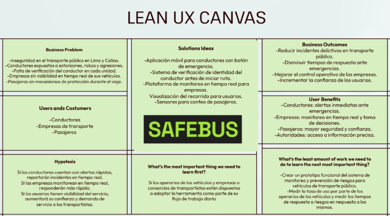

---

### 1.3 Segmento Objetivo

| Segmento objetivo | Características demográficas | Información estadística de sustento |
|-------------------|------------------------------|--------------------------------------|
| Conductores (operarios) de transporte público | Cantidad de vehículos: Uno o 2 a su disposición. Edad: Adultos de 24 años en adelante. Cargo: Conductores con vehículo asignado a una empresa-ruta. Ubicación: Lima Metropolitana y el Callao. Interés: Garantizar su bienestar y el de los pasajeros a bordo. | Según Panamericana.pe (2025), los conductores deben pagar una cuota diaria y semanal para poder operar. Si alguien se niega, corre el riesgo de ser atacado a balazos. |
| Empresas o consorcios de transporte público | Cantidad de vehículos: Más de 2 a nombre del consorcio. Edad: Adultos de 28 años a más. Cargo: Representantes legales de consorcios con operarios de cústers. Ubicación: Lima Metropolitana y Callao. Interés: Garantizar la seguridad de pasajeros y operarios. | De acuerdo con larepublica.pe (2024), más de 14,000 denuncias por extorsión han sido registradas en todo el país, destacándose Lima y La Libertad como las regiones más afectadas. |

---

## Capítulo II: Requirements Elicitation & Analysis

### 2.1 Competidores

#### 2.1.1 Análisis Competitivo

| Competitive Analysis Landscape | | | | |
|---|---|---|---|---|
| **¿Por qué llevar a cabo este análisis?** | Identificar ventajas competitivas frente a soluciones existentes en el mercado de seguridad para transporte público. | | | |
| | **SafeBus (Nuestro startup)** | **Competidor 1 (Metropolitano)** | **Competidor 2 (RTP)** | **Competidor 3 (Mi Transporte)** |
| **Ventaja competitiva** | Monitoreo en tiempo real, botón de emergencia con conteo de pasajeros por sensores en la puerta. | Infraestructura organizada, estaciones, rutas definidas, carriles exclusivos y cámaras de videovigilancia. | Tecnología incorporada: cámaras de seguridad, monitoreo en tiempo real y capacitación del personal. | Monitoreo y protocolos de seguimiento en tiempo real, reportes ciudadanos. |
| **Mercado objetivo** | Consorcios/empresas de transporte público y operarios de vehículos asignados. | Usuarios urbanos de Lima Metropolitana. | Población de zonas periféricas, estudiantes y grupos vulnerables. | Población de zonas periféricas y estudiantes. |
| **Estrategia de marketing** | Enfatiza la seguridad durante la ruta con un sistema integrado al vehículo. | Servicio rápido, moderno, formal y seguro, destacando eficiencia y orden. | Campaña "Yo Soy RTP", sustentabilidad con unidades eléctricas. | Posiciona el transporte como sistema integrado, moderno y eficiente. |
| **Productos & Servicios** | Botón de pánico, información sobre paraderos, monitoreo de riesgos 24h. | Transporte troncal, tarjeta recargable, estaciones seguras, información de rutas. | Servicio ordinario, expreso, Ecobús y Nochebús. | Transporte multimodal, Tarjeta Mi Movilidad, App Mi Saldo, Mi Pasaje. |
| **Precios & Costos** | Desde S/. 99 por unidad/mes incluyendo instalación. 20% de descuento a partir de 3 unidades. | S/. 3.50 por viaje. | 40 céntimos (ordinario) a 1.50 soles (Nochebús). | Tarifa plana S/. 2.00, tarifa preferencial S/. 1.00. |
| **Canales de distribución** | Web y móvil. | Web, móvil/recarga digital, puntos físicos. | App CDMX, tarjeta de movilidad integrada, sitio web oficial. | Web, móvil (App Mi Saldo), puntos físicos (OXXO, estaciones). |
| **Fortalezas** | Equipo profesional comprometido con el bienestar del cliente. | Marca reconocida, sistema formal, modernización digital. | Tarifas sociales subsidiadas, flota moderna eléctrica, conductores capacitados. | Marca unificada, interoperabilidad, modernización de flota. |
| **Oportunidades** | Expansión a provincias, acuerdos formales con la policía. | Expansión urbana, digitalización del servicio. | Expansión de rutas eléctricas para el Mundial 2026. | Crecimiento urbano hacia otros estados, crisis de combustibles. |
| **Amenazas** | Alto índice de extorsiones a transportistas en sus rutas. | Inseguridad ciudadana, saturación en horas punta, fallas operativas. | Competencia del transporte concesionado informal, congestión vial. | Resistencia al cambio, inseguridad, incidentes de vandalismo. |

#### 2.1.2 Estrategia y tácticas frente a competidores

Para posicionar a SafeBus de manera competitiva, se plantean las siguientes estrategias:

**Estrategias de vinculación y fidelización con usuarios clave:**

**#1 Implementación colaborativa con conductores y empresas**  
SafeBus adoptará un enfoque participativo, donde conductores y empresas de transporte formen parte del proceso de implementación y adaptación del sistema. Esto permitirá reducir la resistencia al cambio y asegurar que la solución se ajuste a necesidades reales del entorno.

**#2 Programa integral de capacitación y soporte técnico continuo**  
Se ofrecerán programas de capacitación para conductores y empresas, junto con soporte técnico constante. Esta estrategia responde a la baja adopción tecnológica en el sector.

**#3 Empoderamiento del usuario como actor activo**  
SafeBus integrará funcionalidades visibles para los usuarios (como monitoreo de rutas o estado del viaje), aumentando la percepción de seguridad.

**Estrategias de diferenciación tecnológica y funcional:**

**#1 Sistema integral de seguridad en tiempo real**  
SafeBus integrará monitoreo en tiempo real, botón de emergencia y sensores de conteo de pasajeros en una sola plataforma.

**#2 Plataforma centralizada de información**  
Se consolidará toda la información del vehículo (ubicación, alertas, estado) en un sistema único accesible para empresas.

**#3 Integración de hardware y software**  
SafeBus combinará aplicación móvil con dispositivos físicos (sensores, botón de pánico), generando una solución más robusta.

**#4 Analítica y reportes de seguridad**  
Se incorporarán reportes sobre incidentes, zonas de riesgo y comportamiento de rutas.

**Estrategias de posicionamiento y enfoque de mercado:**

**#1 Enfoque en seguridad como valor principal**  
SafeBus se posicionará como una solución centrada en la protección de conductores y pasajeros, destacando su impacto social.

**#2 Segmentación hacia empresas formales de transporte**  
Se priorizará trabajar con consorcios organizados que busquen mejorar su gestión y seguridad.

**#3 Adaptación al contexto local (Perú)**  
La solución estará diseñada considerando problemáticas reales como extorsión, informalidad y falta de regulación tecnológica.

**#4 Alianzas estratégicas**  
Se buscarán acuerdos con autoridades, municipalidades y entidades de seguridad para fortalecer la credibilidad y efectividad del sistema.

---

### 2.2 Entrevistas

#### 2.2.1 Diseño de entrevistas

**User: Conductores (operarios) de transporte público**

1. ¿Cómo es un día típico para ti desde que inicias hasta que terminas tu jornada manejando?
2. ¿En qué momentos del día te sientes más expuesto al peligro, o inseguro mientras trabajas?
3. ¿Qué tan frecuente es que los conductores reciban amenazas o presiones externas como cobros o extorsión?
4. ¿Qué herramientas o medidas de seguridad tienes actualmente en tu unidad?
5. ¿Qué tan importante crees que es que alguien esté monitoreando lo que pasa en tu unidad en tiempo real?
6. ¿Qué tan rápido puedes pedir ayuda actualmente si pasa algo dentro del vehículo?
7. ¿Qué cosas sientes que faltan para que tu trabajo sea más seguro?
8. ¿Qué tan cómodo te sentirías usando una app que monitoree tu ubicación y seguridad antes de iniciar tu jornada laboral?
9. Tratándose de una herramienta digital ¿Qué opinas de tener que validar tu identidad (por ejemplo con QR) antes de manejar?
10. ¿En qué momento del día usarías más una solución como esta?

**User: Empresas o consorcios de transporte público**

1. ¿Cómo gestionan actualmente la seguridad de sus conductores y pasajeros?
2. ¿Cuáles son los principales problemas de seguridad que enfrentan hoy en día?
3. ¿Qué tan frecuente es enfrentar situaciones como extorsión, robos o incidentes dentro de las unidades?
4. ¿Qué impacto tienen estos problemas en su operación (costos, reputación, continuidad del servicio)?
5. Cuando ocurre una emergencia, ¿cómo se enteran y qué tan rápido pueden actuar?
6. ¿Qué tan difícil es supervisar en tiempo real lo que sucede en cada unidad durante la jornada?
7. ¿Cómo verifican actualmente que el conductor asignado al vehículo sea el correcto?
8. ¿Han tenido problemas relacionados con conductores no autorizados o mala identificación?
9. Haciendo uso de una herramienta digital en tiempo real ¿Qué aspectos podrían ayudarte a mejorar?
10. Si se implementara este sistema, ¿qué necesitarían o qué les preocuparía antes de usarlo?

---

#### 2.2.2 Registro de entrevista

**User: Conductores (operarios) de transporte público**

**Entrevistado 1: Isaac Diaz**  
- Edad: 24 años  
- Distrito: Los Olivos  
- Link del video: https://1drv.ms/v/c/470edfbbf4f38077/IQAgxwp_SW22QpjqP_2LFiWSAdYBHohGYuGkvqzhTnHDw3Q?e=p0gfr4


**Resumen de la entrevista:**

Isaac inicia su jornada a las 4 a.m. y termina pasadas las 10 p.m., enfrentando mayor sensación de inseguridad durante las noches, especialmente en zonas como El Agustino y Caquetá. Señala que las extorsiones y cobros de cupos son prácticamente cotidianos, con amenazas físicas hacia quienes se niegan a pagar. En cuanto a seguridad, su unidad cuenta apenas con una cámara de baja calidad, sin ningún otro mecanismo de protección por parte de la empresa. Ante una emergencia, reconoce que pedir ayuda es muy lento y complicado, ya que depende únicamente de su celular personal. Considera fundamental contar con monitoreo en tiempo real, un botón de pánico y registro del número de pasajeros a bordo. Mostró total disposición a usar una aplicación de seguridad, incluyendo la validación de identidad por QR. Usaría la solución principalmente en el turno nocturno y al inicio de cada jornada.

---

**Entrevistado 2: Elverth Vasquez**  
- Edad: 24 años  
- Distrito: Ate  
- Link del video: https://1drv.ms/v/c/470edfbbf4f38077/IQDZPsCISt-yTYTs5S4l8HeaAQpjL1ZLpmaajFW__S6ceEI?e=qO2gok


**Resumen de la entrevista:**

Elverth inicia su jornada a las 4:30 a.m. y culmina cerca de las 9 p.m., realizando entre 4 y 5 vueltas diarias. Identifica zonas como Zárate y La Victoria como los puntos de mayor riesgo durante su ruta nocturna. Señala que los cobros de cupo ocurren dos veces por semana de manera casi normalizada, asumiendo esta presión como parte inevitable del trabajo. En cuanto a seguridad, cuenta únicamente con una cámara en mal estado sin ningún respaldo adicional por parte de la empresa. Reconoce que pedir ayuda en una emergencia es peligroso e ineficiente, ya que debe llamar por celular mientras conduce. Considera prioritario contar con un botón de alerta directa que no requiera comunicación verbal, y también señala la falta de respuesta policial como un problema estructural. Mostró total disposición a usar una aplicación de monitoreo y valoró positivamente la validación por QR. Usaría la solución principalmente en horario nocturno y al transitar por zonas de alto riesgo.

---

**Entrevistado 3: Margarita Nuñez**  
- Edad: 34 años  
- Distrito: Ate  
- Link del video: https://1drv.ms/v/c/470edfbbf4f38077/IQCDEnBDbQFuT5alyi7S1O1rAc_Amy-5v-hK0TdLZh5oRWs?e=ee2m7X


**Resumen de la entrevista:**

Margarita combina su jornada laboral de 6 a.m. a 8 p.m. con sus responsabilidades como madre, dejando a sus hijos al cuidado de su mamá antes de salir cada día. Identifica el riesgo no solo en horario nocturno sino a lo largo de toda la jornada, señalando que como mujer conductora enfrenta una exposición mayor a intimidaciones y acoso dentro de su propia unidad. Indica que en su ruta se cobra cupo semanalmente y que su condición de mujer la hace blanco más fácil de presión. En cuanto a seguridad, no cuenta con ningún mecanismo real de protección, dependiendo únicamente de un número telefónico de la empresa que raramente responde a tiempo. Destaca como necesidad prioritaria una alarma silenciosa que no sea visible para el agresor. Mostró la mayor disposición de los tres entrevistados hacia el uso de la aplicación, afirmando que la usaría desde el primer día y durante toda la jornada. Valoró positivamente la validación por QR como mecanismo que agiliza la respuesta de la empresa.

---

**User: Representantes de Empresas o consorcios de transporte público**

**Entrevistado 1: Kiara Nuñez Alvarado**  
- Edad: 27 años  
- Distrito: Puente Piedra


**Resumen de la entrevista:** Representante de ETUCHISA SAC.

La entrevistada señala que actualmente la empresa cuenta con medidas básicas de seguridad, como cámaras en algunas unidades, supervisión en paraderos y contacto con autoridades; sin embargo, reconoce que la cobertura es limitada y no existe un sistema integral. El principal problema identificado es la extorsión por parte de organizaciones criminales, además de robos dentro y fuera de las unidades. Destaca la dificultad para monitorear en tiempo real las unidades y menciona que la verificación de conductores se realiza de forma manual. Considera que una solución digital permitiría mejorar el control, aunque identifica como barreras el costo de implementación y la capacitación del personal.

---

**Entrevistado 2: Jaime A. Russvelt**  
- Edad: 50 años  
- Distrito: Ancón


**Resumen de la entrevista:** Representante de la empresa Nueva Estrella.

El entrevistado describe un contexto altamente crítico donde la extorsión es el principal problema estructural, con cobros elevados por parte de organizaciones criminales, incluso múltiples grupos simultáneamente. Menciona que estas situaciones generan escasez de conductores, ya que muchos abandonan el trabajo o migran al extranjero por temor. La empresa no cuenta con mecanismos efectivos de prevención. Reconoce que no existen herramientas tecnológicas adecuadas y que dependen de procesos manuales. Considera que una solución tecnológica sería útil, especialmente si permite comunicación directa con autoridades, pero señala que su principal preocupación es la falta de respuesta del Estado.

---

**Entrevistado 3: Puma Nicanor Yamoca**  
- Edad: 45 años  
- Distrito: Santa Anita


**Resumen de la entrevista:** Representante de Álamo Santa Rosa La G, propietario de 12 unidades que trabaja desde Pacasmayo hasta Santa Anita.

El entrevistado manifiesta que tanto conductores como pasajeros trabajan en un entorno de alta inseguridad, donde la extorsión es el problema más grave y constante. Señala que el pago de cupos es prácticamente obligatorio para poder operar con normalidad y que las organizaciones criminales llegan a conocer información personal de los transportistas. Esta situación tiene un impacto directo en la economía, obligando a los conductores a trabajar más y aumentar las tarifas. En caso de emergencias, la respuesta de las autoridades es lenta. Valora positivamente la implementación de tecnología, indicando que herramientas como sensores, cámaras o sistemas de monitoreo serían de gran ayuda, pero resalta la necesidad de capacitación.

---

#### 2.2.3 Análisis de entrevista

**Conductores (operarios) de transporte público:**

**Entrevista 1:** El segmento objetivo del entrevistado es conductor de transporte público urbano que opera largas jornadas en rutas con alta incidencia de inseguridad y extorsión, especialmente en horarios nocturnos.

Los aspectos más comunes que señala el entrevistado son:
- Jornada extensa (4 a.m. a 10 p.m.) con mayor inseguridad en la noche, especialmente en zonas peligrosas.
- Extorsiones y cobros ilegales son frecuentes, con amenazas físicas.
- Baja seguridad en la unidad (solo una cámara de mala calidad).
- Respuesta ante emergencias lenta y poco efectiva (depende del celular personal).
- Necesita soluciones como monitoreo en tiempo real, botón de pánico y conteo de pasajeros.
- Alta disposición a usar una app de seguridad (incluyendo QR), sobre todo en horarios nocturnos.

**Entrevista 2:** El segmento objetivo del entrevistado es conductor de transporte público urbano que trabaja en rutas con zonas de alto riesgo, expuesto a extorsiones recurrentes y con limitada infraestructura de seguridad.

Los aspectos más comunes que señala el entrevistado son:
- Jornada larga (4:30 a.m. a 9 p.m.) con mayor riesgo en zonas peligrosas durante la noche.
- Cobros de cupo frecuentes (2 veces por semana), normalizados como parte del trabajo.
- Seguridad deficiente (cámara en mal estado y sin apoyo de la empresa).
- Emergencias difíciles de gestionar (llamadas peligrosas mientras conduce).
- Necesita un botón de alerta rápida sin comunicación verbal.
- Percibe baja respuesta policial como un problema grave.
- Alta disposición a usar una app con monitoreo y validación QR.

**Entrevista 3:** El segmento objetivo de la entrevistada es conductora de transporte público urbano, jefa de familia, que opera en entornos de alta inseguridad, con mayor exposición a acoso y extorsión.

Los aspectos más comunes que señala la entrevistada son:
- Jornada extensa (6 a.m. a 8 p.m.) combinada con responsabilidades familiares.
- Riesgo constante durante todo el día, con mayor vulnerabilidad por ser mujer (acoso e intimidación).
- Extorsión semanal, con mayor presión hacia ella.
- Nula seguridad en la unidad (solo un contacto telefónico poco efectivo).
- Necesita una alarma silenciosa que no alerte al agresor.
- Muy alta disposición a usar una app de seguridad desde el primer día.
- Valora la validación por QR para agilizar la respuesta ante incidentes.

**Representantes de Empresas o consorcios de transporte público:**

**Entrevista 1:** El segmento objetivo es representante de empresa de transporte público con múltiples unidades en operación urbana.

Los aspectos más comunes que señala el entrevistado son:
- Falta de un sistema tecnológico integral que permita monitoreo en tiempo real de las unidades.
- Alta frecuencia de problemas de seguridad como extorsión y robos en rutas.
- Limitaciones en la respuesta ante emergencias debido al uso de medios tradicionales como llamadas telefónicas.

**Entrevista 2:** El segmento objetivo es representante de empresa de transporte público afectada por delincuencia organizada y extorsión.

Los aspectos más comunes que señala el entrevistado son:
- La extorsión es el problema principal y afecta directamente la operación del servicio.
- Falta de herramientas para prevenir incidentes, ya que la empresa se entera después de que ocurren.
- Impacto crítico en la operación, incluyendo escasez de conductores y reducción de unidades activas.

**Entrevista 3:** El segmento objetivo es propietario de unidades de transporte público que opera en rutas extensas.

Los aspectos más comunes que señala el entrevistado son:
- La extorsión es constante y condiciona el funcionamiento del servicio.
- Dificultad para supervisar unidades y garantizar seguridad en rutas largas.
- Necesidad de implementar soluciones tecnológicas, aunque con énfasis en capacitación para su uso.

---

### 2.3 Needfinding

Para identificar las necesidades de nuestros usuarios, es importante interactuar con ellos y recopilar información valiosa de las entrevistas previamente realizadas.

#### 2.3.1 User Personas

Con el User Persona, buscamos representar imaginariamente a un usuario actual ideal.

**Segmento #1: Conductores (operarios) de transporte público**

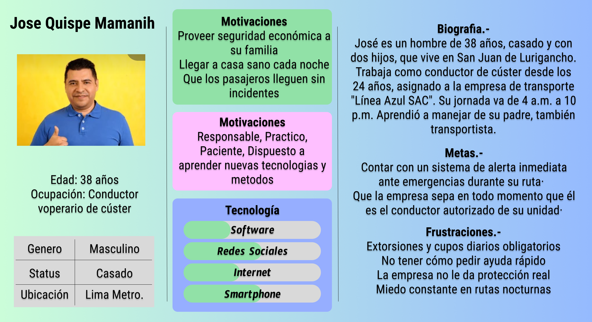

**Segmento #2: Empresas o consorcios de transporte público**

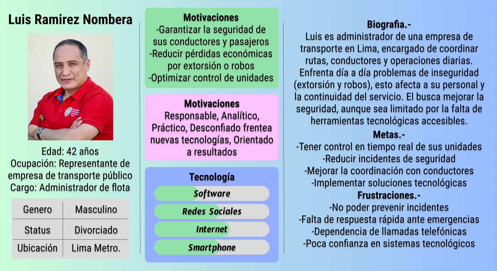

---

#### 2.3.2 User Task Matrix

Esta es una lista de actividades que nuestros usuarios completan. Esto nos ayudará a entender la importancia de las tareas que podríamos llevar a cabo dentro de nuestro producto.

**Segmento objetivo #1**

| Actividades | Frecuencia | Importancia |
|-------------|-----------|-------------|
| Iniciar jornada y verificar el estado de la unidad antes de salir | Con frecuencia | Alta |
| Confirmar la ruta asignada y horario de salida con la empresa | Con frecuencia | Alta |
| Cobrar pasaje y controlar el flujo de subida y bajada de pasajeros | Con frecuencia | Alta |
| Reportar incidentes o percances al encargado de la empresa | A veces | Alta |
| Evaluar zonas de riesgo durante la ruta y tomar desvíos si es necesario | Frecuente | Alta |
| Pagar cuota o cupo a personas externas que operan en la ruta | Frecuente | Media |
| Comunicarse con otros conductores vía celular ante situaciones de riesgo | A veces | Alta |
| Registrar el cierre de turno y entregar la unidad al siguiente conductor | Con frecuencia | Alta |

**Segmento objetivo #2 — Luis Ramirez Nombera**

| Actividades | Frecuencia | Importancia |
|-------------|-----------|-------------|
| Supervisar las unidades de transporte en ruta | Con frecuencia | Alta |
| Coordinar con conductores durante la jornada | Con frecuencia | Alta |
| Atender incidentes o reportes de seguridad | Con frecuencia | Alta |
| Comunicarse con autoridades (policía, emergencia) | A veces | Alta |
| Verificar documentación de conductores | A veces | Media |
| Gestionar problemas de extorsión o amenazas | Con frecuencia | Alta |
| Revisar estado operativo de las unidades | Con frecuencia | Alta |
| Recibir reportes de pasajeros o quejas | A veces | Media |
| Resolver problemas sin información en tiempo real | Con frecuencia | Alta |
| Evaluar implementación de nuevas tecnologías | A veces | Media |

---

#### 2.3.3 User Journey Mapping

Usaremos el User Journey Map para representar las etapas que nuestros usuarios pasan al interactuar por un cambio de turno.

Link: [Proyecto Open Source – Figma](#)

**Segmento objetivo #1 — José Mamani Quispe**

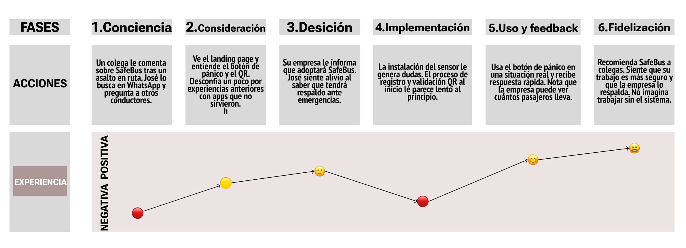


**Segmento objetivo #2 — Luis Ramirez Nomberax**

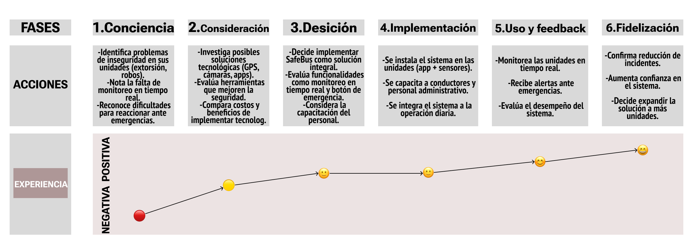

---

#### 2.3.4 Empathy Mapping

Para entender mejor a nuestros usuarios, usamos el Empathy Map, para ponernos en su lugar y entender mejor sus necesidades y deseos.

**#1er Segmento Objetivo:**

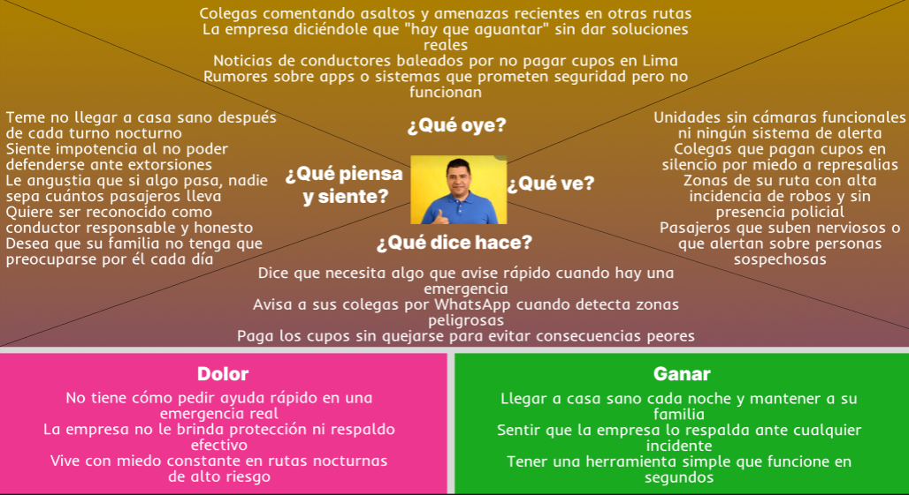

**#2do Segmento Objetivo:**

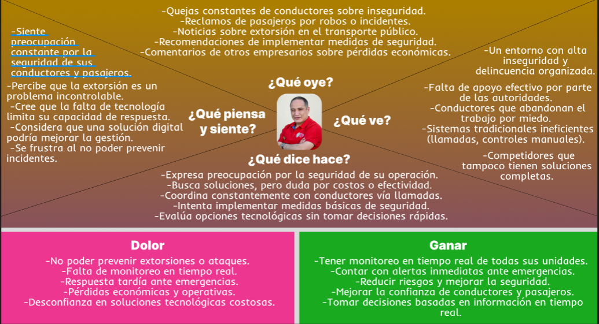

---

### 2.4 Big Picture Event Storming

**Step 1 — Unstructured Exploration**

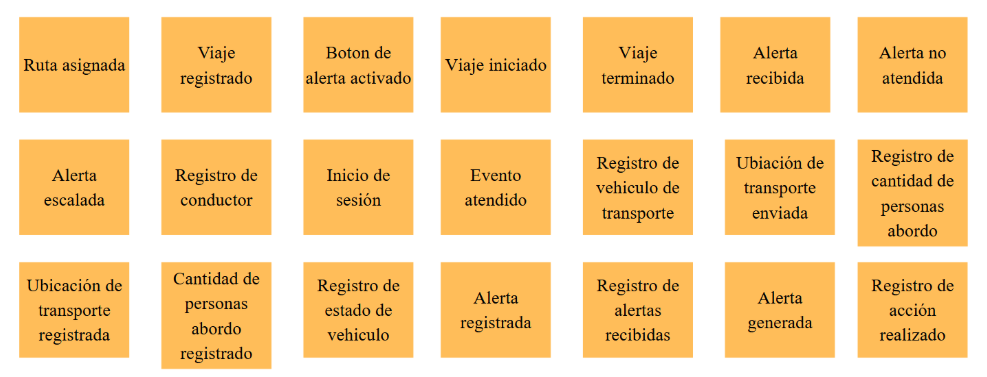

**Step 2 — Timelines**

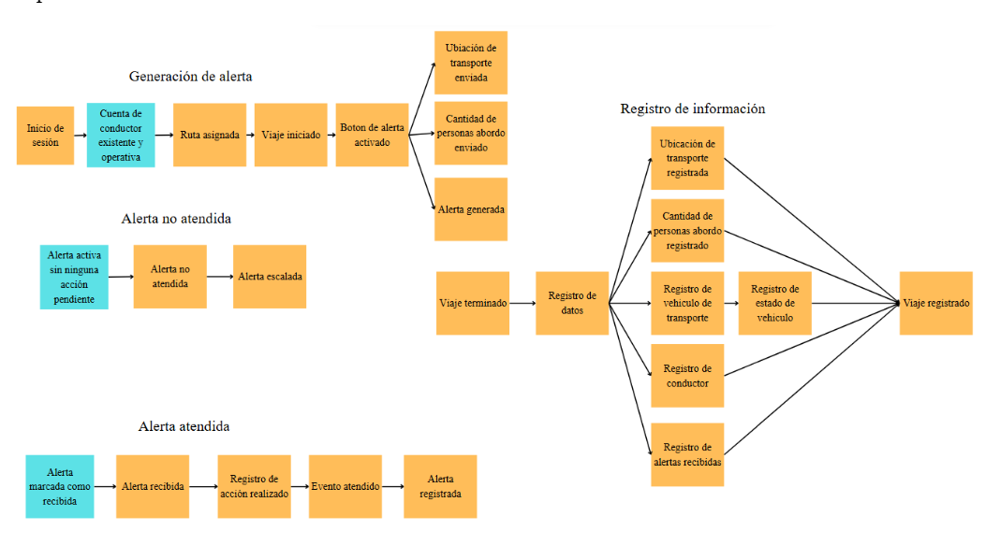

**Step 3 — Pain Points**

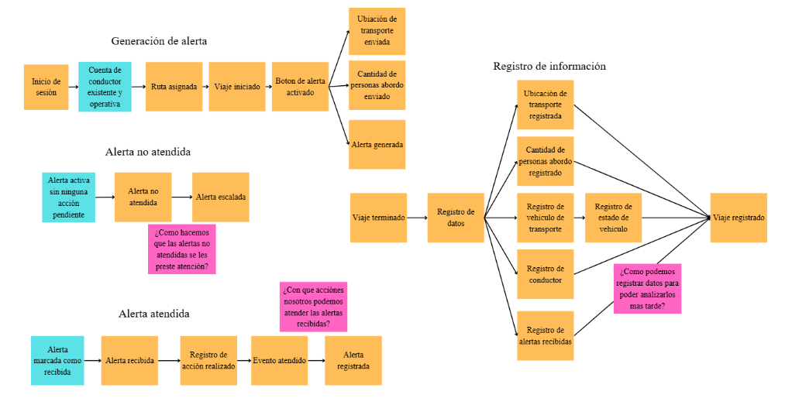

**Step 4 — Pivotal Points**

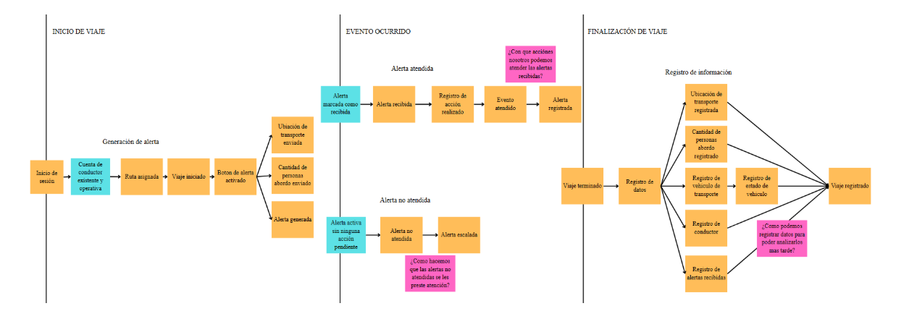

**Step 5 — Commands**

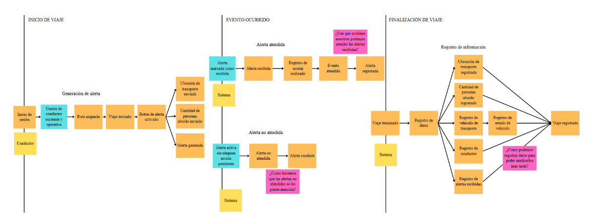

**Step 6 — Policies**

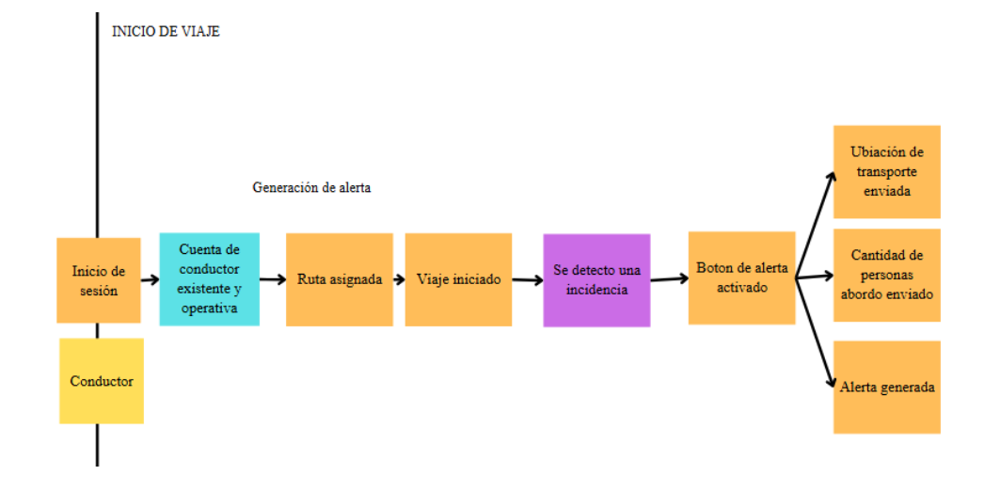

**Step 7 — Read Models**

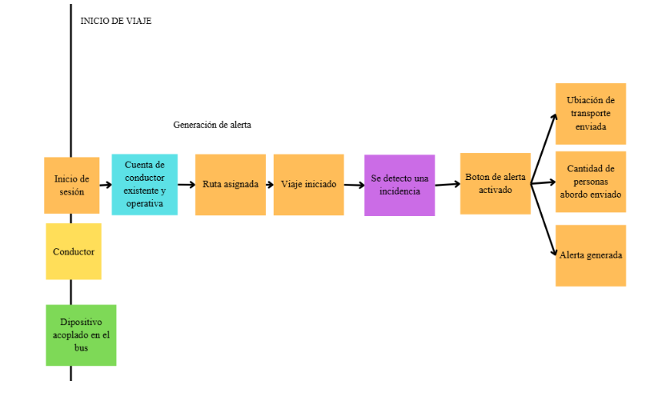

**Step 9 — Aggregates**

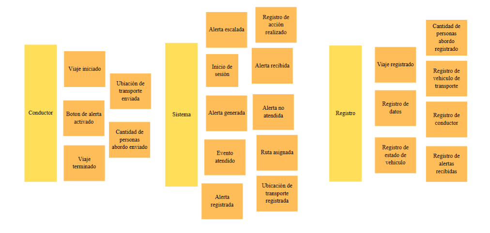

**Step 10**

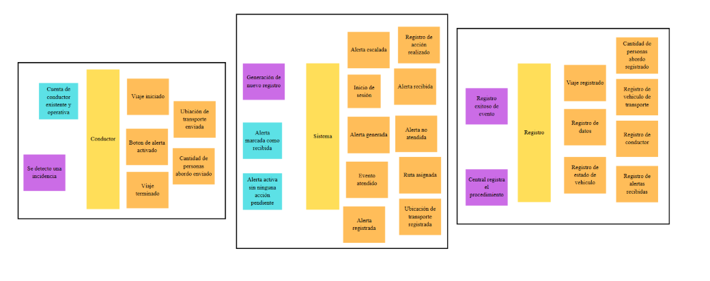

---

### 2.5 Ubiquitous Language

**Transport Unit (Unidad de Transporte):** Vehículo que forma parte del sistema y es objeto de monitoreo. Representa el elemento principal sobre el cual se realiza el seguimiento de ubicación, estado y eventos.

**Driver (Conductor):** Persona responsable de operar una unidad de transporte durante un recorrido. Está asociada a una unidad y puede generar eventos relevantes durante la operación.

**Route (Ruta):** Trayecto definido que sigue una unidad de transporte, incluyendo punto de inicio, paradas y destino final.

**Trip (Viaje):** Recorrido específico realizado por una unidad de transporte dentro de una ruta en un periodo determinado.

**Real-Time Monitoring (Monitoreo en Tiempo Real):** Seguimiento continuo de la ubicación y estado de las unidades, permitiendo observar su comportamiento durante la operación.

**Unit Status (Estado de Unidad):** Condición actual de una unidad dentro del sistema, como en operación, detenida o en situación de alerta.

**Security Event (Evento de Seguridad):** Situación relevante que ocurre durante un viaje y que puede afectar la operación o seguridad.

**Critical Alert (Alerta Crítica):** Notificación de alta prioridad generada ante una situación de riesgo que requiere atención inmediata.

**Panic Alert (Alerta de Pánico):** Señal de emergencia activada manualmente por el conductor o usuario ante una situación de peligro.

**Fleet (Flota):** Conjunto de unidades de transporte gestionadas dentro del sistema.

**Incident (Incidente):** Evento inesperado que afecta el desarrollo normal de un viaje, pudiendo requerir intervención o seguimiento.

**Tracking (Seguimiento):** Proceso de observar y registrar la ubicación y comportamiento de una unidad a lo largo del tiempo.

**Operational Control (Control Operativo):** Supervisión general de las unidades, viajes y eventos para asegurar el correcto funcionamiento del servicio.

**Service Interruption (Interrupción del Servicio):** Situación en la que una unidad deja de operar de manera parcial o total durante un viaje.

**Alert Level (Nivel de Alerta):** Clasificación de la gravedad de una alerta, que permite priorizar la atención de los eventos.

---

## Capítulo III: Requirements Specification

### 3.1 User Stories

#### Epics

| Epic ID | Título | Descripción |
|---------|--------|-------------|
| EPNN01 | Validaciones del sistema | Como sistema, quiero validar la identidad, autorización y vigencia de los conductores, para garantizar que solo usuarios habilitados operen los vehículos y asegurar la trazabilidad de cada servicio. |
| EPNN02 | Gestión de emergencias | Como sistema, quiero gestionar el envío, recepción y seguimiento de alertas de emergencia, para permitir una respuesta oportuna ante situaciones de riesgo durante el servicio. |
| EPNN03 | Conteo de pasajeros | Como sistema, quiero registrar y actualizar la cantidad de pasajeros a bordo en tiempo real, para disponer de información precisa que facilite la gestión de emergencias y el análisis del riesgo. |
| EPNN04 | Plataforma web | Como visitante, quiero acceder a información clara sobre la solución, sus beneficios y funcionalidades, para comprender la propuesta de valor del sistema y evaluar su utilidad. |
| EPNN05 | API RESTful del sistema | Como developer, quiero disponer de endpoints que permitan interactuar con las funcionalidades del sistema, para integrar servicios y asegurar el flujo correcto de información entre componentes. |

#### User Stories

| Story ID | Título | Descripción | Criterios de Aceptación | Epic ID |
|----------|--------|-------------|------------------------|---------|
| US01 | Verificar identidad del conductor | Como conductor, desea validar su identidad antes de iniciar el servicio para asegurar la trazabilidad del viaje. | **Éxito:** Given que el conductor inicia su jornada, When proporciona su código de verificación, Then el sistema valida su identidad correctamente. **Fracaso:** Given que el conductor inicia su jornada, When proporciona un código inválido, Then el sistema rechaza la validación. | EPNN01 |
| US02 | Registrar inicio de servicio | Como conductor, desea registrar el inicio del servicio para dejar evidencia del recorrido. | **Éxito:** Given que el conductor ha sido validado, When inicia el viaje, Then el sistema registra la hora y estado de inicio. **Fracaso:** Given que el conductor no ha sido validado, When intenta iniciar el servicio, Then el sistema impide el registro del inicio. | EPNN01 |
| US03 | Activar alerta de emergencia | Como conductor, desea enviar alerta de emergencia para notificar una situación de riesgo. | **Éxito:** Given que el conductor se encuentra en servicio, When activa una alerta, Then el sistema envía la alerta a la central. **Fracaso:** Given que no existe un servicio activo, When el conductor intenta activar una alerta, Then el sistema rechaza la solicitud. | EPNN02 |
| US04 | Recepción de alerta | Como sistema, desea notificar a la central de operaciones para gestionar la emergencia. | **Éxito:** Given que una alerta ha sido enviada, When el sistema la procesa, Then la central recibe la notificación. **Fracaso:** Given que la alerta contiene datos incompletos, When el sistema intenta procesarla, Then la alerta es rechazada. | EPNN02 |
| US05 | Registro de evento de emergencia | Como sistema, desea almacenar las alertas generadas para su seguimiento. | **Éxito:** Given que una alerta es válida, When es recibida por el sistema, Then se almacena el evento. **Fracaso:** Given que la alerta no cumple con el formato requerido, When se intenta registrar, Then el sistema no almacena el evento. | EPNN02 |
| US06 | Conteo de pasajeros automáticamente | Como sistema, desea contabilizar los pasajeros a bordo para estimar el riesgo en caso de emergencia. | **Éxito:** Given que el vehículo está en operación, When se detecta el ingreso de pasajeros, Then el sistema incrementa el conteo. **Fracaso:** Given que no hay datos de sensores disponibles, When se intenta actualizar el conteo, Then el sistema mantiene el último valor registrado. | EPNN03 |
| US07 | Consultar número de pasajeros | Como sistema, desea disponer del número de pasajeros para reportes de emergencia. | **Éxito:** Given que existe un viaje en curso, When se consulta el estado del vehículo, Then el sistema retorna la cantidad de pasajeros. **Fracaso:** Given que no existe un viaje activo, When se realiza la consulta, Then el sistema indica que no hay información disponible. | EPNN03 |
| US08 | Visualizar información del servicio | Como visitante, desea conocer la propuesta del sistema para entender sus beneficios. | **Éxito:** Given que el visitante accede al sitio web, When carga el contenido, Then el sistema muestra la información del servicio. **Fracaso:** Given que el contenido no está disponible, When el visitante accede al sitio, Then el sistema muestra un mensaje de indisponibilidad. | EPNN04 |
| US09 | Visualización de funcionalidades del servicio | Como visitante, desea conocer las funcionalidades principales del sistema para evaluar su utilidad. | **Éxito:** Given que el visitante navega por el sitio, When accede a la sección de funcionalidades, Then el sistema presenta las funcionalidades. **Fracaso:** Given que no existen funcionalidades registradas, When se accede a la sección, Then el sistema indica ausencia de contenido. | EPNN04 |
| US10 | Endpoint de validación de conductor | Como developer, desea validar la identidad del conductor mediante un servicio API. | **Éxito:** Given credenciales válidas del conductor, When se realiza la consulta al API, Then el sistema valida correctamente. **Fracaso:** Given una solicitud con identificador inválido, When el API procesa la solicitud, Then retorna un error de validación. | EPNN05 |
| US11 | Endpoint de inicio de servicio | Como developer, desea registrar el inicio de un servicio mediante API. | **Éxito:** Given una solicitud válida, When se envían los datos del servicio, Then el API registra el inicio correctamente. **Fracaso:** Given una solicitud inválida, When el API procesa los datos, Then se retorna un error. | EPNN05 |
| US12 | Endpoint de alerta de emergencia | Como developer, desea enviar alertas de emergencia mediante API. | **Éxito:** Given una solicitud con datos completos, When el API recibe la alerta, Then registra la alerta correctamente. **Fracaso:** Given una solicitud con datos incompletos, When el API procesa la alerta, Then retorna un error. | EPNN05 |
| US13 | Endpoint de conteo de pasajeros | Como developer, desea actualizar el número de pasajeros mediante API. | **Éxito:** Given una solicitud de actualización, When se envía el nuevo conteo, Then el API actualiza el valor correctamente. **Fracaso:** Given una solicitud de actualización, When ocurre un error interno, Then se envía un mensaje de error y se mantiene el último número de conteo. | EPNN05 |
| US14 | Validar autorización del conductor | Como sistema, desea verificar que el conductor esté autorizado para operar el vehículo asignado. | **Éxito:** Given que el conductor está registrado, When el sistema valida su autorización, Then se confirma que puede operar el vehículo. **Fracaso:** Given que el conductor no está autorizado, When el sistema valida su información, Then se rechaza la operación del vehículo. | EPNN01 |
| US15 | Asociación de conductor a vehículo | Como sistema, desea asociar un conductor a un vehículo para asegurar la trazabilidad. | **Éxito:** Given un conductor válido, When se realiza la asignación, Then el sistema registra la relación conductor–vehículo. **Fracaso:** Given datos inconsistentes, When se intenta asociar, Then el sistema rechaza la asignación. | EPNN01 |
| US16 | Consultar historial de emergencias | Como empresa, desea revisar el historial de alertas para análisis de seguridad. | **Éxito:** Given registros almacenados, When se consulta el historial, Then el sistema devuelve la lista de eventos. **Fracaso:** Given que no existen registros, When se realiza la consulta, Then el sistema indica ausencia de datos. | EPNN02 |
| US17 | Detección de sobrecapacidad | Como sistema, desea identificar cuando se supera la capacidad del vehículo para evitar altercados. | **Éxito:** Given un límite de capacidad definido, When el conteo lo supera, Then el sistema genera una alerta. **Fracaso:** Given que no existe límite definido, When se evalúa la ocupación, Then el sistema no genera alerta. | EPNN03 |
| US18 | Visualización de estadísticas de impacto | Como visitante, desea conocer estadísticas de seguridad para evaluar la solución. | **Éxito:** Given que existen datos disponibles, When el visitante accede a la sección, Then el sistema muestra estadísticas. **Fracaso:** Given que no hay datos disponibles, When se accede a la sección, Then el sistema muestra mensaje informativo. | EPNN04 |
| US19 | Endpoint para consulta de historial | Como developer, desea consultar el historial de eventos mediante API. | **Éxito:** Given una solicitud válida, When el API procesa la consulta, Then retorna los registros. **Fracaso:** Given una solicitud inválida, When el API procesa la consulta, Then retorna error. | EPNN05 |
| US20 | Endpoint para consulta del estado del vehículo | Como developer, desea consultar el estado actual del vehículo. | **Éxito:** Given un identificador válido, When se consulta el estado, Then el API retorna la información. **Fracaso:** Given un identificador inválido, When se realiza la consulta, Then el API retorna error. | EPNN05 |
| US21 | Navegar entre secciones | Como visitante, desea desplazarse entre secciones para explorar el contenido. | **Éxito:** Given que el visitante accede al sitio, When navega entre secciones, Then el sistema carga el contenido correspondiente. **Fracaso:** Given un error en la navegación, When se intenta acceder a una sección, Then el sistema indica error de acceso. | EPNN04 |
| US22 | Endpoint de autentificación | Como developer, desea autenticar solicitudes al sistema. | **Éxito:** Given credenciales válidas, When se envía la solicitud, Then el API autoriza el acceso. **Fracaso:** Given credenciales inválidas, When se envía la solicitud, Then el API rechaza el acceso. | EPNN05 |
| US23 | Confirmación de recepción de alerta | Como sistema, desea confirmar que la alerta fue recibida por la central. | **Éxito:** Given una alerta enviada, When la central la recibe, Then el sistema registra la confirmación. **Fracaso:** Given una alerta enviada, When no se recibe confirmación, Then el sistema marca la alerta como no confirmada. | EPNN02 |
| US24 | Reintentar envío de alerta | Como sistema, desea reenviar alertas no confirmadas. | **Éxito:** Given una alerta no confirmada, When el sistema ejecuta el reintento, Then la alerta es enviada nuevamente. **Fracaso:** Given múltiples intentos fallidos, When el sistema intenta reenviar, Then la alerta se marca como fallida. | EPNN02 |
| US25 | Registro de turno terminado | Como conductor, desea finalizar el servicio para cerrar el registro del viaje. | **Éxito:** Given un servicio en curso, When el conductor finaliza el servicio, Then el sistema registra el cierre. **Fracaso:** Given que no existe un servicio activo, When se intenta finalizar, Then el sistema rechaza la operación. | EPNN01 |
| US26 | Consulta de estado del servicio | Como conductor, desea conocer el estado actual del servicio. | **Éxito:** Given un servicio activo, When se consulta el estado, Then el sistema devuelve la información del servicio. **Fracaso:** Given que no hay servicio activo, When se realiza la consulta, Then el sistema indica que no existe información. | EPNN01 |
| US27 | Visualizar estado de unidades | Como empresa, desea conocer el estado de sus vehículos en operación. | **Éxito:** Given vehículos registrados, When se consulta su estado, Then el sistema muestra su información actual. **Fracaso:** Given que no hay vehículos registrados, When se realiza la consulta, Then el sistema indica ausencia de datos. | EPNN03 |
| US28 | Monitorear ocupación en tiempo real | Como empresa, desea monitorear la ocupación de los vehículos para gestionar riesgos. | **Éxito:** Given datos de pasajeros disponibles, When se genera el reporte, Then el sistema muestra la ocupación. **Fracaso:** Given datos incompletos, When se genera el reporte, Then el sistema indica error en la información. | EPNN03 |
| US29 | Visualización de segmento de clientes | Como visitante, desea identificar a qué tipo de usuarios está dirigido el sistema. | **Éxito:** Given contenido disponible, When el visitante accede a la sección, Then el sistema muestra los segmentos definidos. **Fracaso:** Given que no existe contenido, When se accede a la sección, Then el sistema muestra un mensaje informativo. | EPNN04 |
| US30 | Visualización de misión y visión | Como visitante, desea conocer la misión y visión de la startup. | **Éxito:** Given que el contenido está disponible, When el visitante accede a la sección, Then el sistema muestra la misión y visión. **Fracaso:** Given que el contenido no está disponible, When se accede, Then el sistema muestra un mensaje de error. | EPNN04 |
| US31 | Endpoint de finalización de servicio | Como developer, desea finalizar un servicio mediante API. | **Éxito:** Given una solicitud válida, When el API procesa la finalización, Then el servicio se cierra correctamente. **Fracaso:** Given una solicitud inválida, When el API procesa la solicitud, Then retorna un error. | EPNN05 |
| US32 | Endpoint de consulta de ocupación | Como developer, desea consultar la ocupación mediante API. | **Éxito:** Given un identificador válido, When se realiza la consulta, Then el API retorna el número de pasajeros. **Fracaso:** Given un identificador inválido, When se consulta, Then el API retorna error. | EPNN05 |
| US33 | Notificar múltiples destinos | Como sistema, desea enviar alertas a múltiples destinatarios. | **Éxito:** Given una alerta generada, When el sistema la procesa, Then la envía a todos los destinatarios definidos. **Fracaso:** Given destinatarios no válidos, When el sistema intenta enviar la alerta, Then registra el fallo de envío. | EPNN02 |
| US34 | Registro de tiempo de respuesta | Como sistema, desea medir el tiempo de respuesta ante una alerta. | **Éxito:** Given una alerta enviada, When es atendida por la central, Then el sistema registra el tiempo de respuesta. **Fracaso:** Given una alerta no atendida, When se evalúa el evento, Then el sistema registra ausencia de respuesta. | EPNN02 |
| US35 | Calcular promedio de pasajeros | Como empresa, desea conocer el promedio de pasajeros por viaje. | **Éxito:** Given datos históricos disponibles, When se realiza el cálculo, Then el sistema devuelve el promedio. **Fracaso:** Given datos insuficientes, When se realiza el cálculo, Then el sistema indica que no puede calcularlo. | EPNN03 |
| US36 | Detección de variaciones anómalas | Como sistema, desea identificar cambios inusuales en el número de pasajeros. | **Éxito:** Given datos consistentes, When se detecta una variación significativa, Then el sistema genera una alerta. **Fracaso:** Given datos inconsistentes, When se analiza la variación, Then el sistema descarta el evento. | EPNN03 |
| US37 | Visualizar problemática del transporte | Como visitante, desea entender el problema que resuelve la solución. | **Éxito:** Given contenido disponible, When accede a la sección, Then el sistema presenta la problemática. **Fracaso:** Given contenido no disponible, When accede a la sección, Then el sistema muestra un mensaje informativo. | EPNN04 |
| US38 | Visualizar propuesta de valor | Como visitante, desea conocer la propuesta de valor del sistema. | **Éxito:** Given contenido definido, When accede a la sección, Then el sistema presenta la propuesta. **Fracaso:** Given contenido incompleto, When accede a la sección, Then el sistema muestra un mensaje de falta de información. | EPNN04 |
| US39 | Validar unidad de conductor en servicio | Como sistema, desea asegurar que un conductor no opere múltiples vehículos simultáneamente. | **Éxito / Fracaso:** *[Pendiente de completar]* | EPNN01 |
| US40 | Clasificación de alertas | Como sistema, desea clasificar alertas según su nivel de gravedad. | **Éxito:** Given una alerta generada, When el sistema evalúa su tipo, Then asigna un nivel de prioridad. **Fracaso:** Given datos insuficientes, When el sistema intenta clasificar, Then asigna prioridad por defecto. | EPNN02 |
| US41 | Escalación de alertas no atendidas | Como sistema, desea escalar alertas que no han sido atendidas. | **Éxito:** Given una alerta sin respuesta, When se supera el tiempo límite, Then el sistema escala la alerta a otro nivel. **Fracaso:** Given una alerta atendida, When se evalúa el tiempo, Then el sistema no realiza escalamiento. | EPNN02 |
| US42 | Registro de ubicación del evento | Como sistema, desea almacenar la ubicación de una alerta de emergencia. | **Éxito:** Given una alerta con datos de ubicación, When se procesa el evento, Then el sistema guarda la ubicación. **Fracaso:** Given una alerta sin ubicación, When se procesa el evento, Then el sistema registra la ausencia de datos. | EPNN02 |
| US43 | Seguimiento de ubicación del vehículo designado al conductor | Como empresa, desea contar con un seguimiento de ubicación de la unidad. | **Éxito / Fracaso:** *[Pendiente de completar]* | — |
| US44 | Comparación de ocupantes entre viajes | Como empresa, desea conocer la cantidad de personas en distintas unidades. | **Éxito:** Given múltiples registros disponibles, When se realiza la comparación, Then el sistema muestra diferencias de ocupación. **Fracaso:** Given datos insuficientes, When se intenta comparar, Then el sistema indica que no es posible. | EPNN03 |
| US45 | Visualización de beneficios de sistema | Como visitante, desea conocer los beneficios del sistema. | **Éxito:** Given contenido disponible, When accede a la sección, Then el sistema presenta los beneficios. **Fracaso:** Given contenido no disponible, When accede, Then el sistema muestra un mensaje informativo. | EPNN04 |
| US46 | Visualización de equipo de trabajo | Como visitante, desea conocer al equipo detrás de la solución. | **Éxito:** Given información registrada, When el visitante accede a la sección, Then el sistema muestra el equipo. **Fracaso:** Given ausencia de información, When se accede, Then el sistema muestra un mensaje de falta de contenido. | EPNN04 |
| US47 | Endpoint de actualización de conductor | Como developer, desea actualizar información de conductores mediante API. | **Éxito:** Given datos válidos, When se envía la solicitud, Then el API actualiza la información. **Fracaso:** Given datos inválidos, When se envía la solicitud, Then el API retorna error. | EPNN05 |
| US48 | Endpoint de eliminación lógica | Como developer, desea desactivar registros sin eliminarlos definitivamente. | **Éxito:** Given un registro existente, When se solicita su desactivación, Then el API cambia su estado a inactivo. **Fracaso:** Given un registro inexistente, When se solicita la operación, Then el API retorna error. | EPNN05 |
| US49 | Endpoint de métricas del sistema | Como developer, desea obtener métricas generales del sistema. | **Éxito:** Given datos disponibles, When se consulta el endpoint, Then el API retorna métricas. **Fracaso:** Given falta de datos, When se realiza la consulta, Then el API retorna respuesta vacía o error. | EPNN05 |
| US50 | Endpoint de validación de permisos | Como developer, desea validar permisos antes de la ejecución de operaciones. | **Éxito:** Given permisos válidos, When se procesa la solicitud, Then el API autoriza la operación. **Fracaso:** Given permisos insuficientes, When se procesa la solicitud, Then el API rechaza la operación. | EPNN05 |

---

### 3.2 Impact Map
Segmento 1:
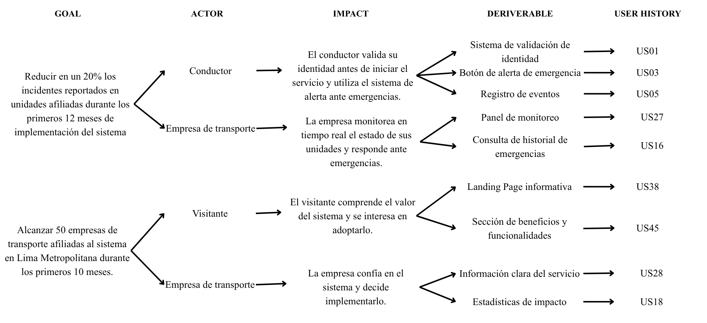

Segmento 2:

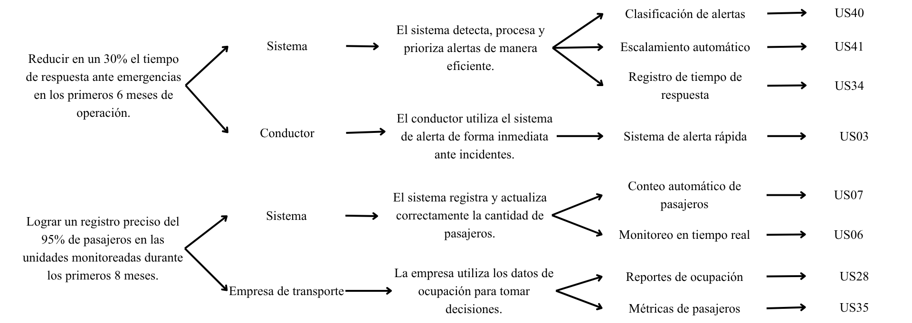
---

### 3.3 Product Backlog

| # | US_ID | Título | Descripción | Story Points |
|---|-------|--------|-------------|-------------|
| 1 | US05 | Registro de evento de emergencia | Como sistema, desea almacenar las alertas generadas para su seguimiento. | 8 |
| 2 | US10 | Endpoint de validación de conductor | Como developer, desea validar la identidad del conductor mediante un servicio API. | 8 |
| 3 | US12 | Endpoint de alerta de emergencia | Como developer, desea enviar alertas de emergencia mediante API. | 8 |
| 4 | US27 | Visualizar estado de unidades | Como empresa, desea conocer el estado de sus vehículos en operación. | 8 |
| 5 | US15 | Asociación de conductor a vehículo | Como sistema, desea asociar un conductor a un vehículo para asegurar la trazabilidad. | 8 |
| 6 | US40 | Clasificación de alertas | Como sistema, desea clasificar alertas según su nivel de gravedad. | 8 |
| 7 | US01 | Verificar identidad del conductor | Como conductor, desea validar su identidad antes de iniciar el servicio. | 5 |
| 8 | US02 | Registrar inicio de servicio | Como conductor, desea registrar el inicio del servicio para dejar evidencia del recorrido. | 5 |
| 9 | US04 | Recepción de alerta | Como sistema, desea notificar a la central de operaciones para gestionar la emergencia. | 5 |
| 10 | US06 | Conteo de pasajeros automáticamente | Como sistema, desea contabilizar los pasajeros a bordo. | 5 |
| 11 | US07 | Consultar número de pasajeros | Como sistema, desea disponer del número de pasajeros para reportes de emergencia. | 5 |
| 12 | US08 | Visualizar información del servicio | Como visitante, desea conocer la propuesta del sistema. | 5 |
| 13 | US09 | Visualización de funcionalidades del servicio | Como visitante, desea conocer las funcionalidades principales del sistema. | 5 |
| 14 | US11 | Endpoint de inicio de servicio | Como developer, desea registrar el inicio de un servicio mediante API. | 5 |
| 15 | US14 | Validar autorización del conductor | Como sistema, desea verificar que el conductor esté autorizado. | 5 |
| 16 | US17 | Detección de sobrecapacidad | Como sistema, desea identificar cuando se supera la capacidad del vehículo. | 5 |
| 17 | US21 | Navegar entre secciones | Como visitante, desea desplazarse entre secciones para explorar el contenido. | 5 |
| 18 | US41 | Escalación de alertas no atendidas | Como sistema, desea escalar alertas que no han sido atendidas. | 5 |
| 19 | US38 | Visualizar propuesta de valor | Como visitante, desea conocer la propuesta de valor del sistema. | 5 |
| 20 | US39 | Validar unidad de conductor en servicio | Como sistema, desea asegurar que un conductor no opere múltiples vehículos simultáneamente. | 5 |
| 21 | US44 | Comparación de ocupantes entre viajes | Como empresa, desea conocer la cantidad de personas en distintas unidades. | 5 |
| 22 | US50 | Endpoint de validación de permisos | Como developer, desea validar permisos antes de la ejecución de operaciones. | 5 |
| 23 | US13 | Endpoint de conteo de pasajeros | Como developer, desea actualizar el número de pasajeros mediante API. | 3 |
| 24 | US03 | Activar alerta de emergencia | Como conductor, desea enviar alerta de emergencia para notificar una situación de riesgo. | 3 |
| 25 | US16 | Consultar historial de emergencias | Como empresa, desea revisar el historial de alertas para análisis de seguridad. | 3 |
| 26 | US20 | Endpoint para consulta del estado del vehículo | Como developer, desea consultar el estado actual del vehículo. | 3 |
| 27 | US22 | Endpoint de autentificación | Como developer, desea autenticar solicitudes al sistema. | 3 |
| 28 | US23 | Confirmación de recepción de alerta | Como sistema, desea confirmar que la alerta fue recibida por la central. | 3 |
| 29 | US49 | Endpoint de métricas del sistema | Como developer, desea obtener métricas generales del sistema. | 3 |
| 30 | US25 | Registro de turno terminado | Como conductor, desea finalizar el servicio para cerrar el registro del viaje. | 3 |
| 31 | US26 | Consulta de estado del servicio | Como conductor, desea conocer el estado actual del servicio. | 3 |
| 32 | US24 | Reintentar envío de alerta | Como sistema, desea reenviar alertas no confirmadas. | 3 |
| 33 | US47 | Endpoint de actualización de conductor | Como developer, desea actualizar información de conductores mediante API. | 3 |
| 34 | US46 | Visualización de equipo de trabajo | Como visitante, desea conocer al equipo detrás de la solución. | 3 |
| 35 | US45 | Visualización de beneficios de sistema | Como visitante, desea conocer los beneficios del sistema. | 3 |
| 36 | US42 | Registro de ubicación del evento | Como sistema, desea almacenar la ubicación de una alerta de emergencia. | 3 |
| 37 | US43 | Seguimiento de ubicación del vehículo designado al conductor | Como empresa, desea contar con un seguimiento de ubicación de la unidad. | 3 |
| 38 | US19 | Endpoint para consulta de historial | Como developer, desea consultar el historial de eventos mediante API. | 2 |
| 39 | US18 | Visualización de estadísticas de impacto | Como visitante, desea conocer estadísticas de seguridad para evaluar la solución. | 2 |
| 40 | US30 | Visualización de misión y visión | Como visitante, desea conocer la misión y visión de la startup. | 2 |
| 41 | US31 | Endpoint de finalización de servicio | Como developer, desea finalizar un servicio mediante API. | 2 |
| 42 | US48 | Endpoint de eliminación lógica | Como developer, desea desactivar registros sin eliminarlos definitivamente. | 2 |
| 43 | US29 | Visualización de segmento de clientes | Como visitante, desea identificar a qué tipo de usuarios está dirigido el sistema. | 1 |
| 44 | US28 | Monitorear ocupación en tiempo real | Como empresa, desea monitorear la ocupación de los vehículos para gestionar riesgos. | 1 |
| 45 | US32 | Endpoint de consulta de ocupación | Como developer, desea consultar la ocupación mediante API. | 1 |
| 46 | US33 | Notificar múltiples destinos | Como sistema, desea enviar alertas a múltiples destinatarios. | 1 |
| 47 | US34 | Registro de tiempo de respuesta | Como sistema, desea medir el tiempo de respuesta ante una alerta. | 1 |
| 48 | US35 | Calcular promedio de pasajeros | Como empresa, desea conocer el promedio de pasajeros por viaje. | 1 |
| 49 | US36 | Detección de variaciones anómalas | Como sistema, desea identificar cambios inusuales en el número de pasajeros. | 1 |
| 50 | US37 | Visualizar problemática del transporte | Como visitante, desea entender el problema que resuelve la solución. | 1 |

---

## Capítulo IV: Product Design

### 4.1. Style Guidelines

Una guía de estilos es un documento que enumera todas las elecciones y convenciones adoptadas en la empresa para mantener alineados al equipo de diseño y desarrollo.

#### 4.1.1. General Style Guidelines

El estilo visual de la aplicación está orientado a transmitir seguridad, control y monitoreo. La decisión del diseño prioriza la claridad de la información, la rapidez de interpretación y la confianza del usuario.

**Branding:**

La identidad de nuestra aplicación se construye como una plataforma tecnológica, confiable y eficiente, orientada a la supervisión y gestión de transporte. Se busca que el usuario perciba el sistema como: Seguro, Preciso, Moderno y Siempre activo.

**Color Palette:**

La paleta de colores de SafeBus se despliega en tonos oscuros y con contrastes, principalmente usando el negro y verde neón, también el blanco y acentos de otros colores.

- **Negro:** Base de la interfaz. Aporta elegancia, seriedad y profundidad, reforzando la percepción de control, vigilancia y tecnología.
- **Verde (#C3F400):** Color principal de acento. Usado en botones, indicadores y títulos. Se asocia a sistemas digitales, monitoreo y confirmación. El verde secundario (#596D0B) genera contraste.
- **Rojo:** Usado de manera puntual en elementos críticos para transmitir alerta, urgencia, peligro o acción inmediata.

**Typography:**

Se emplean tipografías **Space Grotesk** e **Inter**, debido a su alta legibilidad en entornos digitales:

- Títulos: Space Grotesk Bold (96px)
- Subtítulos: Space Grotesk Bold (60–48px)
- Párrafos: Inter Light/Bold (24–12px)

**Spacing y Layout:**

- Base unit: Múltiplos de px para paddings y spacing.
- Grid: Márgenes de 24px para mantener armonía en la vista.
- Breakpoints: Ancho fijo de 1440px y alto de 1024px para web.

**Componentes visuales:**

- Botones: Verde para acciones principales, rojo para acciones críticas, gris para acciones secundarias.
- Cards: Contenedores de información organizados y fáciles de entender.
- Iconografía: Estilo simple y de fácil reconocimiento.

**Tono de comunicación:**

Serio, formal, respetuoso y sereno. Priorizamos mensajes directos, claros y profesionales.

**Principios de diseño:**

- Claridad: Información comprensible de forma inmediata.
- Jerarquía visual: Elementos importantes destacan primero.
- Consistencia: Uso uniforme de colores, tipografías y componentes.
- Accesibilidad: Buen contraste y legibilidad.
- Feedback inmediato: El sistema responde visualmente a las acciones del usuario.

#### 4.1.2. Web Style Guidelines

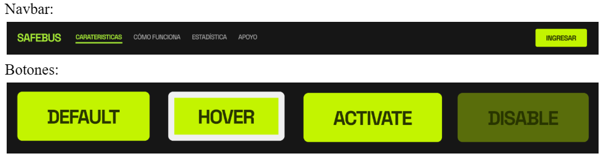

---

### 4.2. Information Architecture

La Arquitectura de la Información de UrbanGuard está diseñada para organizar de manera lógica y clara el contenido, asegurando una navegación fluida y eficiente.

#### 4.2.1. Organization Systems

Para la Landing Page se emplea una organización jerárquica y secuencial.

| Nivel | Sección | Propósito dentro de la arquitectura |
|-------|---------|--------------------------------------|
| Global | Header (Navbar) | Permite acceso rápido a las secciones principales y a la pantalla de inicio de sesión. |
| Principal | Hero section | Presenta la propuesta de valor de UrbanGuard con botones de llamada a la acción. |
| Contextual | Problem section | Explica los problemas operativos del transporte público. |
| Functional | Main features section | Agrupa las funcionalidades principales: Verificación QR, Botón de pánico, Conteo de pasajeros, Monitoreo real, Alertas inteligentes. |
| Explicativo | How it works section | Explica el proceso de funcionamiento de UrbanGuard en 4 etapas. |
| Persuasivo | User benefits section | Resume los beneficios operativos directos para los transportistas. |
| Confianza | Client trust section | Explica cómo UrbanGuard mejora la seguridad y genera confianza. |
| Comparativo | Comparative section | Contrasta el sistema con otros métodos tradicionales de seguridad. |
| Comercial | Pricing section | Presenta los planes disponibles. |
| Soporte | FAQ section | Resuelve dudas frecuentes sobre el uso del sistema. |
| Conversión | Next step section | Refuerza el llamado a la acción. |
| Cierre | Footer section | Repite accesos clave, enlaces de contacto y redes sociales. |

#### 4.2.2. Labeling Systems

| Etiqueta | Tipo | Uso dentro de la landing |
|----------|------|--------------------------|
| Cómo funciona | Navegación principal | Lleva al usuario a la explicación del flujo de funcionamiento de UrbanGuard. |
| Beneficios | Navegación principal | Dirige a la sección de beneficios operativos. |
| Planes | Navegación principal | Permite revisar las opciones de suscripción. |
| FAQ | Navegación principal | Abre la sección de preguntas frecuentes. |
| Iniciar sesión | Acción de acceso | Permite que un usuario existente acceda a su cuenta. |
| Comenzar ahora | CTA principal | Dirige al visitante hacia el flujo de registro. |
| Ver características | CTA secundario | Lleva al visitante a la sección de características. |
| Plan Free | Etiqueta comercial | Identifica el plan gratuito con funciones básicas. |
| Plan Control | Etiqueta comercial | Identifica el plan con mayores funciones operativas. |
| Comparativa breve | Encabezado de sección | Presenta una comparación entre UrbanGuard y otros sistemas. |
| Da el siguiente paso | CTA final | Refuerza el llamado a registrarse o revisar los planes. |
| Explorar | Footer | Agrupa enlaces hacia secciones informativas adicionales. |
| Siguiente paso | Footer | Agrupa enlaces hacia el proceso de registro. |

#### 4.2.3. SEO Tags and Meta Tags

```html
<title>UrbanGuard - Seguridad para el Transporte Público</title>
<meta charset="UTF-8">
<meta name="viewport" content="width=device-width, initial-scale=1.0" />
<meta name="description" content="UrbanGuard ofrece soluciones de seguridad para el transporte público, con verificación de conductores, monitoreo en tiempo real y alertas de emergencia.">
<link rel="icon" type="image/png" href="/assets/urban-guard-icon.png" />
<link rel="preconnect" href="https://fonts.googleapis.com" />
<link rel="preconnect" href="https://fonts.gstatic.com" crossorigin />
<meta name="author" content="UrbanGuard Team">
<meta name="copyright" content="UrbanGuard 2026">
<meta property="og:title" content="UrbanGuard - Seguridad para el Transporte Público">
<meta property="og:description" content="Aumenta la seguridad en el transporte público con verificación de conductores y monitoreo en tiempo real.">
<meta property="og:type" content="website">
```

#### 4.2.4. Searching Systems

**Primera aproximación: Búsqueda incompleta conocida.**
Permite que los usuarios realicen búsquedas aunque no conozcan la información completa, utilizando filtración de palabras existentes en una lista de conductores.

**Segunda aproximación: Búsqueda mediante filtros.**
Permite filtrar por categoría a todos los conductores, mostrando solo los de la categoría seleccionada.

#### 4.2.5. Navigation Systems

- **Menús de navegación:** En versión web, ubicados en header y footer. En versión móvil, menú tipo "hamburguesa".
- **Etiquetas:** Permiten categorizar y agrupar contenidos por temas o funcionalidades.
- **Barras de búsqueda:** Para perfiles con permisos de administrador, permite ubicar conductores por nombre o etiqueta.

---

### 4.3. Landing Page UI Design

#### 4.3.1. Landing Page Wireframe

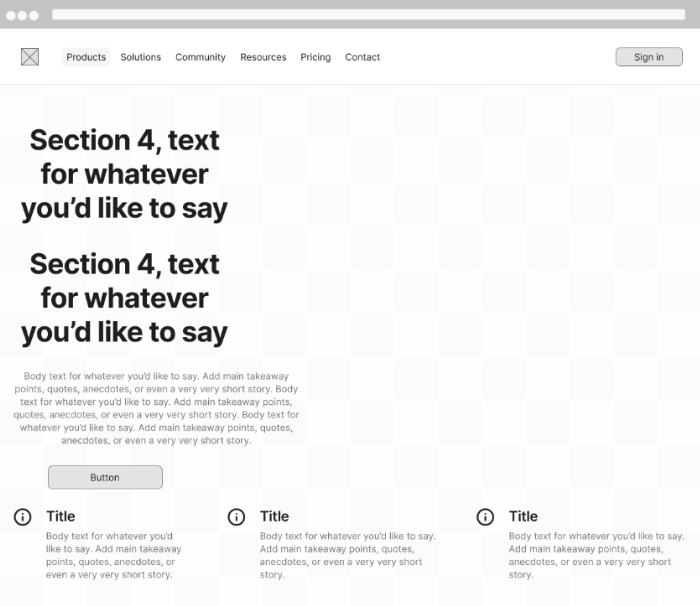

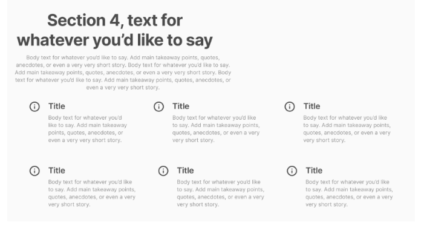

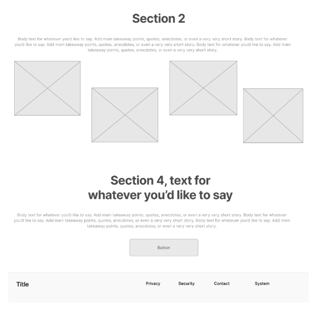

#### 4.3.2. Landing Page Mock-up

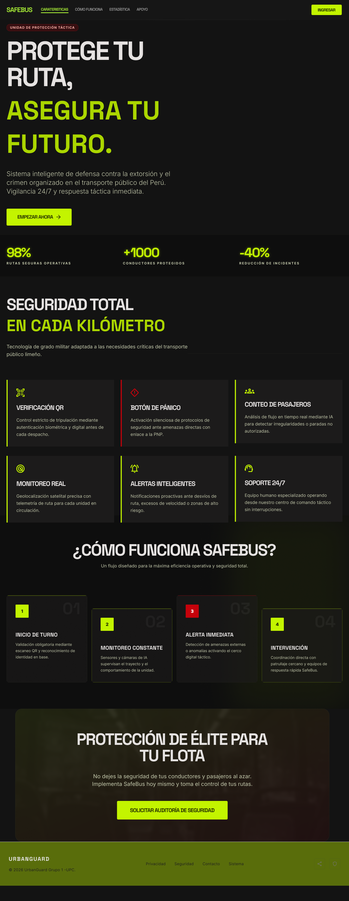

---

### 4.4. Web Applications UX/UI Design

#### 4.4.1. Web Applications Wireframes

Los wireframes de la aplicación web fueron diseñados para definir la estructura funcional de las principales pantallas del sistema. En esta etapa se identificaron los elementos clave de interacción, como paneles de control, visualización de datos, navegación entre secciones y componentes necesarios para la gestión del sistema.

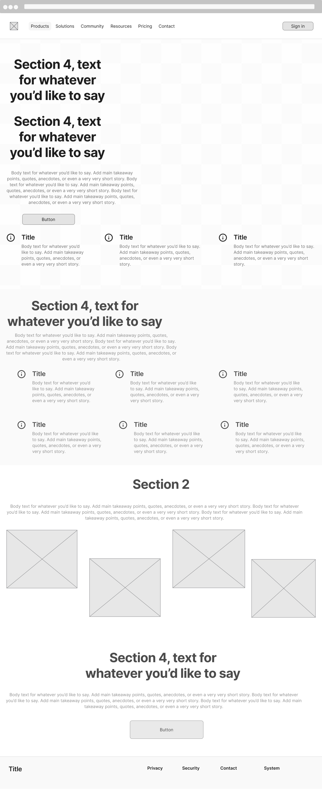

#### 4.4.2. Web Applications Wireflow Diagrams

Los wireflow diagrams representan el flujo de interacción del usuario dentro de la aplicación, mostrando la navegación entre pantallas y las acciones que el usuario puede realizar en cada etapa.

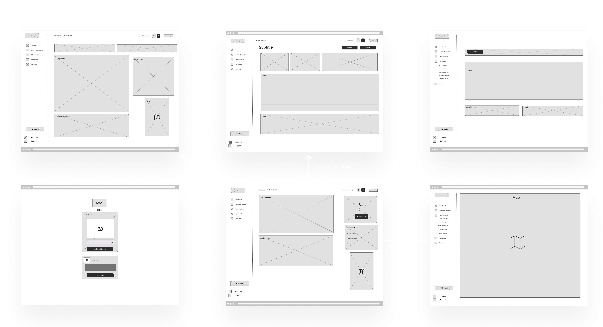

#### 4.4.2. Web Applications Mock-ups


#### 4.4.3. Web Applications User Flow Diagrams

**User flow 1: ADMIN**

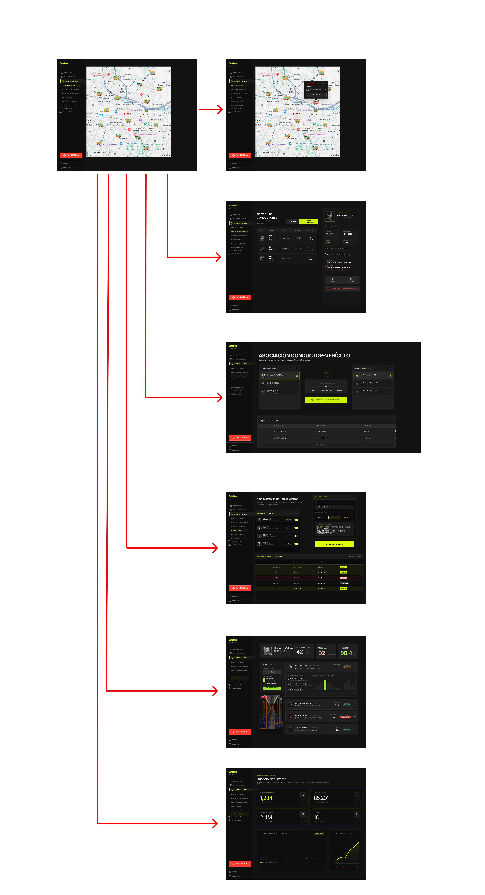

**User Flow 2: Conductor**


---

## 4.5. Web Applications Prototyping

### Introducción y criterios de diseño

El prototipo interactivo de SafeBus simula la navegación y los principales flujos de interacción de la aplicación web, permitiendo evaluar la coherencia de la experiencia de usuario antes del desarrollo, identificar puntos de fricción y validar las decisiones de arquitectura de información tomadas a lo largo del capítulo 4. El prototipo fue construido en Figma utilizando conexiones de prototipado entre frames, transiciones y overlays para representar de forma fiel los comportamientos especificados en los User Flow Diagrams.

Los criterios de diseño que guiaron las decisiones de interacción y navegación del prototipo son los siguientes:

**Orientación al rol y al flujo operativo de urgencia:** La arquitectura de navegación prioriza el acceso inmediato a las tareas de mayor frecuencia e importancia definidas en el User Task Matrix del capítulo 2. Para el conductor, el botón de pánico es el elemento más prominente de su pantalla principal, visible desde el primer momento en que inicia sesión. Para el operador de la central, el panel de alertas activas clasificadas por nivel de gravedad es la primera vista al iniciar sesión. Para el administrador de la empresa, el dashboard con el estado en tiempo real de toda la flota carga como vista inicial sin pasos adicionales.

**Consistencia en los patrones de interacción:** Se emplearon cuatro patrones de navegación a lo largo de toda la aplicación: (1) Navegación por Sidebar para el cambio entre módulos principales según el rol activo — conductor, central o empresa; (2) Drawer lateral deslizante para formularios de registro y edición que no requieren cambio de contexto, como el registro de un nuevo conductor o la asignación de vehículo; (3) Modal central para acciones críticas que requieren confirmación del usuario, como finalizar el turno, desactivar un conductor o escalar una alerta no atendida; y (4) Toast o Snackbar para retroalimentación inmediata de resultado sin interrumpir el flujo operativo, como la confirmación de recepción de una alerta de pánico.

**Prevención de errores en acciones de alto impacto:** En operaciones con consecuencias irreversibles o de alto impacto operativo, como activar el botón de pánico, finalizar un turno activo, desactivar un conductor o escalar una alerta, el prototipo incluye una capa adicional de confirmación mediante modal que describe el impacto de la acción antes de ejecutarla. Esto es especialmente crítico en el contexto de SafeBus, donde una acción incorrecta puede comprometer la trazabilidad de un incidente real de seguridad en el transporte público.

**Retroalimentación inmediata en tiempo real:** Todos los cambios en el estado del sistema que afectan al usuario se comunican de forma inmediata: el panel de alertas de la central se actualiza al recibirse una nueva alerta de pánico, el contador de pasajeros se actualiza en tiempo real al registrarse cada abordaje o bajada, y los campos de formulario muestran validación inline sin necesidad de enviar el formulario completo. Las alertas no confirmadas muestran un indicador de reintento automático visible en el panel de la central.

**Accesibilidad y objetivos táctiles:** Todos los elementos interactivos del prototipo tienen dimensiones mínimas de 48 × 48 px, especialmente relevantes para conductores que interactúan con la aplicación desde su smartphone durante la jornada de manejo. El botón de pánico tiene dimensiones ampliadas y color rojo con alto contraste para garantizar su activación inmediata bajo condiciones de estrés. Los contrastes de color en todos los estados cumplen el mínimo WCAG 2.1 AA.


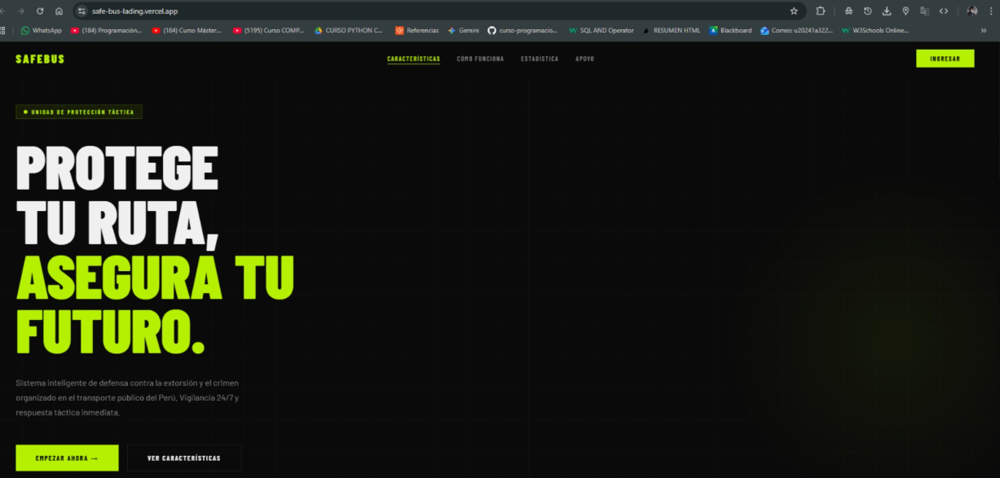

### Flujos de interacción cubiertos por el prototipo

**Flujo 1 — Verificación e inicio de servicio del conductor:** Comprende la pantalla de verificación de identidad mediante código QR, la validación de autorización del conductor para el vehículo asignado, la validación de que el conductor no esté operando otra unidad simultáneamente, la pantalla de servicio activo con el botón de pánico, el contador de pasajeros en tiempo real y el botón de finalización de turno con confirmación modal.

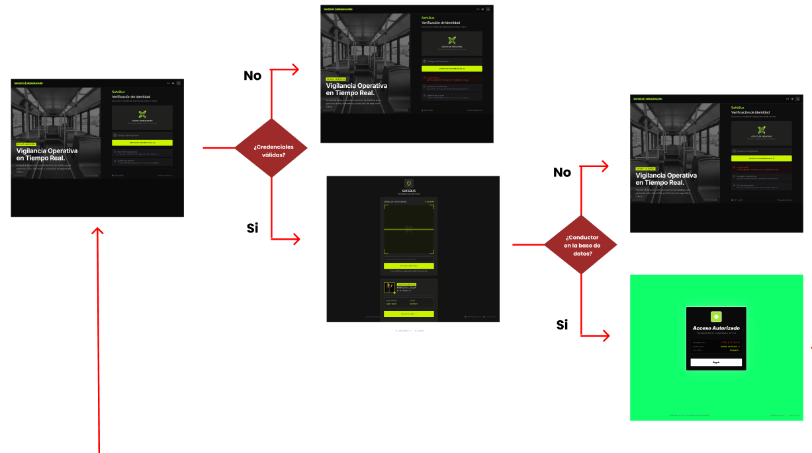

**Flujo 2 — Gestión de pasajeros y detección de anomalías:** Comprende la pantalla de conteo de pasajeros con botones de abordaje y bajada, la alerta visual al superar la capacidad máxima del vehículo, la detección y notificación de variaciones anómalas en el número de pasajeros y la consulta del estado actual del servicio.

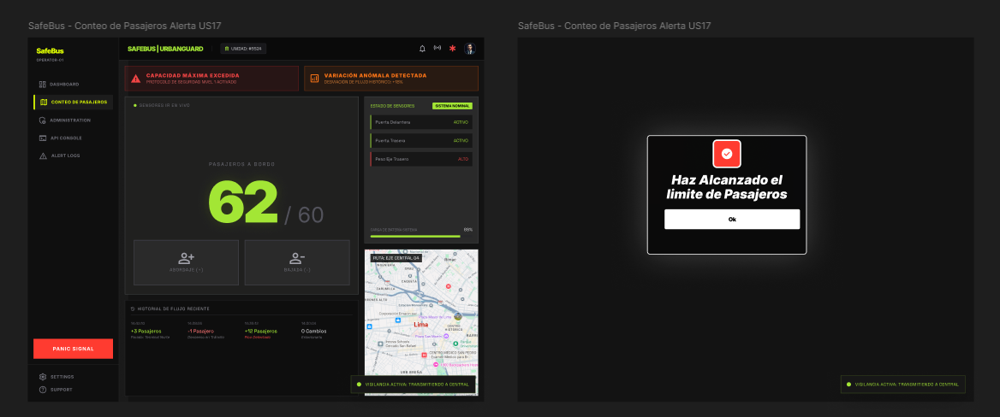

**Flujo 3 — Activación y gestión de alertas de emergencia:** Comprende la activación del botón de pánico por el conductor, la confirmación de envío con indicador de reintento automático si no hay respuesta, la recepción de la alerta en el panel de la central con clasificación automática por nivel de gravedad, el detalle de la alerta con conductor, vehículo, número de pasajeros y ubicación, el registro del tiempo de respuesta al confirmar la atención y el escalamiento automático de alertas no atendidas con notificación a múltiples destinatarios.

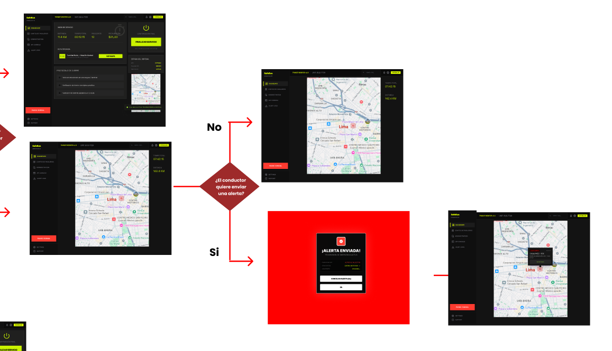

**Flujo 4 — Monitoreo de flota por la empresa administradora:** Comprende el dashboard de estado en tiempo real de todas las unidades activas, el módulo de seguimiento de ubicación por vehículo, el monitoreo de ocupación con comparación entre rutas, la detección de unidades que superan su capacidad y el historial completo de emergencias filtrable por fecha, conductor y vehículo.

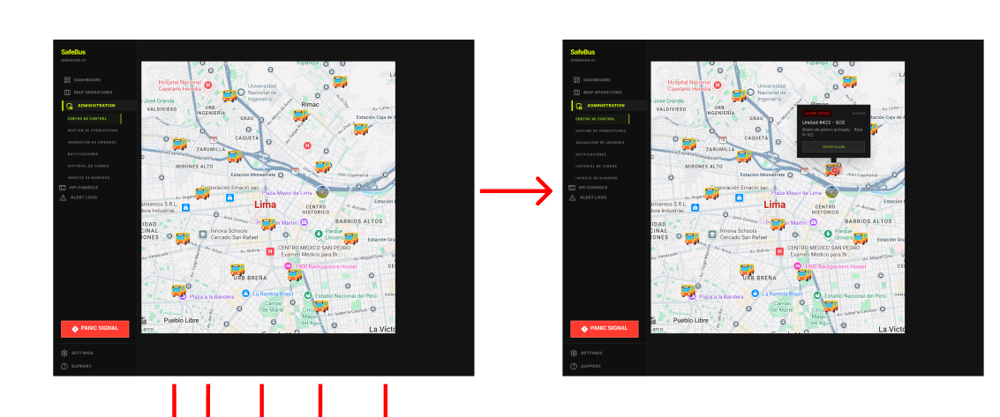


---

### 4.6. Domain-Driven Software Architecture

#### 4.6.1. Design-Level Event Storming


#### 4.6.2. Software Architecture Context Diagram

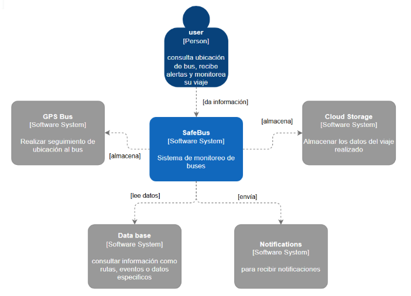

#### 4.6.3. Software Architecture Container Diagrams

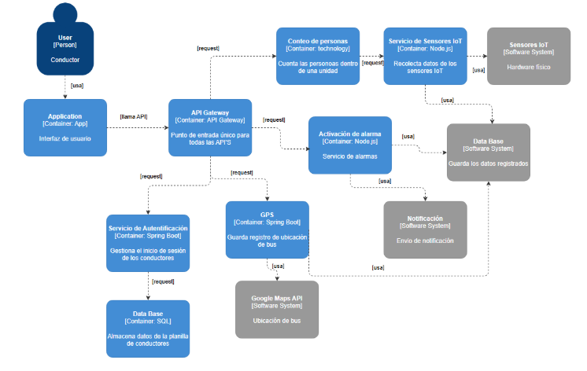


#### 4.6.4. Software Architecture Components Diagrams

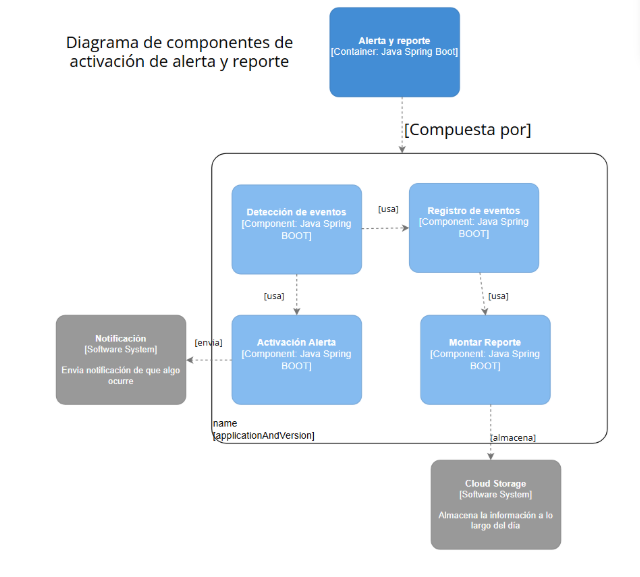

---

### 4.7. Software Object-Oriented Design

#### 4.7.1. Class Diagrams

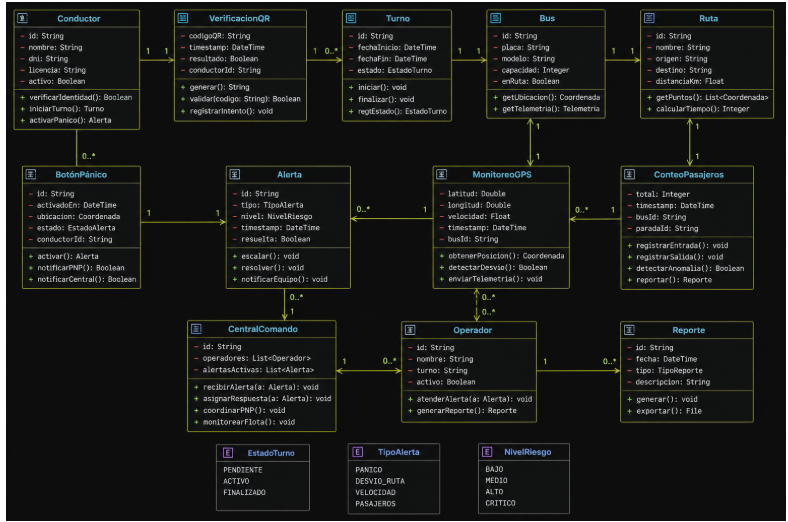

---

### 4.8. Database Design

#### 4.8.1. Database Diagrams

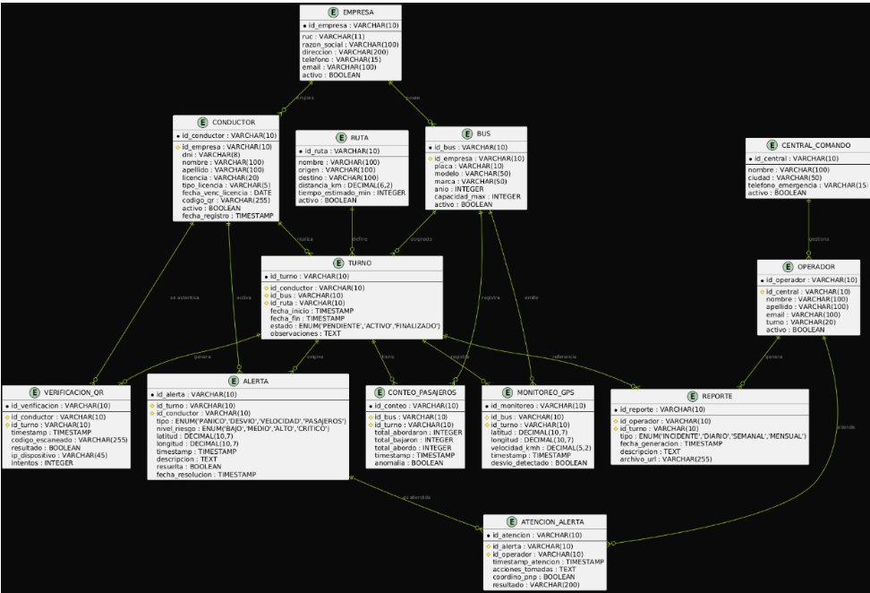

---

## Capítulo V: Product Implementation, Validation & Deployment

### 5.1. Software Configuration Management

El Software Configuration Management (SCM) es un conjunto de actividades y procesos que tiene como objetivo organizar y supervisar los cambios que se realizan en el software durante su desarrollo.

#### 5.1.1. Software Development Environment Configuration

En esta sección referenciamos los productos de software que usamos como equipo para colaborar en la realización de este proyecto.

**Project Management:**

- **WhatsApp:** Utilizado para comunicación rápida mediante un grupo privado donde coordinamos avances, compartimos archivos y establecemos fechas límite.
- **Discord:** Utilizado para reuniones cortas y aclarar dudas en tiempo real mediante llamadas de voz.

**Requirement Management:**

- **OneDrive:** Usado para almacenar archivos audiovisuales del proyecto, como los vídeos requeridos durante las distintas etapas de desarrollo.
- **Git:** Sistema de control de versiones para rastrear los cambios en el código fuente. Usado para registrar los cambios realizados del código dentro de GitHub.

**Product UX/UI Design:**

- **Figma:** Plataforma de diseño de interfaces que permite crear prototipos interactivos de forma colaborativa. Usado para diseñar las pantallas de nuestro producto en versión desktop.

**Software Development:**

- **Visual Studio Code:** Editor de código fuente desarrollado por Microsoft. Empleado para desarrollar el código del proyecto utilizando tecnologías como HTML y CSS.
- **GitHub:** Plataforma de alojamiento de repositorios basada en Git. Empleada para almacenar el proyecto, realizar control de versiones y sincronizar los cambios del equipo.

**Software Testing:**

- **Chrome:** Usado para realizar las pruebas de visualización y comportamiento del prototipo, verificando su correcto funcionamiento en distintos tamaños de pantalla.

**Software Documentation:**

- **Google Docs:** Herramienta de procesamiento de texto en línea usada para redactar la documentación general del proyecto.
- **.MD:** Archivos Markdown usados para guardar toda la documentación del informe realizado.

---

#### 5.1.2. Source Code Management

Para la gestión del código fuente del proyecto, el equipo utilizará **Git** como sistema de control de versiones distribuido y **GitHub** como plataforma central de colaboración.

**Repositorio en GitHub:** https://github.com/OpenSource-Grupo-1/informe-del-proyecto

**Implementación de Gitflow**

El equipo adoptará el modelo de ramificación GitFlow, propuesto por Vincent Driessen.

**Ramas principales:**

- `main`: Contiene el código estable y listo para producción.
- `develop`: Contiene el código con las últimas funcionalidades integradas, en preparación para la siguiente versión estable.

**Ramas de soporte:**

1. **Feature branches:** Desarrollar nuevas funcionalidades o mejoras.
2. **Release branches:** Denominar una nueva versión estable del proyecto.
3. **Hotfix branches:** Corregir errores críticos detectados en producción.

**Semantic Versioning**

Aplicaremos Semantic Versioning 2.0.0 con el formato `MAJOR.MINOR.PATCH`:
- **MAJOR:** Cambio incompatible con versiones anteriores.
- **MINOR:** Agregado de nuevas funcionalidades.
- **PATCH:** Corrección o mejoras sin afectar su compatibilidad.

Ejemplo: `v1.0.0` → `v1.1.0` → `v1.1.1`

**Conventional Commits**

Los mensajes commit seguirán el formato: `tipo(especificación): descripción`

Tipos: `feat`, `fix`, `docs`, `style`, `refactor`, `test`, `chore`

Ejemplos:
- `feat(formulario): se agregó una validación al correo electrónico`
- `fix(navbar): se corrigió error en la alineación`
- `docs(README): se actualizaron instrucciones`

**Flujo general de trabajo:**

1. Cada integrante clona el repositorio y crea su propia rama `feature/` para trabajar en una nueva tarea.
2. Cuando termina, se realiza un merge hacia `develop` mediante pull request.
3. Una vez integradas todas las funcionalidades planificadas, se crea una rama `release/` para pruebas finales.
4. Si la versión es aprobada, se fusiona a `main`, se etiqueta con su número de versión y se elimina la rama `release/`.
5. En caso de detectar errores en producción, se genera una rama `hotfix/` para resolverlos rápidamente.

---

#### 5.1.3. Source Code Style Guide & Conventions

### Landing Page:

Resumen: Como principales tecnologías, usaremos Tailwind CSS, HTML y TypeScript. Componentes pequeños y tipados, comunicación clara por propósitos, y estilos utilitarios y organizados.

| Tecnología  | Convenciones principales  | Convenciones para código  |
| :---- | :---- | :---- |
| Tailwind CSS  | \- Usar solo clases utilitarias de Tailwind.  | \- Usar @apply para estilos reutilizables. Evitar clases condicionales en el HTML.  |
| HTML  | \- Usar etiquetas semánticas (header, main, section, etc.). Indentación de 2 espacios.  | \- Mantener el HTML limpio y libre de código comentado. Usar data-\* atributos para información adicional.  |
| TypeScript  | \- Variables/funciones en camelCase. Clases/interfaces en PascalCase. Tipado obligatorio.  | \- Usar readonly para propiedades que no deben cambiar. Preferir funciones puras y evitar efectos secundarios.  |

### Front-End:
Resumen: Se utilizarán HTML, TypeScript y CSS como tecnologías principales. Los componentes serán pequeños y tipados, con comunicación clara mediante props/emits y un manejo adecuado del estado y las APIs.

| Tecnología  | Convenciones principales  | Convenciones para código  |
| :---- | :---- | :---- |
| HTML5  | \- Uso semántico de etiquetas (header, main, section, footer). Atributos en comillas dobles.  | \- Mantener el HTML limpio y libre de código comentado. Usar comentarios para secciones complejas o importantes.  |
| CSS3  | \- Estilos modulares y reutilizables. Variables globales para colores/tipografía. Evitar \!important. | \- Usar BEM (Block Element Modifier) para nombrar clases. Mantener la especificidad baja.  |
| TypeScript  | \- Variables/funciones en camelCase. Clases/interfaces en PascalCase. Constantes en UPPER\_SNAKE\_CASE.  | \- Usar desestructuración para extraer valores de objetos y arrays.  |

### Herramientas y configuración :

Estas herramientas están principalmente orientadas a mejorar el flujo de desarrollo y facilitar la gestión de configuraciones y dependencias, pero todas ellas están relacionadas con frontend y el proceso de construcción del proyecto. Vite y Babel se encargan de la construcción del código, Git ayuda con el control de versiones y flujo de trabajo, y Docker puede ser útil para contenedores en entornos de desarrollo o despliegue. 

| Tecnología  | Convenciones principales  | Convenciones para código  |
| :---- | :---- | :---- |
| Vite  | \- Herramienta de construcción rápida para el desarrollo en React.  | \- Mantener el archivo [vite.config.js](http://vite.config.js) limpio y organizado. Usar plugins solo cuando sea necesario.  |
| Babel  | \- Uso de Babel para la traducción de código JavaScript moderno (ES6+).  | \- Configuración clara y concisa para la traduccion de código. Mantener las configuraciones mínimas.  |
| Git  | \- Uso de ramas para nuevas características y buenos flujos de trabajo con commits.  | \- Hacer commits frecuentes con mensajes claros. Utilizar flujos de trabajo como Git Flow o feature branching.  |


#### 5.1.4. Software Deployment Configuration

Esta sección detalla los pasos necesarios para desplegar de forma satisfactoria los productos digitales que componen la solución: 

**1\. Landing Page \- HTML, CSS y TypeScript**

Para que nuestra landing page esté disponible para todos nuestros usuarios, la publicamos como un sitio web utilizando la plataforma de GitHub. El proceso se llevó a cabo de la siguiente manera:

Registro en GitHub Creamos una cuenta en GitHub para poder gestionar los repositorios del proyecto y almacenar el código de la Landing Page de SafeBus


* Pantalla de GitHub para crear una organización, donde se ingresan el nombre, correo de contacto y si pertenece a una cuenta personal o institución antes de la verificación.

**2\. Carga de los archivos de la landing page**

Accedimos al repositorio creado. Subimos los archivos generados del proyecto (HTML, TailwindCSS, TypeScript). Verificamos que los cambios se hicieran en la rama principal (main). Finalmente, confirmamos la acción con “Commit changes” para guardar los archivos. Una vez ya configurada y lanzada podremos ingresar desde el repositorio mediante el enlace [safe-bus-lading.vercel.app](https://safe-bus-lading.vercel.app/) .


**3\. Visualización de la landing page**

 La página principal del landing de SafeBus tiene un diseño limpio y moderno con un menú superior que enlaza las secciones "Características", "Cómo funciona", "Estadística" y "Apoyo", junto con un botón de ingreso. En la sección hero, destaca el eslogan "Protege tu ruta, asegura tu futuro" y una breve descripción del servicio. También se presentan estadísticas clave, como el porcentaje de rutas seguras operativas y la cantidad de conductores protegidos.


### 5.2. Landing Page, Services & Applications Implementation

#### 5.2.1. Sprint 1

##### 5.2.1.1. Sprint Planning 1

Para este primer Sprint, el equipo estableció como objetivo principal la implementación y despliegue de la primera versión de la Landing Page del sistema SafeBus.

| Campo | Detalle |
|-------|---------|
| Sprint # | Sprint 1 |
| Date | 2026-04-10 |
| Time | 08:00 PM |
| Location | Reunión virtual vía Google Meet |
| Prepared By | Blancas Chavez, Carlos |
| Attendees | Delgado Arriola, Leonardo / Alvarado Millan, Boris / Blancas Chavez, Carlos / Ibañez Torres, Ivonne / Espíritu Silvestre, Fernando |
| Sprint N-1 Review Summary | Al ser el primer Sprint del proyecto, no existe un Sprint anterior que revisar. Se inicia desde cero con la implementación del producto. |
| Sprint N-1 Retrospective Summary | Al ser el primer Sprint, no existe retrospectiva previa. El equipo acordó mantener comunicación constante y respetar los tiempos establecidos. |
| Sprint 1 Goal | Our focus is on developing and deploying the first version of the SafeBus Landing Page, aimed at communicating the value proposition of improving security in public transportation. We believe it delivers a clear understanding of the system's benefits (driver verification, panic button, and passenger monitoring) to potential clients. This will be confirmed when the Landing Page is accessible, includes all key sections, and allows smooth navigation for users. |
| Sprint N Velocity | 10 |
| Sum of Story Points | 10 |

##### 5.2.1.2. Aspect Leaders and Collaborators

| Team Member | GitHub Username | Configuración del Repositorio y CI/CD (L/C) | Estructura Base del Landing Page (L/C) | Funcionalidades Interactivas (L/C) | Corrección de Contenido (L/C) |
|------------|-----------------|---------------------------------------------|----------------------------------------|-----------------------------------|-------------------------------|
| Delgado Arriola, Leonardo | leodev77 | L | C | C | C |
| Alvarado Millan, Boris | BorisAlvaradoMilan | C | C | C | L |
| Blancas Chavez, Carlos | CarlosBlancas969 | C | L | L | C |
| Ibañez Torres, Ivonne | MarlonLasarte | C | C | C | L |
| Espíritu Silvestre, Fernando | Fernandovepro | C | C | C | L |

##### 5.2.1.3. Sprint Backlog 1

El objetivo principal de este Sprint fue implementar y desplegar la primera versión de la Landing Page del sistema SafeBus.

| Sprint # | Sprint 1 | | | | | | |
|----------|----------|-|-|-|-|-|-|
| **User Story** | | **Work-item / Task** | | | | | |
| Id | Title | Id | Title | Description | Estimation | Assigned To | Status |
| US-08 | Visualizar información del servicio | T-01 | Configuración inicial del repositorio | Crear repositorio en GitHub, inicializar proyecto con HTML/CSS/JS y configurar archivos base (.gitignore, README). | 2 | Leonardo Delgado | Done |
| US-08 | Visualizar información del servicio | T-02 | Configurar despliegue | Configurar GitHub Pages para publicar la Landing Page. | 3 | Carlos Blancas | Done |
| US-08 | Visualizar información del servicio | T-03 | Desarrollo estructura base | Implementar secciones principales: hero, problemática, propuesta, beneficios y footer. | 4 | Carlos Blancas | Done |
| US-08 | Visualizar información del servicio | T-04 | Implementar funcionalidades del sistema | Mostrar funcionalidades clave: QR, botón de pánico y conteo de pasajeros. | 3 | Carlos Blancas | Done |
| US-08 | Visualizar información del servicio | T-05 | Implementar navegación | Permitir navegación entre secciones (scroll y menú). | 2 | Ivonne Ibañez | Done |
| US-08 | Visualizar información del servicio | T-06 | Integración de contenido | Redactar contenido basado en problemática y solución SafeBus. | 2 | Fernando Espíritu | Done |
| US-08 | Visualizar información del servicio | T-07 | Revisión y validación | Corrección de errores, ortografía y pruebas de navegación. | 2 | Boris Alvarado | Done |

##### 5.2.1.4. Development Evidence for Sprint Review

| Repository | Branch | Commit Id | Commit Message | Commit Message Body | Committed on |
|-----------|--------|-----------|----------------|---------------------|--------------|
| | | | | | |

##### 5.2.1.5. Execution Evidence for Sprint Review

Al término del Sprint 1, el equipo logró implementar y desplegar satisfactoriamente la primera versión de la Landing Page del sistema SafeBus. La página se encuentra disponible públicamente mediante GitHub Pages, validando la User Story US08.

La Landing Page incluye las siguientes secciones:

- **Hero:** Presentación principal con el mensaje "Protege tu ruta, asegura tu futuro", con botones de llamada a la acción "Empezar ahora" y "Ver características".
- **Características:** Describe las funcionalidades principales: verificación de conductores mediante código QR, botón de pánico para alertas en tiempo real, conteo de pasajeros a bordo y monitoreo continuo.
- **Cómo funciona:** Explicación general del flujo del sistema, desde la validación del conductor hasta la gestión de emergencias.
- **Estadísticas:** Presentación de indicadores relevantes relacionados con la problemática del transporte público.
- **Navegación:** Barra superior que permite acceder a las diferentes secciones del sitio.
- **Diseño e Interfaz:** Diseño moderno con estilo oscuro, tipografía llamativa y colores contrastantes (verde neón).

> *[Capturas de pantalla de la Landing Page - pendiente de adjuntar]*

##### 5.2.1.6. Services Documentation Evidence for Sprint Review

Durante el Sprint 1, el alcance de implementación se limitó exclusivamente al Landing Page estático. No se desarrollaron ni desplegaron Web Services (RESTful API) en esta iteración, por lo que no aplicadocumentación de endpoints para este Sprint. La documentación de servicios web se incorporará a partir del Sprint 2, conforme a lo planificado en el Product Backlog.

##### 5.2.1.7. Software Deployment Evidence for Sprint Review

> *[Imágenes del proceso de deploy - pendiente de adjuntar]*

##### 5.2.1.8. Team Collaboration Insights during Sprint

Durante el Sprint 1, todos los miembros del equipo participaron activamente en la implementación del Landing Page, evidenciando a traves de los commits registrados en el repositorio `informe-del-proyecto`. El trabajo se distribuyó de manera colaborativa: Fernando Espiritu lideró la configuración del repositorio y el pipeline de despliegue; Carlos Blancas y Leonardo Delgado se encargaron del desarrollo de funcionalidades interactivas y animaciones; Boris Alvarado e Ivonne Ibañez contribuyeron con correcciones de contenido y en la estructura base de la página. 

El equipo aplicó GitFlow como estrategia de control de versiones, trabajando en la rama `develop` y realizando la integración a `main` mediante Pull Requests revisados y aprobados por otros miembros. Se realizaron un total de 4 Pull Requests durante el Sprint.

 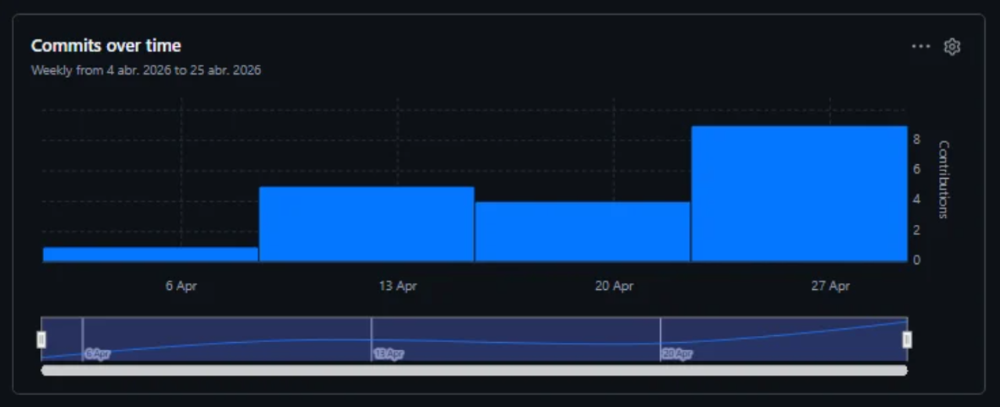
 
 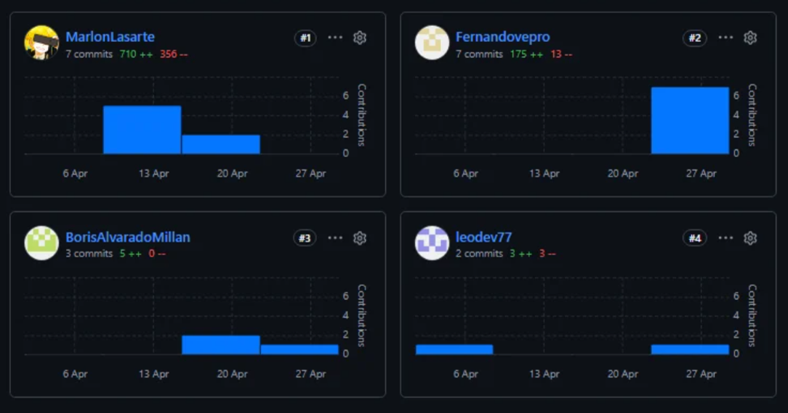
 
---

### 5.3. Validation Interviews

#### 5.3.1. Diseño de Entrevistas

> *[Pendiente de completar]*

#### 5.3.2. Registro de Entrevistas

> *[Pendiente de completar]*

#### 5.3.3. Evaluaciones según heurísticas

> *[Pendiente de completar]*

---

### 5.4. Video About-the-Product

> *[Pendiente de completar]*

---

## Conclusiones

### Conclusiones y recomendaciones

> *[Pendiente de completar]*

### Video About-the-Team

> *[Pendiente de completar]*

---

## Bibliografía

- Ministerio de Transportes y Comunicaciones. (2024). *Anuario estadístico 2023*. Gobierno del Perú. https://www.gob.pe/institucion/mtc/informes-publicaciones/5871728-anuario-estadistico-2023

---

## Anexos

> *[Pendiente de completar]*
