## Capítulo IV: Product Design

### 4.1. Style Guidelines
Una guía de estilos o style guideline es un documento que enumera todas las elecciones y convenciones adoptadas en la empresa para mantener alineados al equipo de diseño y desarrollo. Seguir estos lineamientos permite desarrollar un prototipo de forma más rápida y eficiente (Kas, 2021).

#### 4.1.1. General Style Guidelines
El estilo visual de la aplicación está orientado a transmitir seguridad, control y monitoreo. La decisión del diseño prioriza la claridad de la información, la rapidez de interpretación y la confianza del usuario, considerando que la aplicación está enfocada en un entorno de gestión y seguridad.

**Branding:**
La identidad de nuestra aplicación se construye como una plataforma tecnológica, confiable y eficiente, orientada a la supervisión y gestión de transporte.

Se busca que el usuario perciba el sistema como: 
-Seguro
-Preciso
-Moderno
-Siempre activo.

Visualmente, se toma como referencia interfaces tipo dashboard y sistemas de monitoreo, donde la información es el elemento central y debe ser comprendida rápidamente.

**Color Palette:**
La paleta de colores de SafeBus se despliega en tonos oscuros y con contrastes, principalmente usamos el negro y verde neon, tambien el blanco y acentos de otros colores. Esta selección responde a la necesidad de crear un entorno visual tecnológico, seguro y orientado a la acción inmediata. La combinación de estos colores está pensada para transmitir monitoreo constante, control y respuesta en tiempo real, alineándose en el enfoque del que queremos dar con el producto respecto a la seguridad y gestión de buses.

- **Negro:** Usamos el color negro como la base de la interfaz. Este tono aporta elegancia, seriedad y profundidad, además de generar un entorno visual enfocado y libre de distracciones, refuerza la percepción de control, vigilancia y tecnología.
<center>

</center>

- **Verde** Usamos en verde neón (#C3F400) como color principal de aceto. Lo usamos en botones, indicadores y títulos. Este color se asocia a sistemas digitales, monitoreo y confirmación, transmitiendo dinamismo e innovación. El otro verde (#596D0B) lo usamos de color secundario para generar contraste.
<center>
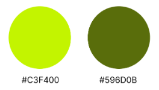
</center>

- **Rojo:** Este rojo lo usamos de manera puntual en elementos críticos, para transmitir alerta, ya que es un color que se asocia mucho a emergencia, urgencia, peligro o acción inmediata.
<center>

</center>

**Typography:**

Se emplean tipografías **Space Grotesk** e **Inter**, debido a su alta legibilidad en entornos digitales y su fácil asociación visual con interfaces modernas.
Se establecerá la siguiente jerarquía:

- Títulos: Claros y visibles para identificar secciones rápidamente. **Space Grotesk-Bold.(96px)**
- Subtítulos: Apoyo estructural. **Space Grotesk- Bold (60-48px)**
- Párrafos: legible y de lectura rápida. **Inter- Light/Bold (24-12px)**

<center>
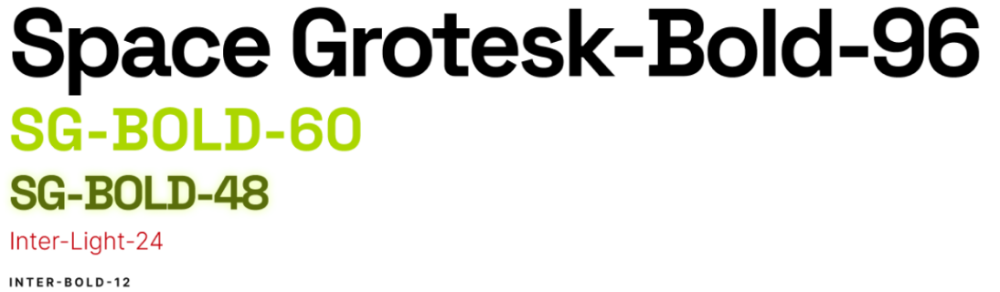
</center>

**Spacing y Layout:**
El diseño se organizará mediante el uso de espacios consistentes y estructuras tipo tarjetas. Las medidas de estos elementos siempre será múltiplo de 2.

- Base unit: Se usará la regla de múltiplos de px para paddings y spacing.
<center>

</center>

- Grid: Márgenes de 24px para mantener armonía en la vista.
- Breakpoints: Ancho fijo de 1440px y alto de 1024px para web.

**Componentes visuales:**

- Botones: Verde para acciones principales, rojo para acciones críticas, gris para acciones secundarias.
<center>
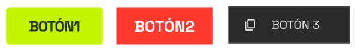
</center>
- Cards: Contenedores de información organizados y fáciles de entender.
<center>
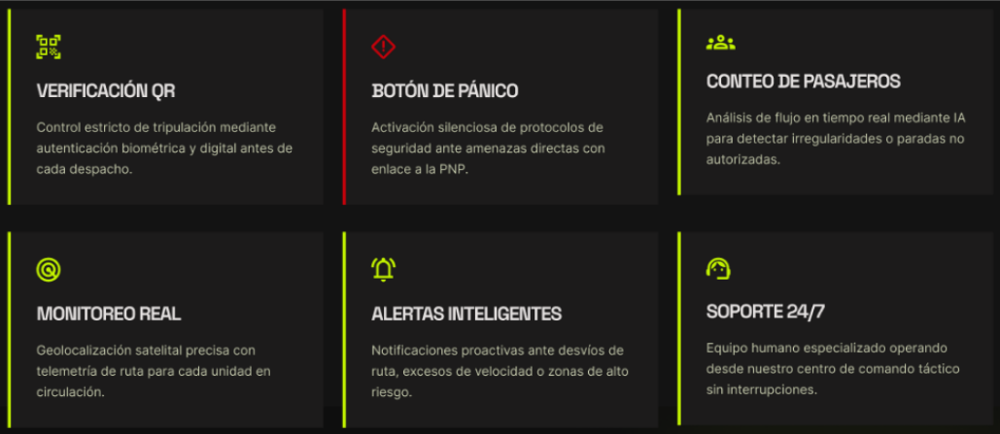
</center>
- Iconografía: Estilo simple y de fácil reconocimiento.
<center>
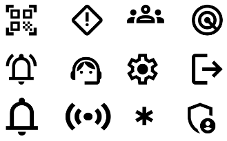
</center>

**Tono de comunicación:**
Nuestro tono de aplicación se define como serio, formal, respetuoso y sereno. Esto se debe a que la aplicación está orientada a un contexto de seguridad y monitoreo, donde la claridad y la confianza son prioritarias. Evitaremos el uso de lenguaje informal, priorizando mensajes directos, claros y profesionales.
**Principios de diseño:**
Las decisiones de diseño se sustentan en los siguientes principios:
- Claridad: Información comprensible de forma inmediata
- Jerarquía visual: Elementos importantes son los primeros en destacar
- Consistencia: Uso uniforme de colores, tipografías y componentes
- Accesibilidad: Buen contraste y legibilidad
- Feedback inmediato: El sistema responde visualmente a las acciones del usuario

#### 4.1.2. Web Style Guidelines
En esta sección, definiremos los estándares visuales e interactivos de la aplicación en entorno web, asegurando una experiencia consistente y funcional.


---

### 4.2. Information Architecture

La Arquitectura de la Información (AI) de UrbanGuard está diseñada para organizar de manera lógica y clara el contenido, asegurando una navegación fluida y eficiente. Cada sección de la página cumple con un propósito específico, alineado con el objetivo de mejorar la seguridad en el transporte público. A continuación, te doy una descripción más detallada.

#### 4.2.1. Organization Systems

Para la Landing Page se emplea una organización jerárquica y secuencial. Es jerárquica porque el usuario puede acceder a secciones clave desde la barra de navegación principal, y es secuencial porque el contenido está ordenado como una narrativa de conversión: primero se presenta la propuesta de valor, luego el problema, después la solución, sus beneficios, la comparación, los planes y finalmente el llamado a la acción.

| Nivel | Sección | Propósito dentro de la arquitectura |
|-------|---------|--------------------------------------|
| Global | Header (Navbar) | Permite acceso rápido a las secciones principales y a la pantalla de inicio de sesión. |
| Principal | Hero section | Presenta la propuesta de valor de UrbanGuard con botones de llamada a la acción. |
| Contextual | Problem section | Explica los problemas operativos del transporte público. |
| Functional | Main features section | Agrupa las funcionalidades principales: Verificación QR, Botón de pánico, Conteo de pasajeros, Monitoreo real, Alertas inteligentes. |
| Explicativo | How it works section | Explica el proceso de funcionamiento de UrbanGuard en 4 etapas. |
| Persuasivo | User benefits section | Resume los beneficios operativos directos para los transportistas. |
| Confianza | Client trust section | Explica cómo UrbanGuard mejora la seguridad y genera confianza. |
| Comparativo | Comparative section | Contrasta el sistema con otros métodos tradicionales de seguridad. |
| Comercial | Pricing section | Presenta los planes disponibles. |
| Soporte | FAQ section | Resuelve dudas frecuentes sobre el uso del sistema. |
| Conversión | Next step section | Refuerza el llamado a la acción. |
| Cierre | Footer section | Repite accesos clave, enlaces de contacto y redes sociales. |

#### 4.2.2. Labeling Systems
Con esto, identificamos el contenido en categorías y nodos. De esta manera, logramos una comunicación eficiente y efectiva para los usuarios, en nuestro caso, identificamos y empleamos las siguiente etiquetas:


| Etiqueta | Tipo | Uso dentro de la landing |
|----------|------|--------------------------|
| Cómo funciona | Navegación principal | Lleva al usuario a la explicación del flujo de funcionamiento de UrbanGuard. |
| Beneficios | Navegación principal | Dirige a la sección de beneficios operativos. |
| Planes | Navegación principal | Permite revisar las opciones de suscripción. |
| FAQ | Navegación principal | Abre la sección de preguntas frecuentes. |
| Iniciar sesión | Acción de acceso | Permite que un usuario existente acceda a su cuenta. |
| Comenzar ahora | CTA principal | Dirige al visitante hacia el flujo de registro. |
| Ver características | CTA secundario | Lleva al visitante a la sección de características. |
| Plan Free | Etiqueta comercial | Identifica el plan gratuito con funciones básicas. |
| Plan Control | Etiqueta comercial | Identifica el plan con mayores funciones operativas. |
| Comparativa breve | Encabezado de sección | Presenta una comparación entre UrbanGuard y otros sistemas. |
| Da el siguiente paso | CTA final | Refuerza el llamado a registrarse o revisar los planes. |
| Explorar | Footer | Agrupa enlaces hacia secciones informativas adicionales. |
| Siguiente paso | Footer | Agrupa enlaces hacia el proceso de registro. |

Estas adaptaciones de la estructura de la landing page para UrbanGuard toman los elementos de seguridad, funcionalidades y beneficios del sistema, alineándose con la información clave que los usuarios necesitan. Además, se utiliza un enfoque claro y persuasivo en cada una de las secciones para facilitar la conversión y maximizar la interacción con el producto.

#### 4.2.3. SEO Tags and Meta Tags
La Landing Page de UrbanGuard incluye metadatos orientados a la indexación básica, compatibilidad móvil, carga de recursos visuales y reconocimiento de marca. Estos elementos ayudan a que la página sea interpretada correctamente por navegadores, buscadores y dispositivos móviles.
**Titulo de la pagina:**
```html
<title>UrbanGuard - Seguridad para el Transporte Público</title>
```
_Descripción_: El título debe ser claro y directo, utilizando palabras clave relevantes como "seguridad", "transporte público" y "UrbanGuard".

**Codificación de caracteres:**
```html
<meta charset="UTF-8">
```

**Configuración del responsive:**
```html
<meta name="viewport" content="width=device-width, initial-scale=1.0" />
```
_Descripción_: Esto asegura que la página sea completamente funcional en dispositivos móviles y tablets.

**Descripción SEO:**
```html
<meta name="description" content="UrbanGuard ofrece soluciones de seguridad para el transporte público, con verificación de conductores, monitoreo en tiempo real y alertas de emergencia.">
```
_Descripción_: Este meta tag proporciona una breve descripción de la página, destacando los beneficios clave del sistema de seguridad.

**Ícono de marca:**
```html
<link rel="icon" type="image/png" href="/assets/urban-guard-icon.png" />
```
_Descripción_: El favicon que se muestra en las pestañas del navegador para aumentar la visibilidad de la marca.

**Optimización de carga tipográfica:**
```html
<link rel="preconnect" href="https://fonts.googleapis.com" />
<link rel="preconnect" href="https://fonts.gstatic.com" crossorigin />
```
_Descripción_: Esto mejora el rendimiento de la carga de fuentes tipográficas, garantizando una carga más rápida.

**Etiquetas de autor, copyright y Open Graph (para redes sociales y aplicaciones de mensajería):**
```html
<meta name="author" content="UrbanGuard Team">
<meta name="copyright" content="UrbanGuard 2026">
<meta property="og:title" content="UrbanGuard - Seguridad para el Transporte Público">
<meta property="og:description" content="Aumenta la seguridad en el transporte público con verificación de conductores y monitoreo en tiempo real.">
<meta property="og:type" content="website">
```

#### 4.2.4. Searching Systems
Los Searching Systems son herramientas fundamentales cuando se maneja una gran cantidad de información o cuando el sitio web está dividido en diferentes secciones, estas, permiten al usuario localizar contenidos de manera rápida, eficiente y precisa, mejorando significativamente la experiencia de navegación. Además, contribuye a facilitar el acceso inmediato a la información deseada.


**Primera aproximación: Búsqueda incompleta conocida.**
Este sistema permite que los usuarios realicen búsquedas aunque no conozcan la información completa, en este caso, el nombre del conductor. Utiliza la filtración de palabras existentes en una lista de conductores para ir descartando nombres, por lo que, solo se mostraran los datos cercanos. Este método resulta especialmente útil cuando el usuario recuerda solo una parte de la información, sin embargo, tendrá que corroborar con los datos que visualice para no confundir identidad a los conductores con un mismo nombre o apellido.

**Segunda aproximación: Búsqueda mediante filtros.**
Nuestra aplicación permite filtrar por categoría a todos los conductores, depende del tipo de categoría que quieras visualizar y solo se te mostraran a los conductores de dicha categoría.

#### 4.2.5. Navigation Systems
Los Navigation Systems son esenciales para guiar al usuario dentro del sitio web, ayudando a localizar y acceder a la información de manera ordenada y eficiente. Un sistema de navegación bien diseñado mejora la usabilidad, la accesibilidad y la experiencia del usuario al interactuar con el contenido.
En nuestro proyecto hemos implementado los siguientes sistemas de navegación:

- **Menús de navegación:** Se utilizan para acceder a las diferentes secciones del sistema. En la versión web, los menús se ubican tanto en el header como en el footer. En la versión móvil, se emplea un menú tipo “hamburguesa” que, al desplegarse, permite acceder de manera clara a las funciones principales del sistema.
- **Etiquetas:** Permiten categorizar y agrupar contenidos por temas o funcionalidades, facilitando la búsqueda y el acceso a la información. En nuestra aplicación, las etiquetas se utilizan para identificar a los conductores con la categoría y estado. 
- **Barras de búsqueda:** Incluidas para los perfiles con permisos de administrador, permite ubicar a los conductores de forma directa mediante nombre o etiqueta asociada. Esta integrada con los sistemas de búsqueda previamente descritos, garantizando resultados precisos y una experiencia fluida.

---

### 4.3. Landing Page UI Design

#### 4.3.1. Landing Page Wireframe
Para la Landing page se desarrollaron en Figma cada apartado del 	sitio web.  
<center>


</center>

#### 4.3.2. Landing Page Mock-up
<center>

</center>

---

### 4.4. Web Applications UX/UI Design

#### 4.4.1. Web Applications Wireframes

Los wireframes de la aplicación web fueron diseñados para definir la estructura funcional de las principales pantallas del sistema. En esta etapa se identificaron los elementos clave de interacción, como paneles de control, visualización de datos, navegación entre secciones y componentes necesarios para la gestión del sistema. Estos wireframes permiten validar la distribución de información antes de la implementación visual, asegurando que las funcionalidades respondan a las necesidades del usuario.  
Wireframe Landing Page: En este wireframe vemos la organización de los elementos que se le presentan al usuario inicialmente al entrar a la página.  
Aquí vemos la organización de secciones individuales que componen las distintas pantallas de la página web. 
<center>

</center>

Organización de elementos para el landing page en entorno de móviles  
<center>
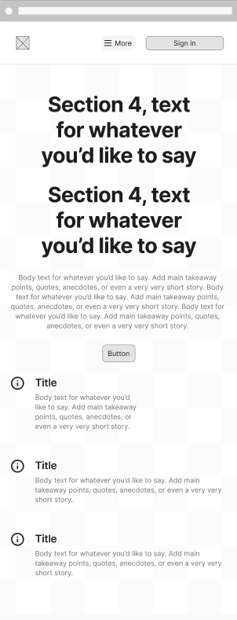
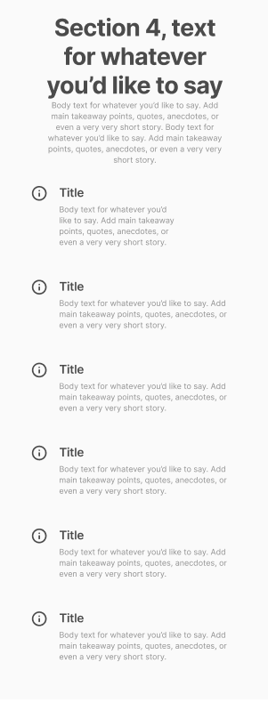
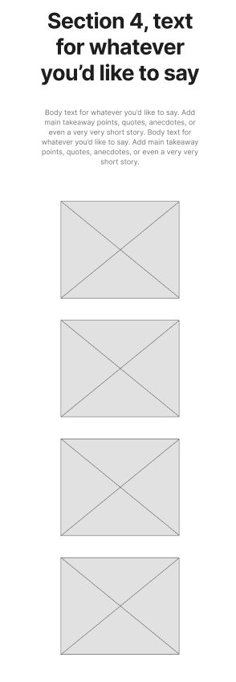
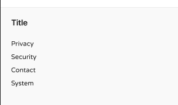
</center>

#### 4.4.2. Web Applications Wireflow Diagrams

Los wireflow diagrams representan el flujo de interacción del usuario dentro de la aplicación, mostrando la navegación entre pantallas y las acciones que el usuario puede realizar en cada etapa. Estos diagramas permiten entender el recorrido del usuario (user flow), facilitando la identificación de puntos clave de interacción y mejorando la experiencia general del sistema.


#### 4.4.2. Web Applications Mock-ups
<center>


</center>

#### 4.4.3. Web Applications User Flow Diagrams

**User flow 1: ADMIN**
<center>

</center>

**User Flow 2: Conductor**

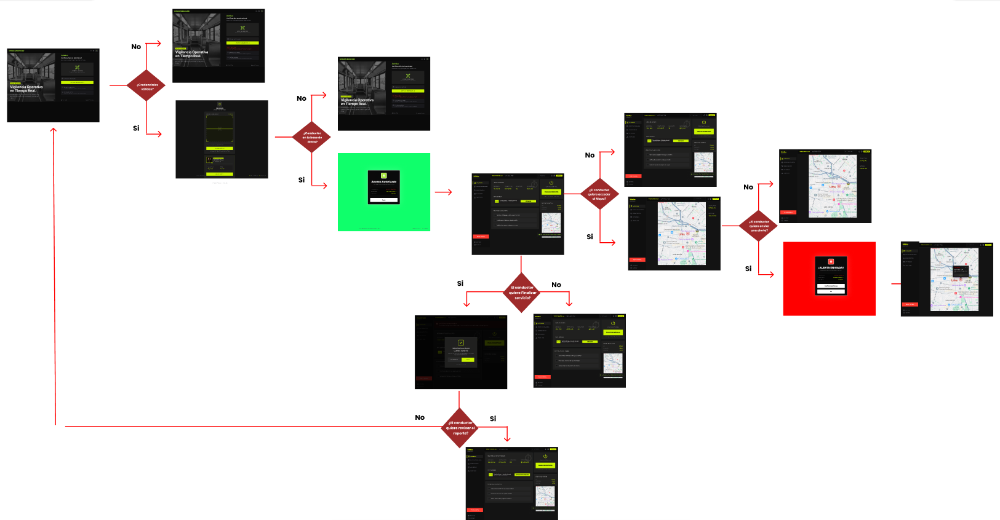

---

## 4.5. Web Applications Prototyping

### Introducción y criterios de diseño

El prototipo interactivo de SafeBus simula la navegación y los principales flujos de interacción de la aplicación web, permitiendo evaluar la coherencia de la experiencia de usuario antes del desarrollo, identificar puntos de fricción y validar las decisiones de arquitectura de información tomadas a lo largo del capítulo 4. El prototipo fue construido en Figma utilizando conexiones de prototipado entre frames, transiciones y overlays para representar de forma fiel los comportamientos especificados en los User Flow Diagrams.

Los criterios de diseño que guiaron las decisiones de interacción y navegación del prototipo son los siguientes:

**Orientación al rol y al flujo operativo de urgencia:** La arquitectura de navegación prioriza el acceso inmediato a las tareas de mayor frecuencia e importancia definidas en el User Task Matrix del capítulo 2. Para el conductor, el botón de pánico es el elemento más prominente de su pantalla principal, visible desde el primer momento en que inicia sesión. Para el operador de la central, el panel de alertas activas clasificadas por nivel de gravedad es la primera vista al iniciar sesión. Para el administrador de la empresa, el dashboard con el estado en tiempo real de toda la flota carga como vista inicial sin pasos adicionales.

**Consistencia en los patrones de interacción:** Se emplearon cuatro patrones de navegación a lo largo de toda la aplicación: (1) Navegación por Sidebar para el cambio entre módulos principales según el rol activo — conductor, central o empresa; (2) Drawer lateral deslizante para formularios de registro y edición que no requieren cambio de contexto, como el registro de un nuevo conductor o la asignación de vehículo; (3) Modal central para acciones críticas que requieren confirmación del usuario, como finalizar el turno, desactivar un conductor o escalar una alerta no atendida; y (4) Toast o Snackbar para retroalimentación inmediata de resultado sin interrumpir el flujo operativo, como la confirmación de recepción de una alerta de pánico.

**Prevención de errores en acciones de alto impacto:** En operaciones con consecuencias irreversibles o de alto impacto operativo, como activar el botón de pánico, finalizar un turno activo, desactivar un conductor o escalar una alerta, el prototipo incluye una capa adicional de confirmación mediante modal que describe el impacto de la acción antes de ejecutarla. Esto es especialmente crítico en el contexto de SafeBus, donde una acción incorrecta puede comprometer la trazabilidad de un incidente real de seguridad en el transporte público.

**Retroalimentación inmediata en tiempo real:** Todos los cambios en el estado del sistema que afectan al usuario se comunican de forma inmediata: el panel de alertas de la central se actualiza al recibirse una nueva alerta de pánico, el contador de pasajeros se actualiza en tiempo real al registrarse cada abordaje o bajada, y los campos de formulario muestran validación inline sin necesidad de enviar el formulario completo. Las alertas no confirmadas muestran un indicador de reintento automático visible en el panel de la central.

**Accesibilidad y objetivos táctiles:** Todos los elementos interactivos del prototipo tienen dimensiones mínimas de 48 × 48 px, especialmente relevantes para conductores que interactúan con la aplicación desde su smartphone durante la jornada de manejo. El botón de pánico tiene dimensiones ampliadas y color rojo con alto contraste para garantizar su activación inmediata bajo condiciones de estrés. Los contrastes de color en todos los estados cumplen el mínimo WCAG 2.1 AA.

<center>

</center>

### Flujos de interacción cubiertos por el prototipo

**Flujo 1 — Verificación e inicio de servicio del conductor:** Comprende la pantalla de verificación de identidad mediante código QR, la validación de autorización del conductor para el vehículo asignado, la validación de que el conductor no esté operando otra unidad simultáneamente, la pantalla de servicio activo con el botón de pánico, el contador de pasajeros en tiempo real y el botón de finalización de turno con confirmación modal.
<center>

</center>

**Flujo 2 — Gestión de pasajeros y detección de anomalías:** Comprende la pantalla de conteo de pasajeros con botones de abordaje y bajada, la alerta visual al superar la capacidad máxima del vehículo, la detección y notificación de variaciones anómalas en el número de pasajeros y la consulta del estado actual del servicio.
<center>

</center>

**Flujo 3 — Activación y gestión de alertas de emergencia:** Comprende la activación del botón de pánico por el conductor, la confirmación de envío con indicador de reintento automático si no hay respuesta, la recepción de la alerta en el panel de la central con clasificación automática por nivel de gravedad, el detalle de la alerta con conductor, vehículo, número de pasajeros y ubicación, el registro del tiempo de respuesta al confirmar la atención y el escalamiento automático de alertas no atendidas con notificación a múltiples destinatarios.
<center>

</center>

**Flujo 4 — Monitoreo de flota por la empresa administradora:** Comprende el dashboard de estado en tiempo real de todas las unidades activas, el módulo de seguimiento de ubicación por vehículo, el monitoreo de ocupación con comparación entre rutas, la detección de unidades que superan su capacidad y el historial completo de emergencias filtrable por fecha, conductor y vehículo.
<center>

</center>

---

### 4.6. Domain-Driven Software Architecture
#### 4.6.1. Design-Level Event Storming
Urban Guard es una plataforma orientada a mejorar la seguridad en el transporte público mediante monitoreo en tiempo real, protocolos de emergencia, sensores inteligentes y comunicación inmediata entre pasajeros, conductores y autoridades.
El objetivo principal del sistema es detectar situaciones de riesgo, gestionar incidentes de seguridad y proporcionar respuesta rápida dentro de las unidades de transporte.

- Autentificacion de cuentas: Responsable de autentificar al conductor.
<center>
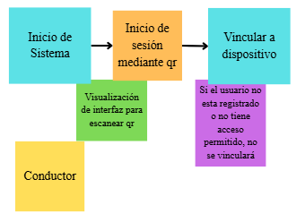
</center>

- Monitoreo de Tranporte: Encargado de seguimiento GPS, estado de unidades y su visualización en tiempo real.
<center>
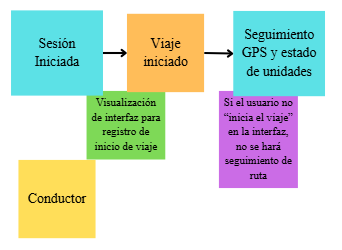
</center>

- Gestion de Alertas: Administra notificaciones de emergencia y comunicación.
<center>
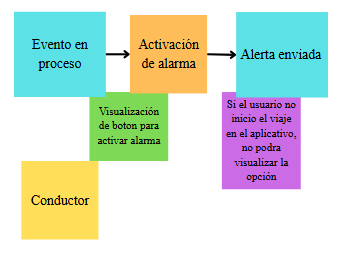
</center>

- Gestión de usuarios: Administra usuarios.
<center>
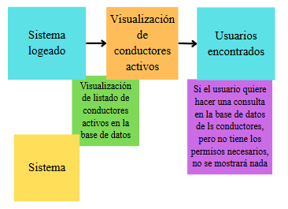
</center>

- Gestion de sensores IoT: Administra sensores
<center>
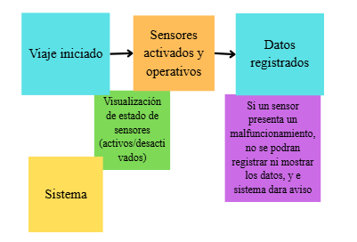
</center>

#### 4.6.2. Software Architecture Context Diagram
<center>

</center>

#### 4.6.3. Software Architecture Container Diagrams
<center>

</center>

#### 4.6.4. Software Architecture Components Diagrams
<center>

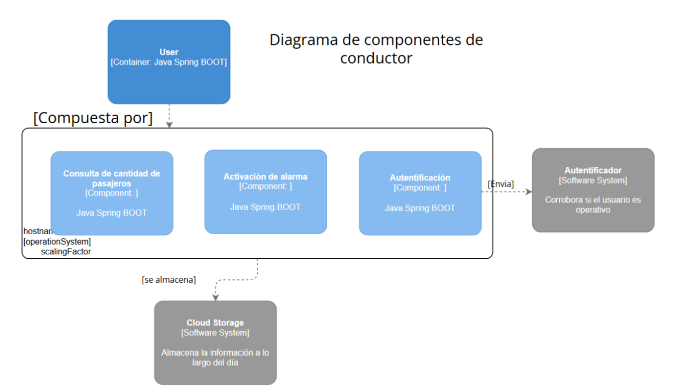
</center>

---

### 4.7. Software Object-Oriented Design
#### 4.7.1. Class Diagrams
<center>

</center>

---

### 4.8. Database Design
#### 4.8.1. Database Diagrams
<center>

</center>

