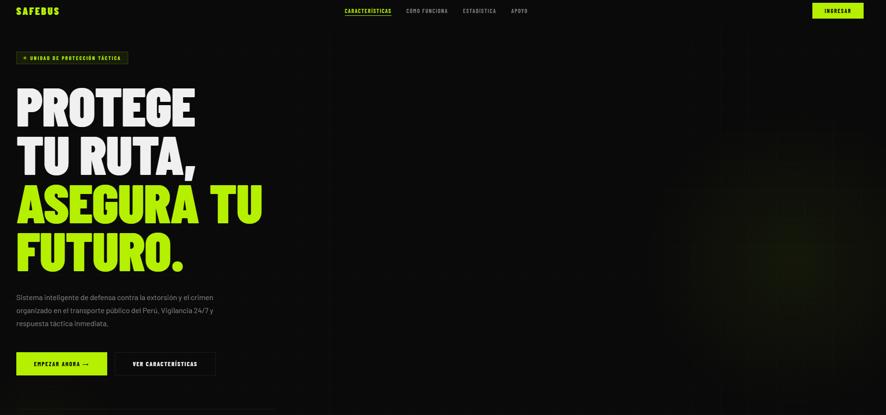
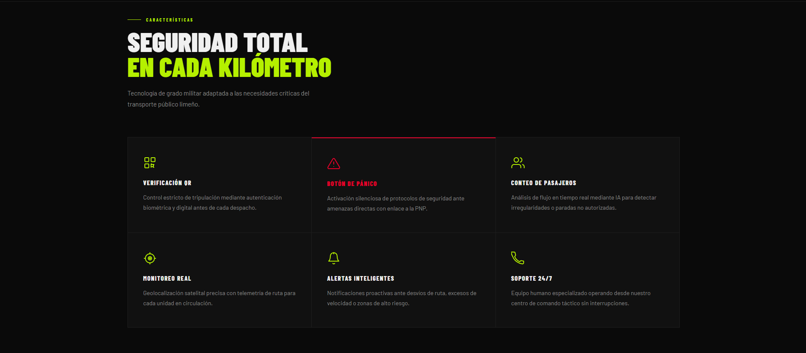
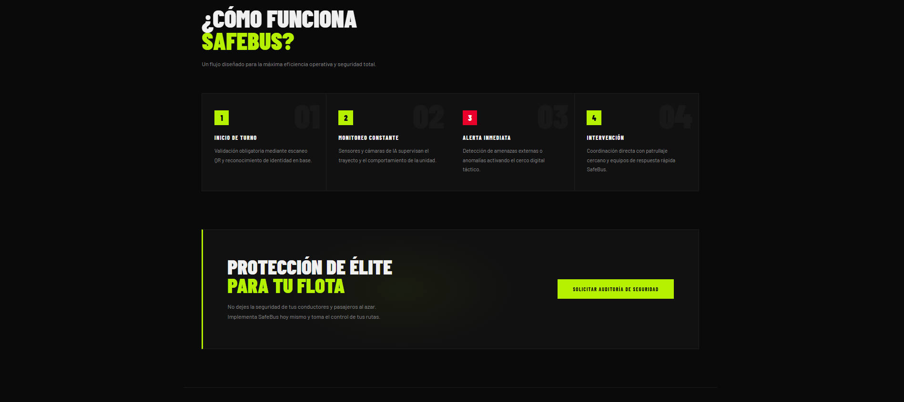

## Capítulo V: Product Implementation, Validation & Deployment

### 5.1. Software Configuration Management

El Software Configuration Management (SCM) es un conjunto de actividades y procesos que tiene como objetivo organizar y supervisar los cambios que se realizan en el software durante su desarrollo.

#### 5.1.1. Software Development Environment Configuration

En esta sección referenciamos los productos de software que usamos como equipo para colaborar en la realización de este proyecto.

**Project Management:**

- **WhatsApp:** Utilizado para comunicación rápida mediante un grupo privado donde coordinamos avances, compartimos archivos y establecemos fechas límite.
- **Discord:** Utilizado para reuniones cortas y aclarar dudas en tiempo real mediante llamadas de voz.

**Requirement Management:**

- **OneDrive:** Usado para almacenar archivos audiovisuales del proyecto, como los vídeos requeridos durante las distintas etapas de desarrollo.
- **Git:** Sistema de control de versiones para rastrear los cambios en el código fuente. Usado para registrar los cambios realizados del código dentro de GitHub.

**Product UX/UI Design:**

- **Figma:** Plataforma de diseño de interfaces que permite crear prototipos interactivos de forma colaborativa. Usado para diseñar las pantallas de nuestro producto en versión desktop.

**Software Development:**

- **Visual Studio Code:** Editor de código fuente desarrollado por Microsoft. Empleado para desarrollar el código del proyecto utilizando tecnologías como HTML y CSS.
- **GitHub:** Plataforma de alojamiento de repositorios basada en Git. Empleada para almacenar el proyecto, realizar control de versiones y sincronizar los cambios del equipo.

**Software Testing:**

- **Chrome:** Usado para realizar las pruebas de visualización y comportamiento del prototipo, verificando su correcto funcionamiento en distintos tamaños de pantalla.

**Software Documentation:**

- **Google Docs:** Herramienta de procesamiento de texto en línea usada para redactar la documentación general del proyecto.
- **.MD:** Archivos Markdown usados para guardar toda la documentación del informe realizado.

---

#### 5.1.2. Source Code Management

Para la gestión del código fuente del proyecto, el equipo utilizará **Git** como sistema de control de versiones distribuido y **GitHub** como plataforma central de colaboración.

**Repositorio en GitHub:** https://github.com/OpenSource-Grupo-1/informe-del-proyecto

**Implementación de Gitflow**

El equipo adoptará el modelo de ramificación GitFlow, propuesto por Vincent Driessen.

**Ramas principales:**

- `main`: Contiene el código estable y listo para producción.
- `develop`: Contiene el código con las últimas funcionalidades integradas, en preparación para la siguiente versión estable.

**Ramas de soporte:**

1. **Feature branches:** Desarrollar nuevas funcionalidades o mejoras.
2. **Release branches:** Denominar una nueva versión estable del proyecto.
3. **Hotfix branches:** Corregir errores críticos detectados en producción.

**Semantic Versioning**

Aplicaremos Semantic Versioning 2.0.0 con el formato `MAJOR.MINOR.PATCH`:
- **MAJOR:** Cambio incompatible con versiones anteriores.
- **MINOR:** Agregado de nuevas funcionalidades.
- **PATCH:** Corrección o mejoras sin afectar su compatibilidad.

Ejemplo: `v1.0.0` → `v1.1.0` → `v1.1.1`

**Conventional Commits**

Los mensajes commit seguirán el formato: `tipo(especificación): descripción`

Tipos: `feat`, `fix`, `docs`, `style`, `refactor`, `test`, `chore`

Ejemplos:
- `feat(formulario): se agregó una validación al correo electrónico`
- `fix(navbar): se corrigió error en la alineación`
- `docs(README): se actualizaron instrucciones`

**Flujo general de trabajo:**

1. Cada integrante clona el repositorio y crea su propia rama `feature/` para trabajar en una nueva tarea.
2. Cuando termina, se realiza un merge hacia `develop` mediante pull request.
3. Una vez integradas todas las funcionalidades planificadas, se crea una rama `release/` para pruebas finales.
4. Si la versión es aprobada, se fusiona a `main`, se etiqueta con su número de versión y se elimina la rama `release/`.
5. En caso de detectar errores en producción, se genera una rama `hotfix/` para resolverlos rápidamente.

---

#### 5.1.3. Source Code Style Guide & Conventions

### Landing Page:

Resumen: Como principales tecnologías, usaremos Tailwind CSS, HTML y TypeScript. Componentes pequeños y tipados, comunicación clara por propósitos, y estilos utilitarios y organizados.

| Tecnología  | Convenciones principales  | Convenciones para código  |
| :---- | :---- | :---- |
| Tailwind CSS  | \- Usar solo clases utilitarias de Tailwind.  | \- Usar @apply para estilos reutilizables. Evitar clases condicionales en el HTML.  |
| HTML  | \- Usar etiquetas semánticas (header, main, section, etc.). Indentación de 2 espacios.  | \- Mantener el HTML limpio y libre de código comentado. Usar data-\* atributos para información adicional.  |
| TypeScript  | \- Variables/funciones en camelCase. Clases/interfaces en PascalCase. Tipado obligatorio.  | \- Usar readonly para propiedades que no deben cambiar. Preferir funciones puras y evitar efectos secundarios.  |

### Front-End:
Resumen: Se utilizarán HTML, TypeScript y CSS como tecnologías principales. Los componentes serán pequeños y tipados, con comunicación clara mediante props/emits y un manejo adecuado del estado y las APIs.

| Tecnología  | Convenciones principales  | Convenciones para código  |
| :---- | :---- | :---- |
| HTML5  | \- Uso semántico de etiquetas (header, main, section, footer). Atributos en comillas dobles.  | \- Mantener el HTML limpio y libre de código comentado. Usar comentarios para secciones complejas o importantes.  |
| CSS3  | \- Estilos modulares y reutilizables. Variables globales para colores/tipografía. Evitar \!important. | \- Usar BEM (Block Element Modifier) para nombrar clases. Mantener la especificidad baja.  |
| TypeScript  | \- Variables/funciones en camelCase. Clases/interfaces en PascalCase. Constantes en UPPER\_SNAKE\_CASE.  | \- Usar desestructuración para extraer valores de objetos y arrays.  |

### Herramientas y configuración :

Estas herramientas están principalmente orientadas a mejorar el flujo de desarrollo y facilitar la gestión de configuraciones y dependencias, pero todas ellas están relacionadas con frontend y el proceso de construcción del proyecto. Vite y Babel se encargan de la construcción del código, Git ayuda con el control de versiones y flujo de trabajo, y Docker puede ser útil para contenedores en entornos de desarrollo o despliegue. 

| Tecnología  | Convenciones principales  | Convenciones para código  |
| :---- | :---- | :---- |
| Vite  | \- Herramienta de construcción rápida para el desarrollo en React.  | \- Mantener el archivo [vite.config.js](http://vite.config.js) limpio y organizado. Usar plugins solo cuando sea necesario.  |
| Babel  | \- Uso de Babel para la traducción de código JavaScript moderno (ES6+).  | \- Configuración clara y concisa para la traduccion de código. Mantener las configuraciones mínimas.  |
| Git  | \- Uso de ramas para nuevas características y buenos flujos de trabajo con commits.  | \- Hacer commits frecuentes con mensajes claros. Utilizar flujos de trabajo como Git Flow o feature branching.  |

#### 5.1.4. Software Deployment Configuration

Esta sección detalla los pasos necesarios para desplegar de forma satisfactoria los productos digitales que componen la solución: 

**1\. Landing Page \- HTML, CSS y TypeScript**

Para que nuestra landing page esté disponible para todos nuestros usuarios, la publicamos como un sitio web utilizando la plataforma de GitHub. El proceso se llevó a cabo de la siguiente manera:

Registro en GitHub Creamos una cuenta en GitHub para poder gestionar los repositorios del proyecto y almacenar el código de la Landing Page de SafeBus

* Pantalla de GitHub para crear una organización, donde se ingresan el nombre, correo de contacto y si pertenece a una cuenta personal o institución antes de la verificación.

**2\. Carga de los archivos de la landing page**

Accedimos al repositorio creado. Subimos los archivos generados del proyecto (HTML, TailwindCSS, TypeScript). Verificamos que los cambios se hicieran en la rama principal (main). Finalmente, confirmamos la acción con “Commit changes” para guardar los archivos. Una vez ya configurada y lanzada podremos ingresar desde el repositorio mediante el enlace [safe-bus-lading.vercel.app](https://safe-bus-lading.vercel.app/) .

**3\. Visualización de la landing page**

 La página principal del landing de SafeBus tiene un diseño limpio y moderno con un menú superior que enlaza las secciones "Características", "Cómo funciona", "Estadística" y "Apoyo", junto con un botón de ingreso. En la sección hero, destaca el eslogan "Protege tu ruta, asegura tu futuro" y una breve descripción del servicio. También se presentan estadísticas clave, como el porcentaje de rutas seguras operativas y la cantidad de conductores protegidos.

### 5.2. Landing Page, Services & Applications Implementation

#### 5.2.1. Sprint 1

##### 5.2.1.1. Sprint Planning 1

Para este primer Sprint, el equipo estableció como objetivo principal la implementación y despliegue de la primera versión de la Landing Page del sistema SafeBus.

| Campo | Detalle |
|-------|---------|
| Sprint # | Sprint 1 |
| Date | 2026-04-10 |
| Time | 08:00 PM |
| Location | Reunión virtual vía Google Meet |
| Prepared By | Blancas Chavez, Carlos |
| Attendees | Delgado Arriola, Leonardo / Alvarado Millan, Boris / Blancas Chavez, Carlos / Ibañez Torres, Ivonne / Espíritu Silvestre, Fernando |
| Sprint N-1 Review Summary | Al ser el primer Sprint del proyecto, no existe un Sprint anterior que revisar. Se inicia desde cero con la implementación del producto. |
| Sprint N-1 Retrospective Summary | Al ser el primer Sprint, no existe retrospectiva previa. El equipo acordó mantener comunicación constante y respetar los tiempos establecidos. |
| Sprint 1 Goal | Our focus is on developing and deploying the first version of the SafeBus Landing Page, aimed at communicating the value proposition of improving security in public transportation. We believe it delivers a clear understanding of the system's benefits (driver verification, panic button, and passenger monitoring) to potential clients. This will be confirmed when the Landing Page is accessible, includes all key sections, and allows smooth navigation for users. |
| Sprint N Velocity | 10 |
| Sum of Story Points | 10 |

##### 5.2.1.2. Aspect Leaders and Collaborators

| Team Member | GitHub Username | Configuración del Repositorio y CI/CD (L/C) | Estructura Base del Landing Page (L/C) | Funcionalidades Interactivas (L/C) | Corrección de Contenido (L/C) |
|------------|-----------------|---------------------------------------------|----------------------------------------|-----------------------------------|-------------------------------|
| Delgado Arriola, Leonardo | leodev77 | L | C | C | C |
| Alvarado Millan, Boris | BorisAlvaradoMilan | C | C | C | L |
| Blancas Chavez, Carlos | CarlosBlancas969 | C | L | L | C |
| Ibañez Torres, Ivonne | MarlonLasarte | C | C | C | L |
| Espíritu Silvestre, Fernando | Fernandovepro | C | C | C | L |

##### 5.2.1.3. Sprint Backlog 1

El objetivo principal de este Sprint fue implementar y desplegar la primera versión de la Landing Page del sistema SafeBus.

| Sprint # | Sprint 1 | | | | | | |
|----------|----------|-|-|-|-|-|-|
| **User Story** | | **Work-item / Task** | | | | | |
| Id | Title | Id | Title | Description | Estimation | Assigned To | Status |
| US-08 | Visualizar información del servicio | T-01 | Configuración inicial del repositorio | Crear repositorio en GitHub, inicializar proyecto con HTML/CSS/JS y configurar archivos base (.gitignore, README). | 2 | Leonardo Delgado | Done |
| US-08 | Visualizar información del servicio | T-02 | Configurar despliegue | Configurar GitHub Pages para publicar la Landing Page. | 3 | Carlos Blancas | Done |
| US-08 | Visualizar información del servicio | T-03 | Desarrollo estructura base | Implementar secciones principales: hero, problemática, propuesta, beneficios y footer. | 4 | Carlos Blancas | Done |
| US-08 | Visualizar información del servicio | T-04 | Implementar funcionalidades del sistema | Mostrar funcionalidades clave: QR, botón de pánico y conteo de pasajeros. | 3 | Carlos Blancas | Done |
| US-08 | Visualizar información del servicio | T-05 | Implementar navegación | Permitir navegación entre secciones (scroll y menú). | 2 | Ivonne Ibañez | Done |
| US-08 | Visualizar información del servicio | T-06 | Integración de contenido | Redactar contenido basado en problemática y solución SafeBus. | 2 | Fernando Espíritu | Done |
| US-08 | Visualizar información del servicio | T-07 | Revisión y validación | Corrección de errores, ortografía y pruebas de navegación. | 2 | Boris Alvarado | Done |

##### 5.2.1.4. Development Evidence for Sprint Review

| Repository | Branch | Commit Id | Commit Message | Commit Message Body | Committed on |
|-----------|--------|-----------|----------------|---------------------|--------------|
| | | | | | |

##### 5.2.1.5. Execution Evidence for Sprint Review

Al término del Sprint 1, el equipo logró implementar y desplegar satisfactoriamente la primera versión de la Landing Page del sistema SafeBus. La página se encuentra disponible públicamente mediante GitHub Pages, validando la User Story US08.

La Landing Page incluye las siguientes secciones:

- **Hero:** Presentación principal con el mensaje "Protege tu ruta, asegura tu futuro", con botones de llamada a la acción "Empezar ahora" y "Ver características".
  
  
  
- **Características:** Describe las funcionalidades principales: verificación de conductores mediante código QR, botón de pánico para alertas en tiempo real, conteo de pasajeros a bordo y monitoreo continuo.
  
  

- **Cómo funciona:** Explicación general del flujo del sistema, desde la validación del conductor hasta la gestión de emergencias.
  
  
  
- **Navegación:** Barra superior que permite acceder a las diferentes secciones del sitio.
  
  
  
- **Estadísticas:** Presentación de indicadores relevantes relacionados con la problemática del transporte público.
- **Diseño e Interfaz:** Diseño moderno con estilo oscuro, tipografía llamativa y colores contrastantes (verde neón).

##### 5.2.1.6. Services Documentation Evidence for Sprint Review

Durante el Sprint 1, el alcance de implementación se limitó exclusivamente al Landing Page estático. No se desarrollaron ni desplegaron Web Services (RESTful API) en esta iteración, por lo que no aplicadocumentación de endpoints para este Sprint. La documentación de servicios web se incorporará a partir del Sprint 2, conforme a lo planificado en el Product Backlog.

##### 5.2.1.7. Software Deployment Evidence for Sprint Review

Las principales funcionalidades implementadas durante este sprint abarcan desde la estructura básica de navegación hasta características avanzadas de experiencia de usuario. Se estableció una arquitectura sólida que incluye la implementación de componentes reutilizables, un sistema de enrutamiento eficiente, y la integración de estilos globales que reflejan la identidad visual de SafeBus definida previamente en las guías de estilo.
El trabajo de desarrollo se organizó siguiendo las mejores prácticas de versionado con Git Flow, donde cada funcionalidad fue desarrollada en ramas específicas y posteriormente integrada a través de pull requests debidamente revisados. Esto garantizó la calidad del código y la colaboración efectiva entre los miembros del equipo de UrbanGuard, cada uno especializado en diferentes aspectos del desarrollo front-end.
Adicionalmente, se implementaron mejoras significativas en diseño responsive para asegurar una experiencia óptima en diferentes dispositivos, optimizaciones de rendimiento para cargas rápidas de página, y consideraciones de accesibilidad web siguiendo estándares WCAG para garantizar que la plataforma sea inclusiva para todos los operadores de transporte, conductores y usuarios potenciales de SafeBus.

1. Primera funcionalidad: Sección Hero con título principal, estadísticas de impacto (98% rutas seguras, +1000 conductores protegidos, -40% reducción de incidentes) y llamada a la acción.
2. Segunda funcionalidad: Sección de características con las 6 funcionalidades del sistema (Verificación QR, Botón de Pánico, Conteo de Pasajeros, Monitoreo Real, Alertas Inteligentes, Soporte 24/7).
3. Tercera funcionalidad: Sección ¿Cómo funciona SafeBus? con los 4 pasos del flujo operativo (Inicio de Turno, Monitoreo Constante, Alerta Inmediata, Intervención).
Otras mejoras: Banda de estadísticas, sección CTA de auditoría de seguridad, footer con información de UrbanGuard, ajustes de diseño responsive y optimización de rendimiento.
Durante el Sprint 1 se realizó el despliegue de la Landing Page de SafeBus utilizando dos plataformas de hosting: GitHub Pages y Vercel. La lading page fue desarrollado con **React + Vite** y el código fuente se encuentra alojado en el repositorio público de la organización UrbanGuard en GitHub.
---

### Despliegue en GitHub Pages

1. Se creó el repositorio público en la organización de GitHub del equipo UrbanGuard y se subió el código fuente de la landing page construida con React + Vite.
2. Se accedió a la sección **Settings** del repositorio. Dentro de **Pages**, se seleccionó la rama `main` como origen de publicación y se guardaron los cambios para activar la publicación automática.
3. Se configuró el archivo `vite.config.js` con el parámetro `base: '/safebus-landing/'` para que las rutas de los assets funcionen correctamente bajo el subdominio de GitHub Pages.
4. Se creó el archivo de workflow `.github/workflows/deploy.yml` para automatizar el build y despliegue mediante GitHub Actions cada vez que se realice un push a la rama `main`.
5. Una vez activado el despliegue, GitHub Pages generó la URL pública del sitio desde donde cualquier usuario puede acceder a la landing page de SafeBus sin necesidad de credenciales.

---

### Despliegue en Vercel

1. Se vinculó el repositorio de GitHub con una cuenta de Vercel mediante la integración oficial de GitHub en la plataforma.
2. Vercel detectó automáticamente el framework React + Vite y configuró el build sin necesidad de parámetros adicionales.
3. Se generó la URL pública del sitio:

   > **https://safe-bus-lading.vercel.app**
   

4. Vercel realiza redeploy automático cada vez que se hace un push a la rama `main`, garantizando que la versión publicada siempre refleje el estado más reciente del repositorio.

##### 5.2.1.8. Team Collaboration Insights during Sprint

Durante el Sprint 1, todos los miembros del equipo participaron activamente en la implementación del Landing Page, evidenciando a traves de los commits registrados en el repositorio `informe-del-proyecto`. El trabajo se distribuyó de manera colaborativa: Fernando Espiritu lideró la configuración del repositorio y el pipeline de despliegue; Carlos Blancas y Leonardo Delgado se encargaron del desarrollo de funcionalidades interactivas y animaciones; Boris Alvarado e Ivonne Ibañez contribuyeron con correcciones de contenido y en la estructura base de la página. 

El equipo aplicó GitFlow como estrategia de control de versiones, trabajando en la rama `develop` y realizando la integración a `main` mediante Pull Requests revisados y aprobados por otros miembros. Se realizaron un total de 4 Pull Requests durante el Sprint.

 
 
 
 
---

#### 5.2.2. Sprint 2

##### 5.2.2.1. Sprint Planning 2
| Campo | Detalle |
|---|---|
| Sprint # | Sprint 2 |
| Date | 2026-05-09 |
| Time | 07:00 PM |
| Location | Reunión virtual vía Discord |
| Prepared By | Ibañez Torres, Ivonne Beatriz |
| Attendees | Delgado Arriola, Leonardo / Alvarado Millan, Boris / Blancas Chavez, Carlos / Ibañez Torres, Ivonne Beatriz / Espíritu Silvestre, Fernando |
| Sprint 1 Review Summary | Durante el Sprint 1 se logró implementar exitosamente la primera versión funcional de la plataforma UrbanGuard, incluyendo autenticación del conductor, monitoreo básico y visualización inicial del sistema. El equipo cumplió los objetivos planteados y consolidó la estructura principal del proyecto. |
| Sprint 1 Retrospective Summary | En la retrospectiva del Sprint 1, el equipo identificó como fortalezas la buena comunicación vía Discord, la correcta distribución de tareas y el trabajo colaborativo mediante GitHub. Como mejora, se acordó optimizar la integración de componentes y realizar validaciones más frecuentes antes de los merges. |
| Sprint 2 Goal | Our focus for Sprint 2 is implementing and integrating the core operational functionalities of UrbanGuard, including emergency alerts, real-time monitoring, passenger tracking, driver validation, and administrative dashboards. We believe this sprint will strengthen the platform’s operational flow and improve the monitoring experience for transport management personnel. This will be confirmed when all modules are functional, interconnected, and accessible through the application dashboard. |
| Sprint 2 Velocity | 24 |
| Sum of Story Points | 24 |

##### 5.2.2.2. Aspect Leaders and Collaborators

| Team Member | GitHub Username | Authentication | Emergency Alerts | Monitoring & Tracking | Driver Management | Dashboard & Reports |
|---|---|---|---|---|---|---|
| Blancas Chavez, Carlos | CarlosBlancas969 | L | C | L | C | C |
| Alvarado Millan, Boris | BorisAlvaradoMilan | C | C | L | L | C |
| Delgado Arriola, Leonardo | leodev77 | C | C | C | C | L |
| Ibañez Torres, Ivonne | MarlonLasarte | C | L | C | C | L |
| Espíritu Silvestre, Fernando | Fernandovepro | C | L | C | C | L |

### 5.2.2.3 Sprint Backlog 2

El propósito de este Sprint es crear, desarrollar y probar las secciones del frontend de SafeBus, asegurando una navegación intuitiva y el correcto funcionamiento de los elementos clave del sistema. El objetivo es que los operadores, conductores y administradores puedan interactuar fácilmente con la plataforma, aumentando la seguridad operativa y contribuyendo al logro de los objetivos de UrbanGuard.

Enlace: > **https://safebus-frontend.vercel.app**

| User Story ID | User Story Title | Task ID | Task Title | Task Description | Estimated Hours | Assigned To | Status |
|--------------|-----------------|---------|-----------|-----------------|----------------|-------------|--------|
| US-01 | Verificar identidad del conductor | T01-1 | Diseño de Vista Login | Crear UI de pantalla split con imagen de bus y formulario de verificación. | 4 | Carlos Blancas | Done |
| | | T01-2 | Implementación UI Login | Programar lógica de verificación por código de empleado con mensajes de error. | 5 | Carlos Blancas | Done |
| | | T01-3 | Diseño de Vista QR Scanner | Crear UI del escáner con viewport de cámara, esquinas animadas y línea de escaneo. | 4 | Boris Alvarado | Done |
| | | T01-4 | Implementación UI QR Scanner | Programar animación de línea de escaneo y tarjeta de identidad verificada. | 5 | Boris Alvarado | Done |
| US-02 | Registrar inicio de servicio | T02-1 | Diseño de Vista Access Authorized | Crear UI de pantalla verde con modal de confirmación y datos GPS. | 3 | Leonardo Delgado | Done |
| | | T02-2 | Implementación UI Access Authorized | Programar lógica de inicio de turno y navegación al dashboard. | 3 | Leonardo Delgado | Done |
| US-03 | Activar alerta de emergencia | T03-1 | Diseño de Vista Panic Alert | Crear UI de pantalla roja con modal ¡ALERTA ENVIADA! y datos de transmisión. | 4 | Ivonne Ibañez | Done |
| | | T03-2 | Implementación UI Panic Alert | Programar countdown de cancelación y lógica de envío de alerta a central. | 4 | Ivonne Ibañez | Done |
| US-04 | Recepción de alerta en central | T04-1 | Diseño Panel de Alertas Admin | Crear UI del listado de alertas con niveles CRÍTICO, ALTO, MEDIO, BAJO. | 4 | Fernando Espiritu | Done |
| | | T04-2 | Implementación UI Alertas Admin | Programar lógica de resolución de alertas y actualización de estado. | 4 | Fernando Espiritu | Done |
| US-06 | Conteo de pasajeros automáticamente | T06-1 | Diseño Métrica Pasajeros Dashboard | Maquetar tarjeta de conteo de pasajeros en tiempo real dentro del dashboard. | 3 | Boris Alvarado | Done |
| | | T06-2 | Implementación Conteo Pasajeros | Programar actualización dinámica del contador cada 15 segundos con datos simulados. | 4 | Boris Alvarado | Done |
| US-07 | Consultar número de pasajeros | T07-1 | Diseño Vista Conteo de Pasajeros | Crear UI de sección de conteo en el panel lateral del conductor. | 2 | Leonardo Delgado | Done |
| | | T07-2 | Implementación UI Conteo | Mostrar datos actualizados de pasajeros abordo desde el estado global. | 3 | Leonardo Delgado | Done |
| US-08 | Visualizar información del servicio | T08-1 | Diseño Sidebar y Toolbar Conductor | Crear UI del menú lateral con íconos, rutas activas y barra superior. | 4 | Ivonne Ibañez | Done |
| | | T08-2 | Implementación Navegación Conductor | Programar routing activo, lazy loading y navegación entre vistas del conductor. | 4 | Carlos Blancas | Done |
| US-14 | Validar autorización del conductor | T14-1 | Diseño Vista Access Authorized | Crear UI de confirmación con coordenadas GPS, estado central y audio remoto. | 3 | Fernando Espiritu | Done |
| | | T14-2 | Implementación Validación Conductor | Programar verificación de estado activo del conductor antes de iniciar turno. | 3 | Carlos Blancas | Done |
| US-15 | Asociación de conductor a vehículo | T15-1 | Diseño Asignación Conductor-Bus | Crear UI de cards de unidades con estado y datos del conductor asignado. | 3 | Boris Alvarado | Done |
| | | T15-2 | Implementación ConductorStateService | Programar servicio global con signals para gestión de estado conductor-bus. | 4 | Carlos Blancas | Done |
| US-16 | Consultar historial de emergencias | T16-1 | Diseño Vista Shift History | Crear UI de tabla con historial de turnos, filtros y columnas de métricas. | 3 | Ivonne Ibañez | Done |
| | | T16-2 | Implementación UI Shift History | Programar tabla con datos mock de turnos finalizados y alertas registradas. | 3 | Ivonne Ibañez | Done |
| US-25 | Registro de turno terminado | T25-1 | Diseño Vista Service Summary | Crear UI de resumen final con métricas de distancia, tiempo, pasajeros y recaudación. | 3 | Fernando Espiritu | Done |
| | | T25-2 | Implementación UI Service Summary | Programar lógica de finalización de turno y visualización de datos acumulados. | 4 | Fernando Espiritu | Done |
| US-27 | Visualizar estado de unidades | T27-1 | Diseño Vista Unit Assignment | Crear UI de cards de buses con placa, conductor, ruta, pasajeros y velocidad. | 3 | Boris Alvarado | Done |
| | | T27-2 | Implementación UI Unit Assignment | Programar listado dinámico de unidades con indicadores de estado visual. | 3 | Boris Alvarado | Done |
| US-28 | Monitorear ocupación en tiempo real | T28-1 | Diseño Control Center Admin | Crear UI del centro de control con mapa, KPIs y lista de unidades activas. | 5 | Fernando Espiritu | Done |
| | | T28-2 | Implementación Control Center | Programar mapa OpenStreetMap, KPIs dinámicos y lista de unidades con estado. | 5 | Fernando Espiritu | Done |
| US-30 | Visualización de misión y visión | T30-1 | Diseño Vista Impact Numbers | Crear UI de tarjetas KPI con íconos, valores y gráfico de barras semanal. | 3 | Leonardo Delgado | Done |
| | | T30-2 | Implementación UI Impact Numbers | Programar visualización de métricas de impacto con datos estadísticos del sistema. | 3 | Leonardo Delgado | Done |
| US-43 | Seguimiento de ubicación del vehículo | T43-1 | Diseño Vista Ver Mapa | Crear UI de mapa expandido con panel lateral de tiempo y distancia. | 4 | Carlos Blancas | Done |
| | | T43-2 | Implementación Vista Ver Mapa | Programar integración OpenStreetMap con telemetría en tiempo real del turno activo. | 4 | Carlos Blancas | Done |
| US-46 | Visualización de equipo de trabajo | T46-1 | Diseño Driver Management | Crear UI de tabla de conductores con foto, datos y acciones de gestión. | 3 | Leonardo Delgado | Done |
| | | T46-2 | Implementación Driver Management | Programar tabla con búsqueda en tiempo real y datos mock de conductores. | 3 | Leonardo Delgado | Done |

##### 5.2.2.4. Development Evidence for Sprint Review

> *[Pendiente de completar]*

##### 5.2.2.5. Execution Evidence for Sprint Review

Durante el Sprint 2, se implementaron y probaron todas las funcionalidades planificadas de SafeBus. A continuacion se muestran las evidencias de las interfaces:

1. ***Capturas de interfaces***:

   **Login Verification**
   - **Descripción:** Pantalla de validación de identidad del conductor. Permite escanear un código QR o ingresar manualmente el código de verificación. Al validar, se muestra la información del conductor y del vehículo asignado, permitiendo iniciar el turno de manera segura.
   - **Tareas asociadas:** T01-1 (Diseño de Vista Login), T01-2 (Implementación UI Login)
   - **Evidencia visual:**

   **Access Authorized**
   - **Descripción:** Pantalla que confirma que el conductor ha sido autorizado para iniciar el turno. Muestra coordenadas GPS, estado central y audio remoto activado.
   - **Tareas asociadas:** T02-1, T02-2
   - **Evidencia visual:**

   **Panic Alert**
   - **Descripción:** Pantalla roja con modal “¡ALERTA ENVIADA!” y countdown de cancelación.
   - **Tareas asociadas:** T03-1, T03-2
   - **Evidencia visual:**

  **Control Center / Dashboard Admin**
  - **Descripción:** Panel de control con mapa de unidades activas, KPIs y lista de alertas en tiempo real.
  - **Tareas asociadas:** T28-1, T28-2
  - **Evidencia visual:**

 **Driver Management**
 - **Descripción:** Tabla de conductores con foto, datos y acciones de gestión.
 - **Tareas asociadas:** T46-1, T46-2
 - **Evidencia visual:**

 **Unit Assignment**
 - **Descripción:** Listado de buses con estado, conductor, pasajeros y velocidad.
 - **Tareas asociadas:** T27-1, T27-2
 - **Evidencia visual:**

 **Passenger Count / Dashboard Metric**
 - **Descripción:** Actualización dinámica del contador de pasajeros en tiempo real dentro del dashboard. Permite a los administradores ver cuántos pasajeros hay abordo en cada unidad.
 - **Tareas asociadas:** T06-1, T06-2, T07-2
 - **Evidencia visual:**

En conclusión, el Sprint 2 demuestra la operatividad completa del sistema SafeBus, con todas las interfaces críticas —como Login Verification, Access Authorized, Panic Alert, Control Center, Driver Management, Unit Assignment y Passenger Count— funcionando de manera integrada y lista para las pruebas de usuario final. Las actualizaciones de datos en tiempo real y la integración entre módulos confirman que el sistema está preparado para su operación y monitoreo efectivo.

##### 5.2.2.6. Services Documentation Evidence for Sprint Review

> *[Pendiente de completar]*

##### 5.2.2.7. Software Deployment Evidence for Sprint Review

> *[Pendiente de completar]*

##### 5.2.2.8. Team Collaboration Insights during Sprint

> *[Pendiente de completar]*
--

### 5.3. Validation Interviews

#### 5.3.1. Diseño de Entrevistas

> *[Pendiente de completar]*

#### 5.3.2. Registro de Entrevistas

> *[Pendiente de completar]*

#### 5.3.3. Evaluaciones según heurísticas

> *[Pendiente de completar]*

---

### 5.4. Video About-the-Product

> *[Pendiente de completar]*

---
