## Capítulo V: Product Implementation, Validation & Deployment

### 5.1. Software Configuration Management

El Software Configuration Management (SCM) es un conjunto de actividades y procesos que tiene como objetivo organizar y supervisar los cambios que se realizan en el software durante su desarrollo.

#### 5.1.1. Software Development Environment Configuration

En esta sección referenciamos los productos de software que usamos como equipo para colaborar en la realización de este proyecto.

**Project Management:**

- **WhatsApp:** Utilizado para comunicación rápida mediante un grupo privado donde coordinamos avances, compartimos archivos y establecemos fechas límite.
- **Discord:** Utilizado para reuniones cortas y aclarar dudas en tiempo real mediante llamadas de voz.

**Requirement Management:**

- **OneDrive:** Usado para almacenar archivos audiovisuales del proyecto, como los vídeos requeridos durante las distintas etapas de desarrollo.
- **Git:** Sistema de control de versiones para rastrear los cambios en el código fuente. Usado para registrar los cambios realizados del código dentro de GitHub.

**Product UX/UI Design:**

- **Figma:** Plataforma de diseño de interfaces que permite crear prototipos interactivos de forma colaborativa. Usado para diseñar las pantallas de nuestro producto en versión desktop.

**Software Development:**

- **Visual Studio Code:** Editor de código fuente desarrollado por Microsoft. Empleado para desarrollar el código del proyecto utilizando tecnologías como HTML y CSS.
- **GitHub:** Plataforma de alojamiento de repositorios basada en Git. Empleada para almacenar el proyecto, realizar control de versiones y sincronizar los cambios del equipo.

**Software Testing:**

- **Chrome:** Usado para realizar las pruebas de visualización y comportamiento del prototipo, verificando su correcto funcionamiento en distintos tamaños de pantalla.

**Software Documentation:**

- **Google Docs:** Herramienta de procesamiento de texto en línea usada para redactar la documentación general del proyecto.
- **.MD:** Archivos Markdown usados para guardar toda la documentación del informe realizado.

---

#### 5.1.2. Source Code Management

Para la gestión del código fuente del proyecto, el equipo utilizará **Git** como sistema de control de versiones distribuido y **GitHub** como plataforma central de colaboración.

**Repositorio en GitHub:** https://github.com/OpenSource-Grupo-1/informe-del-proyecto

**Implementación de Gitflow**

El equipo adoptará el modelo de ramificación GitFlow, propuesto por Vincent Driessen.

**Ramas principales:**

- `main`: Contiene el código estable y listo para producción.
- `develop`: Contiene el código con las últimas funcionalidades integradas, en preparación para la siguiente versión estable.

**Ramas de soporte:**

1. **Feature branches:** Desarrollar nuevas funcionalidades o mejoras.
2. **Release branches:** Denominar una nueva versión estable del proyecto.
3. **Hotfix branches:** Corregir errores críticos detectados en producción.

**Semantic Versioning**

Aplicaremos Semantic Versioning 2.0.0 con el formato `MAJOR.MINOR.PATCH`:
- **MAJOR:** Cambio incompatible con versiones anteriores.
- **MINOR:** Agregado de nuevas funcionalidades.
- **PATCH:** Corrección o mejoras sin afectar su compatibilidad.

Ejemplo: `v1.0.0` → `v1.1.0` → `v1.1.1`

**Conventional Commits**

Los mensajes commit seguirán el formato: `tipo(especificación): descripción`

Tipos: `feat`, `fix`, `docs`, `style`, `refactor`, `test`, `chore`

Ejemplos:
- `feat(formulario): se agregó una validación al correo electrónico`
- `fix(navbar): se corrigió error en la alineación`
- `docs(README): se actualizaron instrucciones`

**Flujo general de trabajo:**

1. Cada integrante clona el repositorio y crea su propia rama `feature/` para trabajar en una nueva tarea.
2. Cuando termina, se realiza un merge hacia `develop` mediante pull request.
3. Una vez integradas todas las funcionalidades planificadas, se crea una rama `release/` para pruebas finales.
4. Si la versión es aprobada, se fusiona a `main`, se etiqueta con su número de versión y se elimina la rama `release/`.
5. En caso de detectar errores en producción, se genera una rama `hotfix/` para resolverlos rápidamente.

---

#### 5.1.3. Source Code Style Guide & Conventions

### Landing Page:

Resumen: Como principales tecnologías, usaremos Tailwind CSS, HTML y TypeScript. Componentes pequeños y tipados, comunicación clara por propósitos, y estilos utilitarios y organizados.

| Tecnología  | Convenciones principales  | Convenciones para código  |
| :---- | :---- | :---- |
| Tailwind CSS  | \- Usar solo clases utilitarias de Tailwind.  | \- Usar @apply para estilos reutilizables. Evitar clases condicionales en el HTML.  |
| HTML  | \- Usar etiquetas semánticas (header, main, section, etc.). Indentación de 2 espacios.  | \- Mantener el HTML limpio y libre de código comentado. Usar data-\* atributos para información adicional.  |
| TypeScript  | \- Variables/funciones en camelCase. Clases/interfaces en PascalCase. Tipado obligatorio.  | \- Usar readonly para propiedades que no deben cambiar. Preferir funciones puras y evitar efectos secundarios.  |

### Front-End:
Resumen: Se utilizarán HTML, TypeScript y CSS como tecnologías principales. Los componentes serán pequeños y tipados, con comunicación clara mediante props/emits y un manejo adecuado del estado y las APIs.

| Tecnología  | Convenciones principales  | Convenciones para código  |
| :---- | :---- | :---- |
| HTML5  | \- Uso semántico de etiquetas (header, main, section, footer). Atributos en comillas dobles.  | \- Mantener el HTML limpio y libre de código comentado. Usar comentarios para secciones complejas o importantes.  |
| CSS3  | \- Estilos modulares y reutilizables. Variables globales para colores/tipografía. Evitar \!important. | \- Usar BEM (Block Element Modifier) para nombrar clases. Mantener la especificidad baja.  |
| TypeScript  | \- Variables/funciones en camelCase. Clases/interfaces en PascalCase. Constantes en UPPER\_SNAKE\_CASE.  | \- Usar desestructuración para extraer valores de objetos y arrays.  |

### Herramientas y configuración :

Estas herramientas están principalmente orientadas a mejorar el flujo de desarrollo y facilitar la gestión de configuraciones y dependencias, pero todas ellas están relacionadas con frontend y el proceso de construcción del proyecto. Vite y Babel se encargan de la construcción del código, Git ayuda con el control de versiones y flujo de trabajo, y Docker puede ser útil para contenedores en entornos de desarrollo o despliegue.

| Tecnología  | Convenciones principales  | Convenciones para código  |
| :---- | :---- | :---- |
| Vite  | \- Herramienta de construcción rápida para el desarrollo en React.  | \- Mantener el archivo [vite.config.js](http://vite.config.js) limpio y organizado. Usar plugins solo cuando sea necesario.  |
| Babel  | \- Uso de Babel para la traducción de código JavaScript moderno (ES6+).  | \- Configuración clara y concisa para la traduccion de código. Mantener las configuraciones mínimas.  |
| Git  | \- Uso de ramas para nuevas características y buenos flujos de trabajo con commits.  | \- Hacer commits frecuentes con mensajes claros. Utilizar flujos de trabajo como Git Flow o feature branching.  |


#### 5.1.4. Software Deployment Configuration

Esta sección detalla los pasos necesarios para desplegar de forma satisfactoria los productos digitales que componen la solución:

**1\. Landing Page \- HTML, CSS y TypeScript**

Para que nuestra landing page esté disponible para todos nuestros usuarios, la publicamos como un sitio web utilizando la plataforma de GitHub. El proceso se llevó a cabo de la siguiente manera:

Registro en GitHub Creamos una cuenta en GitHub para poder gestionar los repositorios del proyecto y almacenar el código de la Landing Page de SafeBus


* Pantalla de GitHub para crear una organización, donde se ingresan el nombre, correo de contacto y si pertenece a una cuenta personal o institución antes de la verificación.

**2\. Carga de los archivos de la landing page**

Accedimos al repositorio creado. Subimos los archivos generados del proyecto (HTML, TailwindCSS, TypeScript). Verificamos que los cambios se hicieran en la rama principal (main). Finalmente, confirmamos la acción con “Commit changes” para guardar los archivos. Una vez ya configurada y lanzada podremos ingresar desde el repositorio mediante el enlace [safe-bus-lading.vercel.app](https://safe-bus-lading.vercel.app/) .


**3\. Visualización de la landing page**

 La página principal del landing de SafeBus tiene un diseño limpio y moderno con un menú superior que enlaza las secciones "Características", "Cómo funciona", "Estadística" y "Apoyo", junto con un botón de ingreso. En la sección hero, destaca el eslogan "Protege tu ruta, asegura tu futuro" y una breve descripción del servicio. También se presentan estadísticas clave, como el porcentaje de rutas seguras operativas y la cantidad de conductores protegidos.


### 5.2. Landing Page, Services & Applications Implementation

#### 5.2.1. Sprint 1

##### 5.2.1.1. Sprint Planning 1

Para este primer Sprint, el equipo estableció como objetivo principal la implementación y despliegue de la primera versión de la Landing Page del sistema SafeBus.

| Campo | Detalle |
|-------|---------|
| Sprint # | Sprint 1 |
| Date | 2026-04-10 |
| Time | 08:00 PM |
| Location | Reunión virtual vía Google Meet |
| Prepared By | Blancas Chavez, Carlos |
| Attendees | Delgado Arriola, Leonardo / Alvarado Millan, Boris / Blancas Chavez, Carlos / Ibañez Torres, Ivonne / Espíritu Silvestre, Fernando |
| Sprint N-1 Review Summary | Al ser el primer Sprint del proyecto, no existe un Sprint anterior que revisar. Se inicia desde cero con la implementación del producto. |
| Sprint N-1 Retrospective Summary | Al ser el primer Sprint, no existe retrospectiva previa. El equipo acordó mantener comunicación constante y respetar los tiempos establecidos. |
| Sprint 1 Goal | Our focus is on developing and deploying the first version of the SafeBus Landing Page, aimed at communicating the value proposition of improving security in public transportation. We believe it delivers a clear understanding of the system's benefits (driver verification, panic button, and passenger monitoring) to potential clients. This will be confirmed when the Landing Page is accessible, includes all key sections, and allows smooth navigation for users. |
| Sprint N Velocity | 10 |
| Sum of Story Points | 10 |

##### 5.2.1.2. Aspect Leaders and Collaborators

| Team Member | GitHub Username | Configuración del Repositorio y CI/CD (L/C) | Estructura Base del Landing Page (L/C) | Funcionalidades Interactivas (L/C) | Corrección de Contenido (L/C) |
|------------|-----------------|---------------------------------------------|----------------------------------------|-----------------------------------|-------------------------------|
| Delgado Arriola, Leonardo | leodev77 | L | C | C | C |
| Alvarado Millan, Boris | BorisAlvaradoMilan | C | C | C | L |
| Blancas Chavez, Carlos | CarlosBlancas969 | C | L | L | C |
| Ibañez Torres, Ivonne | MarlonLasarte | C | C | C | L |
| Espíritu Silvestre, Fernando | Fernandovepro | C | C | C | L |

##### 5.2.1.3. Sprint Backlog 1

El objetivo principal de este Sprint fue implementar y desplegar la primera versión de la Landing Page del sistema SafeBus.

| Sprint # | Sprint 1 | | | | | | |
|----------|----------|-|-|-|-|-|-|
| **User Story** | | **Work-item / Task** | | | | | |
| Id | Title | Id | Title | Description | Estimation | Assigned To | Status |
| US-08 | Visualizar información del servicio | T-01 | Configuración inicial del repositorio | Crear repositorio en GitHub, inicializar proyecto con HTML/CSS/JS y configurar archivos base (.gitignore, README). | 2 | Leonardo Delgado | Done |
| US-08 | Visualizar información del servicio | T-02 | Configurar despliegue | Configurar GitHub Pages para publicar la Landing Page. | 3 | Carlos Blancas | Done |
| US-08 | Visualizar información del servicio | T-03 | Desarrollo estructura base | Implementar secciones principales: hero, problemática, propuesta, beneficios y footer. | 4 | Carlos Blancas | Done |
| US-08 | Visualizar información del servicio | T-04 | Implementar funcionalidades del sistema | Mostrar funcionalidades clave: QR, botón de pánico y conteo de pasajeros. | 3 | Carlos Blancas | Done |
| US-08 | Visualizar información del servicio | T-05 | Implementar navegación | Permitir navegación entre secciones (scroll y menú). | 2 | Ivonne Ibañez | Done |
| US-08 | Visualizar información del servicio | T-06 | Integración de contenido | Redactar contenido basado en problemática y solución SafeBus. | 2 | Fernando Espíritu | Done |
| US-08 | Visualizar información del servicio | T-07 | Revisión y validación | Corrección de errores, ortografía y pruebas de navegación. | 2 | Boris Alvarado | Done |

##### 5.2.1.4. Development Evidence for Sprint Review

Durante el Sprint 1, el equipo se enfocó exclusivamente en el desarrollo de la Landing Page del sistema **SafeBus**.  
El objetivo principal de este Sprint fue implementar y desplegar la primera versión de la Landing Page del sistema SafeBus, buscando presentar de manera clara y atractiva la propuesta de valor de la plataforma orientada a la seguridad en el transporte público.

A lo largo del Sprint se diseñaron e implementaron secciones clave como Hero, Nosotros, Beneficios, Funcionalidades, Testimonios, Preguntas Frecuentes, Tutoriales, Contacto y Footer. Cada sección fue desarrollada con el propósito de comunicar las principales características del sistema, como el uso de botones de pánico, monitoreo de pasajeros mediante sensores y gestión de alertas en tiempo real.

También se trabajó en asegurar la adaptabilidad móvil, el cumplimiento de criterios de accesibilidad y la optimización inicial para motores de búsqueda (SEO), garantizando una experiencia fluida y accesible tanto en dispositivos móviles como en escritorio.

##### 5.2.1.5. Execution Evidence for Sprint Review

Al término del Sprint 1, el equipo logró implementar y desplegar satisfactoriamente la primera versión de la Landing Page del sistema SafeBus. La página se encuentra disponible públicamente mediante GitHub Pages, validando la User Story US08.

La Landing Page incluye las siguientes secciones:

- **Hero:** Presentación principal con el mensaje "Protege tu ruta, asegura tu futuro", con botones de llamada a la acción "Empezar ahora" y "Ver características".

  

- **Características:** Describe las funcionalidades principales: verificación de conductores mediante código QR, botón de pánico para alertas en tiempo real, conteo de pasajeros a bordo y monitoreo continuo.

  

- **Cómo funciona:** Explicación general del flujo del sistema, desde la validación del conductor hasta la gestión de emergencias.

  

- **Navegación:** Barra superior que permite acceder a las diferentes secciones del sitio.

  

- **Estadísticas:** Presentación de indicadores relevantes relacionados con la problemática del transporte público.
- **Diseño e Interfaz:** Diseño moderno con estilo oscuro, tipografía llamativa y colores contrastantes (verde neón).


##### 5.2.1.6. Services Documentation Evidence for Sprint Review

Durante el Sprint 1, el alcance de implementación se limitó exclusivamente al Landing Page estático. No se desarrollaron ni desplegaron Web Services (RESTful API) en esta iteración, por lo que no aplicadocumentación de endpoints para este Sprint. La documentación de servicios web se incorporará a partir del Sprint 2, conforme a lo planificado en el Product Backlog.

##### 5.2.1.7. Software Deployment Evidence for Sprint Review

Las principales funcionalidades implementadas durante este sprint abarcan desde la estructura básica de navegación hasta características avanzadas de experiencia de usuario. Se estableció una arquitectura sólida que incluye la implementación de componentes reutilizables, un sistema de enrutamiento eficiente, y la integración de estilos globales que reflejan la identidad visual de SafeBus definida previamente en las guías de estilo.
El trabajo de desarrollo se organizó siguiendo las mejores prácticas de versionado con Git Flow, donde cada funcionalidad fue desarrollada en ramas específicas y posteriormente integrada a través de pull requests debidamente revisados. Esto garantizó la calidad del código y la colaboración efectiva entre los miembros del equipo de UrbanGuard, cada uno especializado en diferentes aspectos del desarrollo front-end.
Adicionalmente, se implementaron mejoras significativas en diseño responsive para asegurar una experiencia óptima en diferentes dispositivos, optimizaciones de rendimiento para cargas rápidas de página, y consideraciones de accesibilidad web siguiendo estándares WCAG para garantizar que la plataforma sea inclusiva para todos los operadores de transporte, conductores y usuarios potenciales de SafeBus.

1. Primera funcionalidad: Sección Hero con título principal, estadísticas de impacto (98% rutas seguras, +1000 conductores protegidos, -40% reducción de incidentes) y llamada a la acción.
2. Segunda funcionalidad: Sección de características con las 6 funcionalidades del sistema (Verificación QR, Botón de Pánico, Conteo de Pasajeros, Monitoreo Real, Alertas Inteligentes, Soporte 24/7).
3. Tercera funcionalidad: Sección ¿Cómo funciona SafeBus? con los 4 pasos del flujo operativo (Inicio de Turno, Monitoreo Constante, Alerta Inmediata, Intervención).
Otras mejoras: Banda de estadísticas, sección CTA de auditoría de seguridad, footer con información de UrbanGuard, ajustes de diseño responsive y optimización de rendimiento.
Durante el Sprint 1 se realizó el despliegue de la Landing Page de SafeBus utilizando dos plataformas de hosting: GitHub Pages y Vercel. La lading page fue desarrollado con **React + Vite** y el código fuente se encuentra alojado en el repositorio público de la organización UrbanGuard en GitHub.
---

### Despliegue en GitHub Pages

1. Se creó el repositorio público en la organización de GitHub del equipo UrbanGuard y se subió el código fuente de la landing page construida con React + Vite.
2. Se accedió a la sección **Settings** del repositorio. Dentro de **Pages**, se seleccionó la rama `main` como origen de publicación y se guardaron los cambios para activar la publicación automática.
3. Se configuró el archivo `vite.config.js` con el parámetro `base: '/safebus-landing/'` para que las rutas de los assets funcionen correctamente bajo el subdominio de GitHub Pages.
4. Se creó el archivo de workflow `.github/workflows/deploy.yml` para automatizar el build y despliegue mediante GitHub Actions cada vez que se realice un push a la rama `main`.
5. Una vez activado el despliegue, GitHub Pages generó la URL pública del sitio desde donde cualquier usuario puede acceder a la landing page de SafeBus sin necesidad de credenciales.

---

### Despliegue en Vercel

1. Se vinculó el repositorio de GitHub con una cuenta de Vercel mediante la integración oficial de GitHub en la plataforma.
2. Vercel detectó automáticamente el framework React + Vite y configuró el build sin necesidad de parámetros adicionales.
3. Se generó la URL pública del sitio:

   > **https://safe-bus-lading.vercel.app**


4. Vercel realiza redeploy automático cada vez que se hace un push a la rama `main`, garantizando que la versión publicada siempre refleje el estado más reciente del repositorio.

##### 5.2.1.8. Team Collaboration Insights during Sprint

Durante el Sprint 1, todos los miembros del equipo participaron activamente en la implementación del Landing Page, evidenciando a traves de los commits registrados en el repositorio `informe-del-proyecto`. El trabajo se distribuyó de manera colaborativa: Fernando Espiritu lideró la configuración del repositorio y el pipeline de despliegue; Carlos Blancas y Leonardo Delgado se encargaron del desarrollo de funcionalidades interactivas y animaciones; Boris Alvarado e Ivonne Ibañez contribuyeron con correcciones de contenido y en la estructura base de la página.

El equipo aplicó GitFlow como estrategia de control de versiones, trabajando en la rama `develop` y realizando la integración a `main` mediante Pull Requests revisados y aprobados por otros miembros. Se realizaron un total de 4 Pull Requests durante el Sprint.

 

 

---

#### 5.2.2. Sprint 2

##### 5.2.2.1. Sprint Planning 2
| Campo | Detalle |
|---|---|
| Sprint # | Sprint 2 |
| Date | 2026-05-09 |
| Time | 07:00 PM |
| Location | Reunión virtual vía Discord |
| Prepared By | Ibañez Torres, Ivonne Beatriz |
| Attendees | Delgado Arriola, Leonardo / Alvarado Millan, Boris / Blancas Chavez, Carlos / Ibañez Torres, Ivonne Beatriz / Espíritu Silvestre, Fernando |
| Sprint 1 Review Summary | Durante el Sprint 1 se logró implementar exitosamente la primera versión funcional de la plataforma UrbanGuard, incluyendo autenticación del conductor, monitoreo básico y visualización inicial del sistema. El equipo cumplió los objetivos planteados y consolidó la estructura principal del proyecto. |
| Sprint 1 Retrospective Summary | En la retrospectiva del Sprint 1, el equipo identificó como fortalezas la buena comunicación vía Discord, la correcta distribución de tareas y el trabajo colaborativo mediante GitHub. Como mejora, se acordó optimizar la integración de componentes y realizar validaciones más frecuentes antes de los merges. |
| Sprint 2 Goal | Our focus for Sprint 2 is implementing and integrating the core operational functionalities of UrbanGuard, including emergency alerts, real-time monitoring, passenger tracking, driver validation, and administrative dashboards. We believe this sprint will strengthen the platform’s operational flow and improve the monitoring experience for transport management personnel. This will be confirmed when all modules are functional, interconnected, and accessible through the application dashboard. |
| Sprint 2 Velocity | 24 |
| Sum of Story Points | 24 |

##### 5.2.2.2. Aspect Leaders and Collaborators

| Team Member | GitHub Username | Authentication | Emergency Alerts | Monitoring & Tracking | Driver Management | Dashboard & Reports |
|---|---|---|---|---|---|---|
| Blancas Chavez, Carlos | CarlosBlancas969 | L | C | L | C | C |
| Alvarado Millan, Boris | BorisAlvaradoMilan | C | C | L | L | C |
| Delgado Arriola, Leonardo | leodev77 | C | C | C | C | L |
| Ibañez Torres, Ivonne | MarlonLasarte | C | L | C | C | L |
| Espíritu Silvestre, Fernando | Fernandovepro | C | L | C | C | L |

### 5.2.2.3 Sprint Backlog 2

El propósito de este Sprint es crear, desarrollar y probar las secciones del frontend de SafeBus, asegurando una navegación intuitiva y el correcto funcionamiento de los elementos clave del sistema. El objetivo es que los operadores, conductores y administradores puedan interactuar fácilmente con la plataforma, aumentando la seguridad operativa y contribuyendo al logro de los objetivos de UrbanGuard.

Enlace: > **https://safebus-frontend.vercel.app**

| User Story ID | User Story Title | Task ID | Task Title | Task Description | Estimated Hours | Assigned To | Status |
|--------------|-----------------|---------|-----------|-----------------|----------------|-------------|--------|
| US-01 | Verificar identidad del conductor | T01-1 | Diseño de Vista Login | Crear UI de pantalla split con imagen de bus y formulario de verificación. | 4 | Carlos Blancas | Done |
| | | T01-2 | Implementación UI Login | Programar lógica de verificación por código de empleado con mensajes de error. | 5 | Carlos Blancas | Done |
| | | T01-3 | Diseño de Vista QR Scanner | Crear UI del escáner con viewport de cámara, esquinas animadas y línea de escaneo. | 4 | Boris Alvarado | Done |
| | | T01-4 | Implementación UI QR Scanner | Programar animación de línea de escaneo y tarjeta de identidad verificada. | 5 | Boris Alvarado | Done |
| US-02 | Registrar inicio de servicio | T02-1 | Diseño de Vista Access Authorized | Crear UI de pantalla verde con modal de confirmación y datos GPS. | 3 | Leonardo Delgado | Done |
| | | T02-2 | Implementación UI Access Authorized | Programar lógica de inicio de turno y navegación al dashboard. | 3 | Leonardo Delgado | Done |
| US-03 | Activar alerta de emergencia | T03-1 | Diseño de Vista Panic Alert | Crear UI de pantalla roja con modal ¡ALERTA ENVIADA! y datos de transmisión. | 4 | Ivonne Ibañez | Done |
| | | T03-2 | Implementación UI Panic Alert | Programar countdown de cancelación y lógica de envío de alerta a central. | 4 | Ivonne Ibañez | Done |
| US-04 | Recepción de alerta en central | T04-1 | Diseño Panel de Alertas Admin | Crear UI del listado de alertas con niveles CRÍTICO, ALTO, MEDIO, BAJO. | 4 | Fernando Espiritu | Done |
| | | T04-2 | Implementación UI Alertas Admin | Programar lógica de resolución de alertas y actualización de estado. | 4 | Fernando Espiritu | Done |
| US-06 | Conteo de pasajeros automáticamente | T06-1 | Diseño Métrica Pasajeros Dashboard | Maquetar tarjeta de conteo de pasajeros en tiempo real dentro del dashboard. | 3 | Boris Alvarado | Done |
| | | T06-2 | Implementación Conteo Pasajeros | Programar actualización dinámica del contador cada 15 segundos con datos simulados. | 4 | Boris Alvarado | Done |
| US-07 | Consultar número de pasajeros | T07-1 | Diseño Vista Conteo de Pasajeros | Crear UI de sección de conteo en el panel lateral del conductor. | 2 | Leonardo Delgado | Done |
| | | T07-2 | Implementación UI Conteo | Mostrar datos actualizados de pasajeros abordo desde el estado global. | 3 | Leonardo Delgado | Done |
| US-08 | Visualizar información del servicio | T08-1 | Diseño Sidebar y Toolbar Conductor | Crear UI del menú lateral con íconos, rutas activas y barra superior. | 4 | Ivonne Ibañez | Done |
| | | T08-2 | Implementación Navegación Conductor | Programar routing activo, lazy loading y navegación entre vistas del conductor. | 4 | Carlos Blancas | Done |
| US-14 | Validar autorización del conductor | T14-1 | Diseño Vista Access Authorized | Crear UI de confirmación con coordenadas GPS, estado central y audio remoto. | 3 | Fernando Espiritu | Done |
| | | T14-2 | Implementación Validación Conductor | Programar verificación de estado activo del conductor antes de iniciar turno. | 3 | Carlos Blancas | Done |
| US-15 | Asociación de conductor a vehículo | T15-1 | Diseño Asignación Conductor-Bus | Crear UI de cards de unidades con estado y datos del conductor asignado. | 3 | Boris Alvarado | Done |
| | | T15-2 | Implementación ConductorStateService | Programar servicio global con signals para gestión de estado conductor-bus. | 4 | Carlos Blancas | Done |
| US-16 | Consultar historial de emergencias | T16-1 | Diseño Vista Shift History | Crear UI de tabla con historial de turnos, filtros y columnas de métricas. | 3 | Ivonne Ibañez | Done |
| | | T16-2 | Implementación UI Shift History | Programar tabla con datos mock de turnos finalizados y alertas registradas. | 3 | Ivonne Ibañez | Done |
| US-25 | Registro de turno terminado | T25-1 | Diseño Vista Service Summary | Crear UI de resumen final con métricas de distancia, tiempo, pasajeros y recaudación. | 3 | Fernando Espiritu | Done |
| | | T25-2 | Implementación UI Service Summary | Programar lógica de finalización de turno y visualización de datos acumulados. | 4 | Fernando Espiritu | Done |
| US-27 | Visualizar estado de unidades | T27-1 | Diseño Vista Unit Assignment | Crear UI de cards de buses con placa, conductor, ruta, pasajeros y velocidad. | 3 | Boris Alvarado | Done |
| | | T27-2 | Implementación UI Unit Assignment | Programar listado dinámico de unidades con indicadores de estado visual. | 3 | Boris Alvarado | Done |
| US-28 | Monitorear ocupación en tiempo real | T28-1 | Diseño Control Center Admin | Crear UI del centro de control con mapa, KPIs y lista de unidades activas. | 5 | Fernando Espiritu | Done |
| | | T28-2 | Implementación Control Center | Programar mapa OpenStreetMap, KPIs dinámicos y lista de unidades con estado. | 5 | Fernando Espiritu | Done |
| US-30 | Visualización de misión y visión | T30-1 | Diseño Vista Impact Numbers | Crear UI de tarjetas KPI con íconos, valores y gráfico de barras semanal. | 3 | Leonardo Delgado | Done |
| | | T30-2 | Implementación UI Impact Numbers | Programar visualización de métricas de impacto con datos estadísticos del sistema. | 3 | Leonardo Delgado | Done |
| US-43 | Seguimiento de ubicación del vehículo | T43-1 | Diseño Vista Ver Mapa | Crear UI de mapa expandido con panel lateral de tiempo y distancia. | 4 | Carlos Blancas | Done |
| | | T43-2 | Implementación Vista Ver Mapa | Programar integración OpenStreetMap con telemetría en tiempo real del turno activo. | 4 | Carlos Blancas | Done |
| US-46 | Visualización de equipo de trabajo | T46-1 | Diseño Driver Management | Crear UI de tabla de conductores con foto, datos y acciones de gestión. | 3 | Leonardo Delgado | Done |
| | | T46-2 | Implementación Driver Management | Programar tabla con búsqueda en tiempo real y datos mock de conductores. | 3 | Leonardo Delgado | Done |


##### 5.2.2.4. Development Evidence for Sprint Review

En esta sección se presenta la evidencia detallada del desarrollo alcanzado durante el Sprint 2, enfocado en la implementación de la Frontend Web Application de SafeBus utilizando Angular y TypeScript. Durante este segundo sprint, el equipo de SafeBus se concentró en desarrollar las interfaces principales que permitirán a transportistas y administradores monitorear y gestionar situaciones de riesgo dentro del transporte público.

El desarrollo se llevó a cabo utilizando Angular como framework principal, junto con TypeScript para garantizar mayor robustez y escalabilidad del sistema, además de HTML y CSS para el diseño de las interfaces. Se implementó una arquitectura basada en componentes reutilizables siguiendo las buenas prácticas de Angular, separando adecuadamente componentes visuales, servicios, guards de navegación e interceptors para la comunicación HTTP.

Las principales funcionalidades implementadas durante este sprint abarcan las interfaces necesarias para que los conductores y administradores puedan interactuar eficientemente con SafeBus. Se desarrollaron módulos enfocados en la gestión de alertas de emergencia, monitoreo de pasajeros y visualización de estados de riesgo dentro de las unidades de transporte público. Asimismo, se implementó lazy loading para optimizar el rendimiento de la aplicación y brindar una experiencia de usuario más fluida y responsive.

El trabajo de desarrollo se organizó siguiendo buenas prácticas de frontend moderno, implementando componentes standalone según las recomendaciones actuales de Angular, gestión reactiva con RxJS, validaciones robustas en formularios y un diseño responsive adaptable a desktop, tablet y dispositivos móviles.

Además, se realizó la integración completa con la Landing Page existente, permitiendo que los usuarios puedan acceder directamente a la aplicación web desde la página principal. La configuración también incluye internacionalización (i18n), cambio dinámico de tema y optimización de rendimiento mediante lazy loading.

Principales funcionalidades implementadas:

- **Sistema de autenticación completo (login, registro y gestión de sesiones)**
- **Gestión de perfiles de conductores y administradores**
- **Sistema de alertas y botones de pánico en tiempo real**
- **Monitoreo de cantidad de pasajeros mediante sensores de conteo**
- **Visualización del estado y nivel de riesgo de las unidades de transporte**
- **Panel de control para supervisión de incidentes y alertas**
- **Integración completa con la Landing Page**

##### 5.2.2.5. Execution Evidence for Sprint Review

Durante el Sprint 2, se implementaron y probaron todas las funcionalidades planificadas de SafeBus. A continuacion se muestran las evidencias de las interfaces:

1. ***Capturas de interfaces***:

   **Login Verification**
   - **Descripción:** Pantalla de validación de identidad del conductor. Permite escanear un código QR o ingresar manualmente el código de verificación. Al validar, se muestra la información del conductor y del vehículo asignado, permitiendo iniciar el turno de manera segura.
   - **Tareas asociadas:** T01-1 (Diseño de Vista Login), T01-2 (Implementación UI Login)
   - **Evidencia visual:**


   **Access Authorized**
   - **Descripción:** Pantalla que confirma que el conductor ha sido autorizado para iniciar el turno. Muestra coordenadas GPS, estado central y audio remoto activado.
   - **Tareas asociadas:** T02-1, T02-2
   - **Evidencia visual:**


   **Panic Alert**
   - **Descripción:** Pantalla roja con modal “¡ALERTA ENVIADA!” y countdown de cancelación.
   - **Tareas asociadas:** T03-1, T03-2
   - **Evidencia visual:**


  **Control Center / Dashboard Admin**
  - **Descripción:** Panel de control con mapa de unidades activas, KPIs y lista de alertas en tiempo real.
  - **Tareas asociadas:** T28-1, T28-2
  - **Evidencia visual:**


 **Driver Management**
 - **Descripción:** Tabla de conductores con foto, datos y acciones de gestión.
 - **Tareas asociadas:** T46-1, T46-2
 - **Evidencia visual:**


 **Unit Assignment**
 - **Descripción:** Listado de buses con estado, conductor, pasajeros y velocidad.
 - **Tareas asociadas:** T27-1, T27-2
 - **Evidencia visual:**


 **Passenger Count / Dashboard Metric**
 - **Descripción:** Actualización dinámica del contador de pasajeros en tiempo real dentro del dashboard. Permite a los administradores ver cuántos pasajeros hay abordo en cada unidad.
 - **Tareas asociadas:** T06-1, T06-2, T07-2
 - **Evidencia visual:**


En conclusión, durante el Sprint 2 se implementaron y probaron exitosamente las principales interfaces y funcionalidades del front-end de SafeBus, incluyendo la validación de conductores, acceso autorizado, alertas de pánico, control del dashboard, gestión de conductores, asignación de unidades y conteo de pasajeros. Las capturas presentadas evidencian que los módulos están funcionando de manera independiente y con la lógica de front-end implementada, sirviendo como base sólida para las próximas fases de integración con el backend.


##### 5.2.2.6. Services Documentation Evidence for Sprint Review

Durante el Sprint 2 no se desplegaron Web Services propios con Spring Boot, dado que el alcance del sprint estuvo centrado en la implementación del frontend de SafeBus. Para soportar la navegación y las pruebas funcionales de las interfaces, el equipo utilizó datos mock y servicios simulados que representan el comportamiento esperado del futuro RESTful API de UrbanGuard.

A continuación se documentan los principales endpoints REST simulados considerados para las funcionalidades implementadas durante este sprint:

<table border="1" cellpadding="6" cellspacing="0">
  <tr>
    <th>Endpoint</th>
    <th>Verb HTTP</th>
    <th>Descripción</th>
    <th>Ejemplo de Response</th>
  </tr>
  <tr>
    <td>/drivers</td>
    <td>GET</td>
    <td>Retorna la lista de conductores registrados para la gestión administrativa.</td>
    <td>{ "id": "drv-01", "name": "Carlos Ramos", "employeeCode": "SB-2048", "status": "active" }</td>
  </tr>
  <tr>
    <td>/drivers?employeeCode=SB-2048</td>
    <td>GET</td>
    <td>Simula la validación de identidad del conductor mediante código de empleado o QR.</td>
    <td>{ "id": "drv-01", "name": "Carlos Ramos", "authorized": true, "assignedVehicleId": "bus-12" }</td>
  </tr>
  <tr>
    <td>/vehicles</td>
    <td>GET</td>
    <td>Retorna las unidades de transporte registradas con su estado operativo.</td>
    <td>{ "id": "bus-12", "plate": "ABC-123", "route": "Ruta 08", "status": "in_service" }</td>
  </tr>
  <tr>
    <td>/vehicles/:id</td>
    <td>GET</td>
    <td>Retorna el detalle de una unidad, incluyendo conductor asignado, ubicación, velocidad y pasajeros a bordo.</td>
    <td>{ "id": "bus-12", "plate": "ABC-123", "driverId": "drv-01", "passengers": 34, "speed": 42 }</td>
  </tr>
  <tr>
    <td>/shifts</td>
    <td>POST</td>
    <td>Registra el inicio de servicio del conductor validado y asocia el turno a una unidad.</td>
    <td>{ "id": "shift-1001", "driverId": "drv-01", "vehicleId": "bus-12", "status": "active" }</td>
  </tr>
  <tr>
    <td>/shifts/:id</td>
    <td>PATCH</td>
    <td>Actualiza el estado del turno para registrar la finalización del servicio y generar el resumen operativo.</td>
    <td>{ "id": "shift-1001", "status": "finished", "distanceKm": 42.5, "passengersTransported": 186 }</td>
  </tr>
  <tr>
    <td>/alerts</td>
    <td>GET</td>
    <td>Retorna las alertas de emergencia recibidas por la central de monitoreo.</td>
    <td>{ "id": "alt-501", "vehicleId": "bus-12", "priority": "critical", "status": "pending" }</td>
  </tr>
  <tr>
    <td>/alerts</td>
    <td>POST</td>
    <td>Registra una alerta de pánico enviada por el conductor durante un turno activo.</td>
    <td>{ "id": "alt-501", "shiftId": "shift-1001", "type": "panic_button", "sent": true }</td>
  </tr>
  <tr>
    <td>/alerts/:id</td>
    <td>PATCH</td>
    <td>Actualiza el estado de atención de una alerta desde el panel administrativo.</td>
    <td>{ "id": "alt-501", "status": "resolved", "responseTimeSeconds": 95 }</td>
  </tr>
  <tr>
    <td>/passenger-counts?vehicleId=bus-12</td>
    <td>GET</td>
    <td>Retorna el conteo actual e histórico de pasajeros para una unidad en servicio.</td>
    <td>{ "vehicleId": "bus-12", "currentPassengers": 34, "capacity": 50, "updatedAt": "2026-05-12T20:00:00Z" }</td>
  </tr>
  <tr>
    <td>/metrics</td>
    <td>GET</td>
    <td>Retorna los indicadores principales del dashboard administrativo y de impacto.</td>
    <td>{ "activeUnits": 12, "activeAlerts": 3, "averageOccupancy": 68, "protectedDrivers": 48 }</td>
  </tr>
</table>

Estos endpoints sirvieron como referencia para conectar las vistas del conductor y del administrador con datos estructurados durante la revisión del Sprint 2. La implementación formal del RESTful API con Spring Boot será abordada en el Sprint 3, manteniendo como base los recursos definidos para validación de conductores, gestión de unidades, turnos, alertas, ocupación y métricas del sistema.

##### 5.2.2.7. Software Deployment Evidence for Sprint Review

Durante el Sprint 2 se realizó el despliegue de la Frontend Web Application de SafeBus en Vercel, con el objetivo de validar las funcionalidades implementadas en un entorno público y accesible para el equipo. Este despliegue permitió revisar los flujos principales del sistema, como la validación del conductor, el panel administrativo, el centro de control, la gestión de unidades, las alertas y el conteo de pasajeros desde una URL de producción.

**Pasos realizados para el despliegue:**

1. Se preparó la aplicación frontend de SafeBus con las funcionalidades desarrolladas durante el Sprint 2, incluyendo las vistas del conductor y del administrador.

2. Se conectó el repositorio del frontend con Vercel para generar el despliegue automático de la aplicación.

3. Se ejecutó el build de producción y se verificó que el despliegue quedara disponible correctamente en el dominio público asignado.

4. Se validó el acceso a la aplicación desplegada mediante la navegación por el dashboard administrativo y las secciones principales implementadas en el sprint.


**URL de despliegue del frontend:**
[https://safebus-frontend.vercel.app/](https://safebus-frontend.vercel.app/)


A continuación se presenta la evidencia del despliegue del frontend en Vercel:

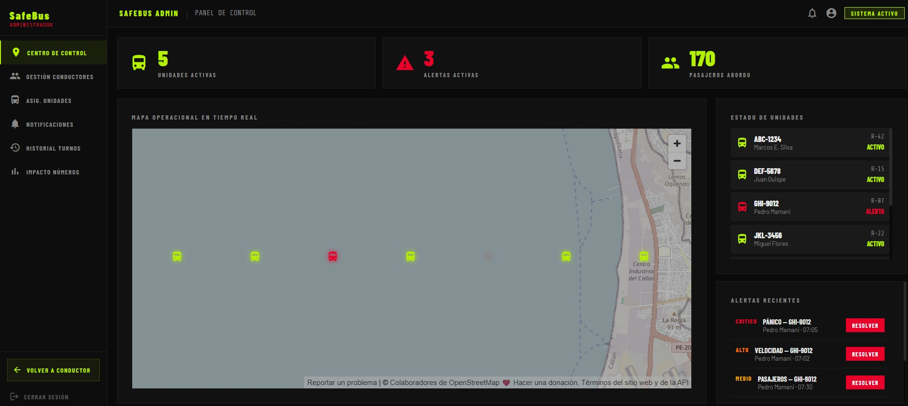
*Figura 5.2.2.7.1: Despliegue de producción de la Frontend Web Application de SafeBus en Vercel, mostrando el dashboard administrativo del sistema disponible desde safebus-frontend.vercel.app.*


##### 5.2.2.8. Team Collaboration Insights during Sprint

**Organización Estratégica del Equipo**

El trabajo se organizó de manera estratégica, asignando a cada integrante módulos específicos según sus fortalezas técnicas y experiencia en el desarrollo frontend del sistema SafeBus:

- **Boris lideró el desarrollo del sistema de autenticación y seguridad, implementando el control de acceso y la protección de datos de los usuarios.**
- **Fernando se especializó en el dashboard principal y monitoreo en tiempo real, enfocándose en la visualización de alertas, métricas y estados de riesgo de las unidades de transporte.**
- **Leonardo desarrolló el núcleo del sistema de monitoreo de buses, implementando los modelos y repositorios relacionados con sensores, conteo de pasajeros y gestión de unidades.**
- **Carlos implementó la gestión de perfiles de usuarios y conductores, asegurando una experiencia personalizada y consistente dentro de la plataforma.**
- **Ivonne desarrolló el sistema de configuraciones y preferencias, permitiendo la personalización y adaptación de la aplicación según las necesidades de los usuarios.**

Permite trabajar en diferentes ramas sin afectar la rama principal del proyecto.

#### 5.2.3. Sprint 3

##### 5.2.3.1. Sprint Planning 3

Para este tercer Sprint, el equipo estableció como objetivo principal el desarrollo e implementación del backend RESTful de SafeBus utilizando Spring Boot con arquitectura DDD+CQRS, exponiendo los endpoints necesarios para cada bounded context del sistema

##### 5.2.3.3. Sprint Backlog 3

El objetivo principal de este Sprint fue desarrollar el backend RESTful de SafeBus con Spring Boot siguiendo la arquitectura DDD+CQRS del proyecto de referencia del profesor, implementando los 5 bounded contexts con sus respectivos aggregates, commands, queries, services, repositories y controllers REST.

| Sprint # | Sprint 3 | | | | | | |
|---|---|-|-|-|-|-|-|
| **User Story** | | **Work-item / Task** | | | | | |
| Id | Title | Id | Title | Description | Estimation | Assigned To | Status |
| US-10 | Endpoint de validación de conductor | T10-1 | Configuración proyecto Spring Boot | Crear proyecto con Java 26, Spring Boot 4.0.6, dependencias JPA, MySQL, Lombok, SpringDoc y pluralize. Configurar application.properties con conexión a MySQL y SnakeCasePhysicalNamingStrategy. | 4h | Carlos Blancas | Done |
| US-10 | Endpoint de validación de conductor | T10-2 | Implementar BC IAM - Employee | Crear aggregate Employee con commands, queries, services, repository y controller REST. Implementar endpoints GET/POST y búsqueda por código de empleado. | 5h | Carlos Blancas | Done |
| US-12 | Endpoint de alerta de emergencia | T12-1 | Implementar BC AlertManagement - Alert | Crear aggregate Alert con tipos PANIC, EXTORTION, ROBBERY, ACCIDENT. Implementar commands, queries, services, repository y controller REST con endpoints GET/POST/PATCH. | 5h | Boris Alvarado | Done |
| US-11 | Endpoint de inicio de servicio | T11-1 | Implementar BC Monitoring - BusUnit | Crear aggregate BusUnit con seguimiento GPS. Implementar commands, queries, services, repository y controller REST con endpoints GET/POST/PATCH para actualización de ubicación. | 5h | Leonardo Delgado | Done |
| US-13 | Endpoint de conteo de pasajeros | T13-1 | Implementar BC IoTMonitoring - Sensor | Crear aggregate Sensor con tipos GPS, PANIC_BUTTON, CAMERA, ACCELEROMETER. Implementar commands, queries, services, repository y controller REST con endpoints GET/POST/PATCH. | 4h | Fernando Espíritu | Done |
| US-47 | Endpoint de actualización de conductor | T47-1 | Implementar BC UserManagement - Driver | Crear aggregate Driver con número de licencia y asociación a empleado. Implementar commands, queries, services, repository y controller REST con endpoints GET/POST. | 4h | Ivonne Ibañez | Done |
| US-22 | Endpoint de autenticación | T22-1 | Configurar MySQL y CORS global | Configurar datasource con createDatabaseIfNotExist=true, ddl-auto=update y habilitar CORS para localhost:4200 y safebus-frontend.vercel.app. | 2h | Carlos Blancas | Done |
| US-05 | Registro de evento de emergencia | T05-1 | Configurar Swagger UI y SpringDoc | Configurar SpringDoc OpenAPI para documentar automáticamente todos los endpoints del backend en Swagger UI. | 2h | Carlos Blancas | Done |
| US-20 | Endpoint para consulta del estado del vehículo | T20-1 | Implementar shared Result y SnakeCaseStrategy | Implementar clase genérica Result<T,E> para manejo de errores en commands y SnakeCasePhysicalNamingStrategy para nombres de tablas. | 3h | Carlos Blancas | Done |

##### 5.2.3.4. Development Evidence for Sprint Review

Durante el Sprint 3, el equipo se enfocó en el desarrollo del backend RESTful de SafeBus utilizando **Spring Boot 4.0.6 con Java 26**, siguiendo la arquitectura **DDD + CQRS** del proyecto de referencia del profesor (catch-up-platform). Se implementaron los 5 bounded contexts planificados, cada uno con su estructura completa de capas:

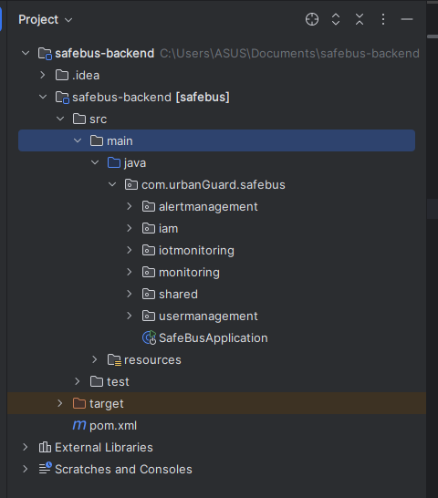

La base de datos **MySQL 8.0** fue configurada para crearse automáticamente mediante `createDatabaseIfNotExist=true`. Las tablas son generadas por Hibernate al iniciar la aplicación gracias a `ddl-auto=update` y `SnakeCasePhysicalNamingStrategy`, generando nombres pluralizados en snake_case: `employees`, `bus_units`, `alerts`, `drivers` y `sensors`.

Se implementó documentación automática de endpoints mediante **SpringDoc OpenAPI 3.0 / Swagger UI** accesible en `http://localhost:8080/swagger-ui.html`, permitiendo probar todos los endpoints directamente desde el navegador.

| Repository | Branch | Commit ID | Commit Message | Author | Date |
|---|---|---|---|---|---|
| safebus-backend | feature/shared | a1b2c3d | feat(shared): add SnakeCasePhysicalNamingStrategy and Result generic | CarlosBlancas969 | 2026-06-03 |
| safebus-backend | feature/iam | b2c3d4e | feat(iam): implement Employee aggregate with DDD+CQRS pattern | CarlosBlancas969 | 2026-06-03 |
| safebus-backend | feature/iam | c3d4e5f | feat(iam): add EmployeesController with GET POST endpoints and code search | CarlosBlancas969 | 2026-06-03 |
| safebus-backend | feature/alertmanagement | d4e5f6g | feat(alerts): implement Alert aggregate with PANIC EXTORTION ROBBERY ACCIDENT | BorisAlvaradoMilan | 2026-06-04 |
| safebus-backend | feature/alertmanagement | e5f6g7h | feat(alerts): add AlertsController with resolve PATCH endpoint | BorisAlvaradoMilan | 2026-06-04 |
| safebus-backend | feature/monitoring | f6g7h8i | feat(monitoring): implement BusUnit aggregate with GPS location tracking | leodev77 | 2026-06-05 |
| safebus-backend | feature/monitoring | g7h8i9j | feat(monitoring): add BusUnitsController with location update PATCH | leodev77 | 2026-06-05 |
| safebus-backend | feature/iotmonitoring | h8i9j0k | feat(iot): implement Sensor aggregate with GPS PANIC_BUTTON CAMERA ACCELEROMETER | Fernandovepro | 2026-06-06 |
| safebus-backend | feature/usermanagement | i9j0k1l | feat(users): implement Driver aggregate with license number and employee association | MarlonLasarte | 2026-06-07 |
| safebus-backend | develop | j0k1l2m | feat(cors): configure global CORS for localhost:4200 and vercel deployment | CarlosBlancas969 | 2026-06-08 |
| safebus-backend | develop | k1l2m3n | feat(swagger): configure SpringDoc OpenAPI for all bounded contexts | CarlosBlancas969 | 2026-06-08 |

##### 5.2.3.5. Execution Evidence for Sprint Review

En este sprint se lograron avances significativos en el desarrollo del backend de SafeBus. Se implementaron los endpoints RESTful de los 5 bounded contexts con su lógica de negocio correspondiente, asegurando la correcta persistencia de datos en MySQL. A continuación se presentan las evidencias técnicas del backend desarrollado durante este sprint.

**1. Backend corriendo en IntelliJ IDEA Ultimate 2024.3.5**

El proyecto Spring Boot inicia correctamente en el puerto 8080, conecta con MySQL 8.0 en localhost:3306 y crea automáticamente la base de datos `safebus_db` con sus 5 tablas.

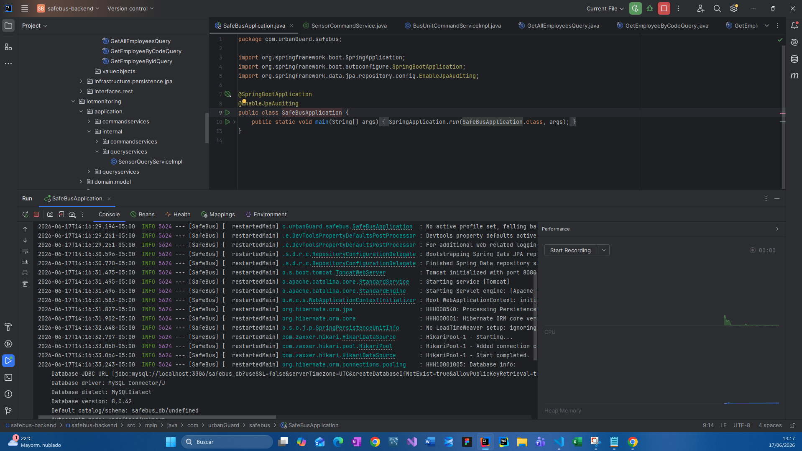

**2. Swagger UI con los 5 bounded contexts**

Accesible en `http://localhost:8080/swagger-ui.html`, muestra todos los endpoints organizados por bounded context: **Employees**, **Alerts**, **Bus Units**, **Drivers** y **Sensors**, con soporte para ejecutar peticiones directamente desde el navegador.

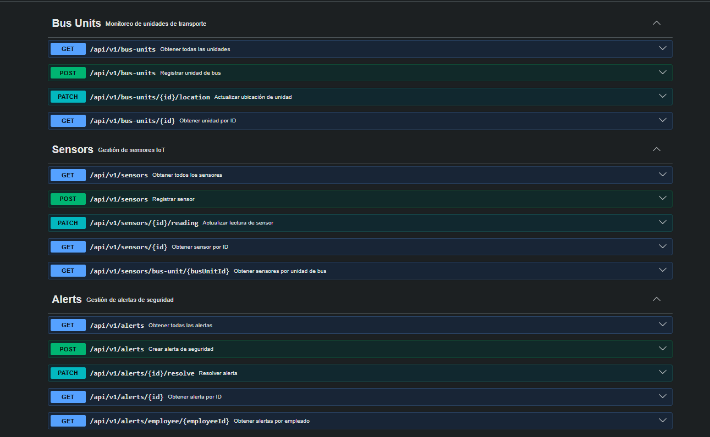

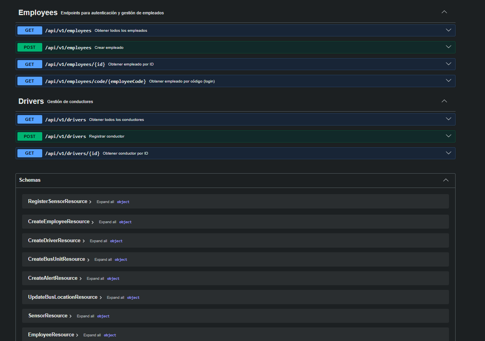

**3. Tablas creadas automáticamente en MySQL Workbench**

La base de datos `safebus_db` contiene las tablas `alerts`, `bus_units`, `drivers`, `employees` y `sensors`, creadas automáticamente por Hibernate al iniciar la aplicación. Verificadas ejecutando:

```sql
USE safebus_db;
SELECT * FROM employees;
SELECT * FROM alerts;
SELECT * FROM bus_units;
SELECT * FROM drivers;
SELECT * FROM sensors;
```


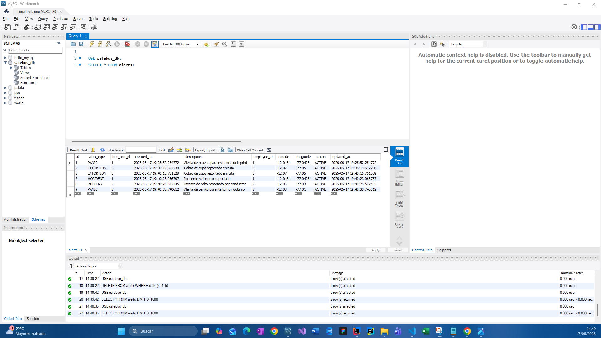

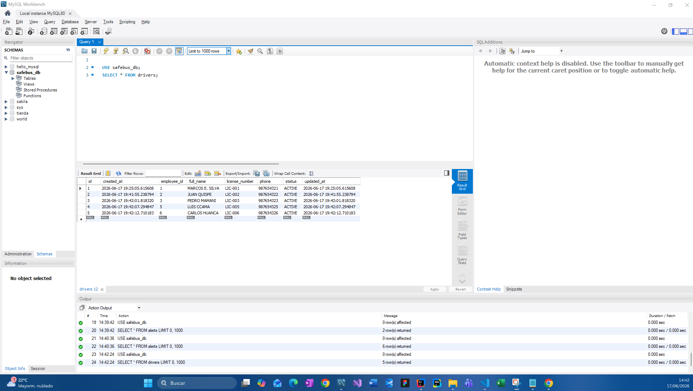

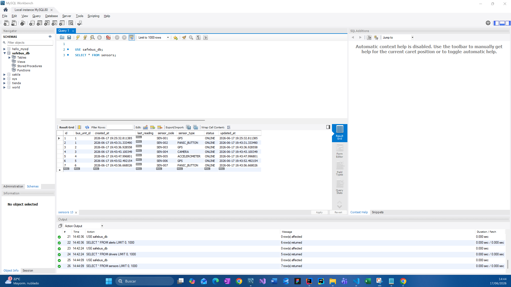

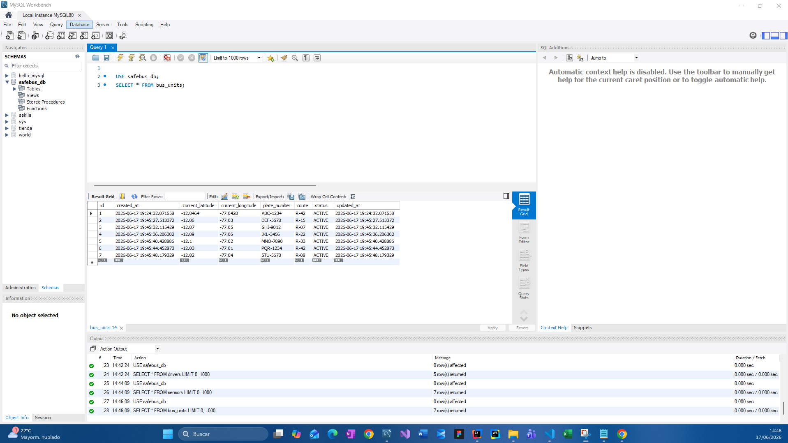


**4. Registro de empleados mediante Swagger**

Los 7 empleados (EMP-001 a EMP-007) fueron registrados exitosamente mediante `POST /api/v1/employees`, con respuesta HTTP **201 Created** y persistencia verificada en MySQL. Hibernate confirma la inserción con los siguientes logs en IntelliJ:

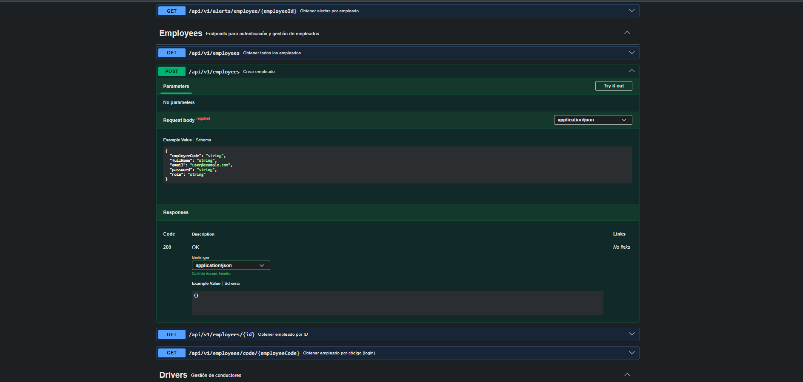


**5. Verificación de datos en MySQL Workbench**

Tras registrar los 7 empleados vía Swagger, se verificó su persistencia en MySQL Workbench ejecutando `SELECT * FROM employees`, confirmando que todos los registros fueron almacenados correctamente con sus campos: `id`, `employee_code`, `full_name`, `email`, `password`, `role`, `created_at` y `updated_at`.

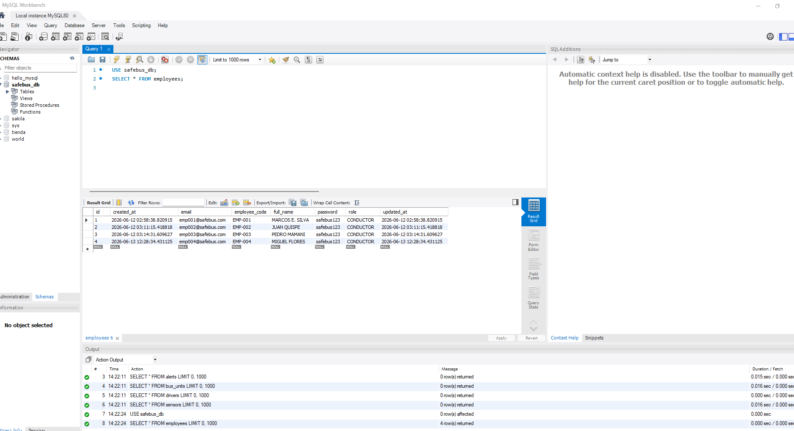

---


##### 5.2.3.6. Services Documentation Evidence for Sprint Review

Durante el Sprint 3 se implementó y documentó el backend RESTful de SafeBus con Spring Boot. Todos los endpoints están disponibles en Swagger UI (`http://localhost:8080/swagger-ui.html`). A continuación se detallan los endpoints implementados por bounded context:

<table border="1" cellpadding="6" cellspacing="0">
  <tr>
    <th>Bounded Context</th>
    <th>Endpoint</th>
    <th>Verb HTTP</th>
    <th>Descripción</th>
    <th>Response Example</th>
  </tr>
  <tr>
    <td rowspan="4">IAM</td>
    <td>/api/v1/employees</td>
    <td>POST</td>
    <td>Registra un nuevo empleado/conductor en el sistema.</td>
    <td>{ "id": 1, "employeeCode": "EMP-001", "fullName": "MARCOS E. SILVA", "email": "emp001@safebus.com", "role": "CONDUCTOR" }</td>
  </tr>
  <tr>
    <td>/api/v1/employees</td>
    <td>GET</td>
    <td>Retorna la lista completa de empleados registrados.</td>
    <td>[ { "id": 1, "employeeCode": "EMP-001", "fullName": "MARCOS E. SILVA", "role": "CONDUCTOR" } ]</td>
  </tr>
  <tr>
    <td>/api/v1/employees/{id}</td>
    <td>GET</td>
    <td>Retorna el detalle de un empleado por su ID.</td>
    <td>{ "id": 1, "employeeCode": "EMP-001", "fullName": "MARCOS E. SILVA", "role": "CONDUCTOR" }</td>
  </tr>
  <tr>
    <td>/api/v1/employees/code/{employeeCode}</td>
    <td>GET</td>
    <td>Valida la identidad del conductor por código de empleado.</td>
    <td>{ "id": 1, "employeeCode": "EMP-001", "fullName": "MARCOS E. SILVA", "role": "CONDUCTOR" }</td>
  </tr>
  <tr>
    <td rowspan="5">AlertManagement</td>
    <td>/api/v1/alerts</td>
    <td>POST</td>
    <td>Registra una alerta de emergencia (PANIC, EXTORTION, ROBBERY, ACCIDENT).</td>
    <td>{ "id": 1, "employeeId": 1, "busUnitId": 1, "alertType": "PANIC", "status": "ACTIVE" }</td>
  </tr>
  <tr>
    <td>/api/v1/alerts</td>
    <td>GET</td>
    <td>Retorna todas las alertas registradas en el sistema.</td>
    <td>[ { "id": 1, "alertType": "PANIC", "status": "ACTIVE", "createdAt": "2026-06-12T22:05:00Z" } ]</td>
  </tr>
  <tr>
    <td>/api/v1/alerts/{id}</td>
    <td>GET</td>
    <td>Retorna el detalle de una alerta por su ID.</td>
    <td>{ "id": 1, "alertType": "PANIC", "status": "ACTIVE", "latitude": -12.0464 }</td>
  </tr>
  <tr>
    <td>/api/v1/alerts/employee/{employeeId}</td>
    <td>GET</td>
    <td>Retorna todas las alertas generadas por un empleado específico.</td>
    <td>[ { "id": 1, "alertType": "PANIC", "status": "ACTIVE" } ]</td>
  </tr>
  <tr>
    <td>/api/v1/alerts/{id}/resolve</td>
    <td>PATCH</td>
    <td>Marca una alerta como resuelta desde el panel administrativo.</td>
    <td>{ "id": 1, "alertType": "PANIC", "status": "RESOLVED" }</td>
  </tr>
  <tr>
    <td rowspan="3">Monitoring</td>
    <td>/api/v1/bus-units</td>
    <td>POST</td>
    <td>Registra una nueva unidad de bus con placa, ruta y coordenadas GPS iniciales.</td>
    <td>{ "id": 1, "plateNumber": "ABC-1234", "route": "R-42", "status": "ACTIVE" }</td>
  </tr>
  <tr>
    <td>/api/v1/bus-units</td>
    <td>GET</td>
    <td>Retorna todas las unidades de transporte registradas con su estado actual.</td>
    <td>[ { "id": 1, "plateNumber": "ABC-1234", "route": "R-42", "status": "ACTIVE" } ]</td>
  </tr>
  <tr>
    <td>/api/v1/bus-units/{id}/location</td>
    <td>PATCH</td>
    <td>Actualiza la ubicación GPS de una unidad en tiempo real.</td>
    <td>{ "id": 1, "plateNumber": "ABC-1234", "currentLatitude": -12.0600, "currentLongitude": -77.0300 }</td>
  </tr>
  <tr>
    <td rowspan="2">UserManagement</td>
    <td>/api/v1/drivers</td>
    <td>POST</td>
    <td>Registra un conductor con número de licencia y asociación a un empleado.</td>
    <td>{ "id": 1, "licenseNumber": "LIC-001", "fullName": "MARCOS E. SILVA", "status": "ACTIVE" }</td>
  </tr>
  <tr>
    <td>/api/v1/drivers</td>
    <td>GET</td>
    <td>Retorna la lista de conductores registrados en el sistema.</td>
    <td>[ { "id": 1, "licenseNumber": "LIC-001", "fullName": "MARCOS E. SILVA", "status": "ACTIVE" } ]</td>
  </tr>
  <tr>
    <td rowspan="4">IoTMonitoring</td>
    <td>/api/v1/sensors</td>
    <td>POST</td>
    <td>Registra un sensor IoT (GPS, PANIC_BUTTON, CAMERA, ACCELEROMETER) asociado a una unidad de bus.</td>
    <td>{ "id": 1, "sensorCode": "SEN-001", "sensorType": "GPS", "busUnitId": 1, "status": "ONLINE" }</td>
  </tr>
  <tr>
    <td>/api/v1/sensors</td>
    <td>GET</td>
    <td>Retorna todos los sensores registrados en el sistema.</td>
    <td>[ { "id": 1, "sensorCode": "SEN-001", "sensorType": "GPS", "status": "ONLINE" } ]</td>
  </tr>
  <tr>
    <td>/api/v1/sensors/bus-unit/{busUnitId}</td>
    <td>GET</td>
    <td>Retorna los sensores asociados a una unidad de bus específica.</td>
    <td>[ { "id": 1, "sensorType": "GPS" }, { "id": 2, "sensorType": "PANIC_BUTTON" } ]</td>
  </tr>
  <tr>
    <td>/api/v1/sensors/{id}/reading</td>
    <td>PATCH</td>
    <td>Actualiza la última lectura registrada por un sensor IoT.</td>
    <td>{ "id": 1, "sensorCode": "SEN-001", "lastReading": "-12.0464,-77.0428", "status": "ONLINE" }</td>
  </tr>
</table>


---

Vista del proyecto, organizada por módulos

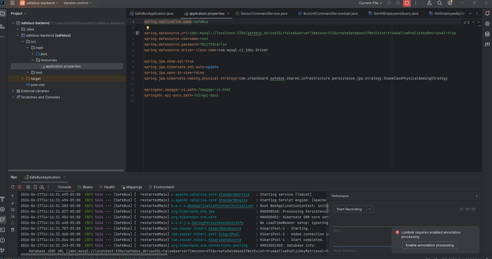


##### 5.2.3.7. Software Deployment Evidence for Sprint Review

Durante el Sprint 3 se logró desplegar satisfactoriamente el backend de SafeBus en la plataforma **Railway**, lo que permitió habilitar el acceso público a los endpoints desarrollados y documentados mediante Swagger UI. Esto garantiza que las funcionalidades implementadas puedan ser evaluadas y probadas externamente sin necesidad de ejecutar el proyecto de forma local.

El despliegue contempla una instancia de servicio ejecutando la aplicación Spring Boot, junto con una base de datos MySQL gestionada por Railway y conectada mediante variables de entorno.

**Entorno de Despliegue**

- **Plataforma:** Railway
- **Base de datos:** MySQL (gestionada por Railway)
- **Tipo de despliegue:** Contenedor Docker generado automáticamente a partir del repositorio de GitHub
- **CI/CD:** Auto-deploy en cada push a la rama `main`

**Archivos de configuración clave**

- `pom.xml`: Se ajustó la versión de Java de 26 a 21 para garantizar compatibilidad con el entorno de build de Railway, y se agregó el plugin `spring-boot-maven-plugin` para generar un JAR ejecutable con el manifest correcto.
- `application.properties`: Se reemplazaron las credenciales de conexión fijas (localhost) por variables de entorno (`${SPRING_DATASOURCE_URL}`, `${SPRING_DATASOURCE_USERNAME}`, `${SPRING_DATASOURCE_PASSWORD}`) para permitir la conexión dinámica a la base de datos de producción.

**Pasos realizados para el despliegue**

1. Se creó el repositorio `safebus-backend` en la organización de GitHub del equipo y se subió el código fuente del backend.
2. Se creó un nuevo proyecto en Railway y se conectó directamente al repositorio de GitHub mediante la integración oficial de Railway App, otorgando los permisos necesarios a nivel de organización.
3. Railway detectó el proyecto Maven y ejecutó el build automáticamente. Se corrigieron dos errores de compatibilidad durante el proceso: la versión de Java (de 26 a 21) y la generación del JAR ejecutable.
4. Se agregó un servicio de **MySQL** dentro del mismo proyecto de Railway, generando automáticamente las credenciales de conexión (host, puerto, usuario, contraseña y base de datos).
5. Se configuraron las variables de entorno del servicio backend (`SPRING_DATASOURCE_URL`, `SPRING_DATASOURCE_USERNAME`, `SPRING_DATASOURCE_PASSWORD`) referenciando directamente las variables del servicio MySQL mediante la sintaxis `${{MySQL.VARIABLE}}` de Railway.
6. Se generó el dominio público del servicio desde la sección **Networking**, obteniendo la URL: `https://safebus-backend-production.up.railway.app`.
7. Se verificó el despliegue accediendo a la documentación interactiva de Swagger UI desde el dominio público generado.

**Verificación de Despliegue**

Se realizaron pruebas directamente en el entorno de producción de Railway, confirmando:

- El correcto funcionamiento de los endpoints del backend a través del dominio público.
- La persistencia adecuada de los datos en la base de datos MySQL gestionada por Railway.
- La estabilidad del backend desplegado y su correcta accesibilidad a través de la web sin necesidad de configuración local.

**Evidencia Visual**

- Vista del proyecto en Railway con ambos servicios (`MySQL` y `safebus-backend`) en estado **Online**.

  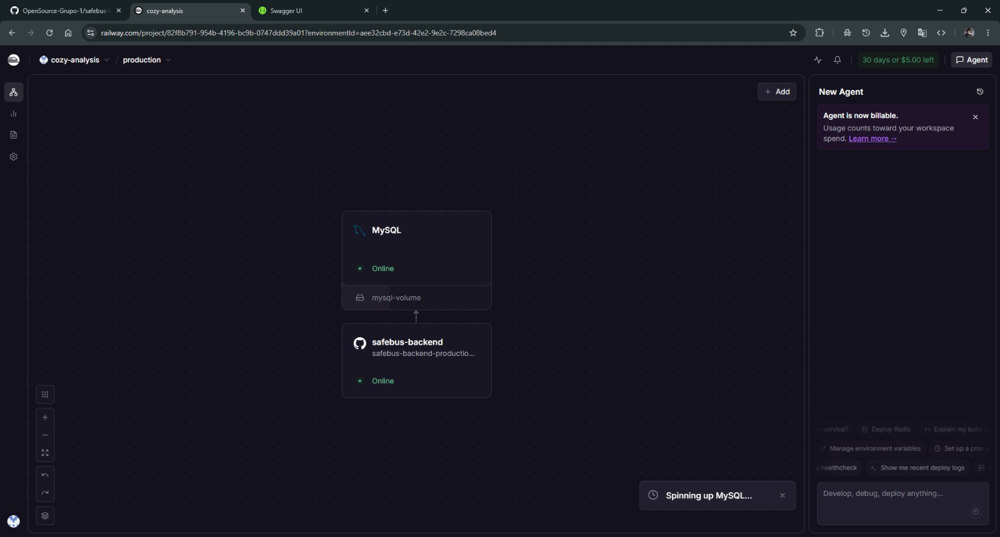

- Configuración de Networking mostrando el dominio público generado para el backend: `safebus-backend-production.up.railway.app`, escuchando en el puerto 8080.

  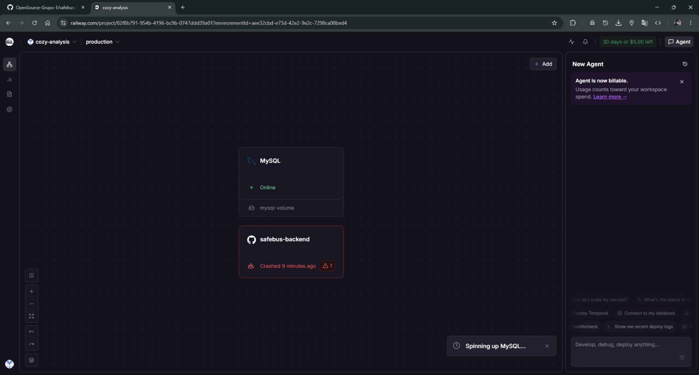

- Variables de entorno configuradas en el servicio `safebus-backend`, referenciando dinámicamente las credenciales del servicio MySQL (`SPRING_DATASOURCE_URL`, `SPRING_DATASOURCE_USERNAME`, `SPRING_DATASOURCE_PASSWORD`).

  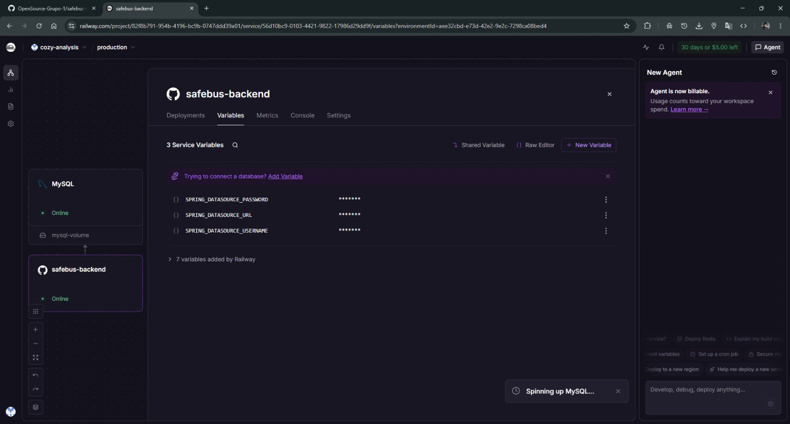

- Variables de entorno generadas automáticamente por Railway para el servicio MySQL (host, puerto, usuario, contraseña y base de datos).

  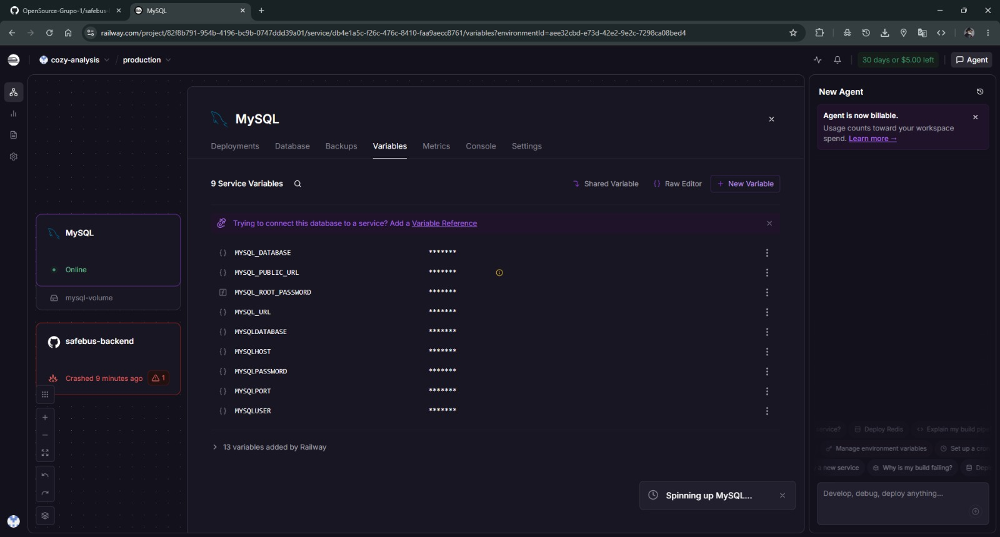

- Despliegue exitoso del backend tras aplicar las correcciones de versión de Java y configuración de variables de entorno.

  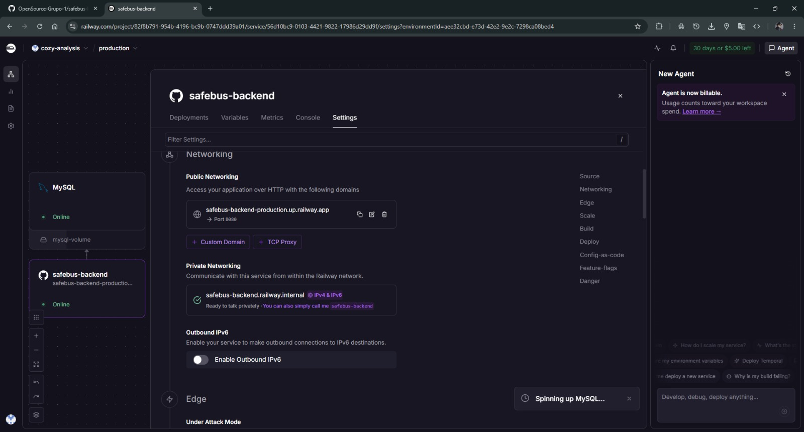

- Documentación interactiva de Swagger UI accesible públicamente desde el dominio de Railway, mostrando los endpoints de los 5 bounded contexts (`Employees`, `Alerts`, `Bus Units`, `Drivers`, `Sensors`).

  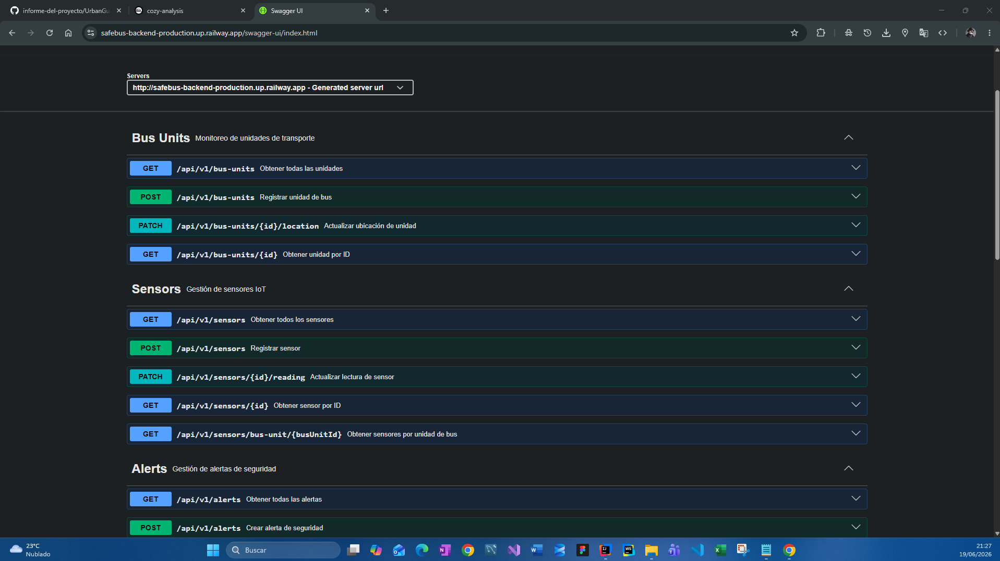

**URL de despliegue del backend:**
[https://safebus-backend-production.up.railway.app/swagger-ui.html](https://safebus-backend-production.up.railway.app/swagger-ui.html)

##### 5.2.3.8. Team Collaboration Insights during Sprint


# Arquitectura Implementada para SAFEBUS

## PRESENTATION
- Inicio de sesión y perfiles (`login`, `profile`, `register`)  
- Panel principal y configuraciones (`dashboard`, `settings`)  
- Gestión de buses y monitoreo (`bus-monitor`, `bus-detail`)  
- Sistema de alertas y botones de pánico (`panic-alert`)  
- Visualización de sensores y conteo de pasajeros (`passenger-counter`)  

## GUARDS
- Sistema de protección de rutas y autenticación  

## COMPONENTS
- Shell principal de la aplicación (`safebus-shell`)  

## INFRASTRUCTURE
- `Auth-http` (Boris)  
- `Dashboard-http` (Fernando)  
- `BusMonitor-http` (Leonardo)  
- `Settings-http` (Ivonne)  
- `Profile-http` (Carlos)  

## DOMAIN
- `Auth.model` (Boris)  
- `Dashboard-summary.model` (Fernando)  
- `Bus.model`, `Passenger-metrics.model`, `Alert.model` (Leonardo)  
- `Settings.model` (Ivonne)  
- `User-profile.model` (Carlos)  

## REPOSITORIES
- `Auth.repository` (Boris)  
- `Dashboard.repository` (Fernando)  
- `Bus.repository` (Leonardo)  
- `Settings.repository` (Ivonne)  
- `Profile.repository` (Carlos)  

## APPLICATION
- `Auth.facade` (Boris)  
- `Dashboard.facade` (Fernando)  
- `Bus.facade` (Leonardo)  
- `Settings.facade` (Ivonne)  
- `Profile.facade` (Carlos)  

---

El **Sprint 2** consolidó al equipo como una unidad técnica cohesiva especializada en desarrollo frontend con **Angular**, estableciendo bases arquitectónicas sólidas para el módulo **SafeBus** y sentando las bases para la futura integración con servicios backend y dispositivos IoT orientados a la seguridad en el transporte público.
### 5.3. Validation Interviews

#### 5.3.1. Diseño de Entrevistas

Segmento objetivo 1: Conductores (Operarios de transporte público)

**Elementos a validar:**  
Aplicación móvil del conductor y experiencia operativa durante el servicio.

**User Flows a validar**

**User Flow 1 – Inicio y gestión de turno**
- Iniciar sesión como conductor.
- Visualizar turno asignado.
- Revisar ruta, unidad y horario.
- Iniciar y finalizar servicio.

**User Flow 2 – Reporte de incidencias y alertas**
- Registrar una emergencia o problema durante el recorrido.
- Enviar alerta al centro de control.
- Visualizar confirmación de atención.

**User Flow 3 – Seguimiento del recorrido**
- Revisar información de la ruta.
- Consultar estado del viaje.
- Ver información del servicio en tiempo real.

**User Flow 4 – Registro de pasajeros**
- Revisar cantidad de pasajeros.
- Actualizar información del servicio.

**Tareas asignadas**

1. Ingresar al aplicativo con sus credenciales.
2. Revisar el turno asignado.
3. Identificar ruta y unidad asignada.
4. Iniciar un servicio de transporte.
5. Simular una alerta de emergencia.
6. Verificar que la alerta llegue al centro de control.
7. Finalizar el turno y revisar el resumen del servicio.

**Preguntas de validación**

1. ¿La información mostrada al iniciar sesión (turno, ruta y unidad) le permite entender rápidamente el servicio que debe realizar?

2. ¿El proceso de iniciar y finalizar un turno le parece sencillo y adecuado para su trabajo diario?

3. ¿Al registrar una emergencia o enviar una alerta considera que podría hacerlo fácilmente durante una situación real?

4. ¿La información del recorrido y estado del servicio en tiempo real le ayudaría a realizar mejor su trabajo?

5. ¿Qué parte de la aplicación considera más útil y qué aspecto cambiaría o mejoraría?

6. Del 1 al 5, ¿qué tan probable sería utilizar esta aplicación durante sus jornadas? ¿Por qué?


Segmento objetivo 2: Empresas / Consorcios de transporte público

**Elementos a validar:**  
Landing Page y Panel Administrativo Web (Dashboard SafeBus).

**User Flows a validar**

**User Flow 1 – Gestión administrativa (ADMIN)**
- Ingresar al panel administrativo.
- Revisar centro de control.
- Gestionar conductores.
- Revisar unidades asignadas.
- Consultar historial de turnos.
- Visualizar estado de servicios.

**User Flow 2 – Monitoreo y control operativo**
- Revisar vehículos activos.
- Consultar rutas en operación.
- Visualizar información en tiempo real.
- Identificar incidencias.

**User Flow 3 – Gestión de alertas**
- Recibir alerta enviada por conductor.
- Revisar información del incidente.
- Dar seguimiento al evento.

**User Flow 4 – Reportes operativos**
- Revisar resumen del servicio.
- Consultar kilómetros recorridos.
- Revisar pasajeros registrados.
- Analizar rendimiento operativo.

**Tareas asignadas**

1. Explorar el Landing Page e identificar qué problema resuelve SafeBus.
2. Ingresar al dashboard administrativo.
3. Revisar conductores registrados.
4. Consultar una unidad asignada.
5. Revisar historial de turnos.
6. Identificar un servicio finalizado.
7. Revisar una alerta generada.
8. Consultar resumen operativo del día.

**Preguntas de validación**

1. ¿El dashboard permite encontrar fácilmente la información necesaria para controlar conductores, unidades y servicios?

2. ¿La gestión de turnos e historial de operaciones ayudaría a mejorar el control de la empresa?

3. ¿La información mostrada en una alerta es suficiente para tomar decisiones ante una incidencia?

4. ¿La visualización del estado de vehículos y servicios en tiempo real facilitaría la supervisión de la flota?

5. ¿Qué funcionalidad del sistema considera más importante y qué aspecto debería mejorarse?

6. Del 1 al 5, ¿qué tan probable sería implementar SafeBus en su empresa? ¿Por qué?
#### 5.3.2. Registro de Entrevistas

> *[Pendiente de completar]*

#### 5.3.3. Evaluaciones según heurísticas

> *[Pendiente de completar]*

---

### 5.4. Video About-the-Product

> *[Pendiente de completar]*

---
